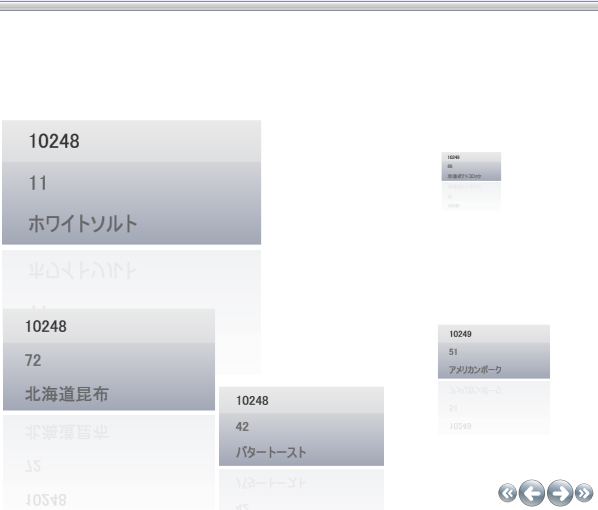

////

|metadata|
{
    "name": "xamdatapresenter-modifying-the-scale-of-elements-on-a-path",
    "controlName": ["xamDataPresenter"],
    "tags": ["How Do I","Layouts","Tips and Tricks"],
    "guid": "{FE444B7B-CC06-44AE-BED2-8B791B939201}",  
    "buildFlags": [],
    "createdOn": "2012-01-30T19:39:53.2660063Z"
}
|metadata|
////

= パスで要素のスケールを変更

xamDataPresenter のカルーセル ビューによって、パス上の位置に基づいてパーセントでレコードをスケールすることができます。スケーリングはレコードに 3D 効果を提供します。ScalingEffect は、 link:{RootAssembly}{ApiVersion}~infragistics.windows.controls.carouselviewsettings~scalingeffectstopsproperty.html[ScalingEffectsStops] を含む link:{RootAssembly}{ApiVersion}~infragistics.windows.controls.scalingeffectstopcollection.html[ScalingEffectStopCollection] (それぞれがオフセットとそのオフセットで適用する値を指定する) を定義する点で、その他のパスエフェクトに似ています。値は 0 から 10 に進むことができる小数のパーセントです。

link:{RootAssembly}{ApiVersion}~infragistics.windows.controls.carouselviewsettings.html[CarouselViewSettings] オブジェクトの link:{RootAssembly}{ApiVersion}~infragistics.windows.controls.carouselviewsettings~usescalingproperty.html[UseScaling] プロパティを True に設定することによってスケーリングを有効にします。この同じオブジェクトで、 link:{RootAssembly}{ApiVersion}~infragistics.windows.controls.carouselviewsettings~scalingeffectstopdirectionproperty.html[ScalingEffectStopDirection] プロパティを UseItemPath、Horizontal、または Vertical に設定します。

[NOTE]
====
*注:* このトピックは、 link:xamdatapresenter-getting-started-with-xamdatapresenter.html[xamDataPresenter をアプリケーションに追加]のタスクを完了しており、 link:xamdatapresenter-about-carouselview.html[CarouselView について]を読んでいることが前提となります。
====

[start=1]
. link:{ApiPlatform}datapresenter{ApiVersion}~infragistics.windows.datapresenter.xamdatacarousel~viewsettings.html[ViewSettings] オブジェクトを定義します。

*XAML の場合:*

----
<igWindows:CarouselView.ViewSettings>
        ...        
</igWindows:CarouselView.ViewSettings>
----

[start=2]
. CarouselViewSettings オブジェクトを指定して、UseScaling プロパティを True に、ScalingEffectStopDirection プロパティを UseItemPath に設定します。

*XAML の場合:*

----
<igWindows:CarouselViewSettings ScalingEffectStopDirection="UseItemPath" 
  UseScaling="True">
        ...
</igWindows:CarouselViewSettings>
----

[start=3]
. link:{RootAssembly}{ApiVersion}~infragistics.windows.controls.scalingeffectstop.html[ScalingEffectStops] オブジェクトを定義します。このオブジェクトには、ScalingEffectStopCollection と ScalingEffectStops が含まれます。3 つの ScalingEffectStops を作成します。

*XAML の場合:*

----
<igWindows:CarouselViewSettings.ScalingEffectStops>
        <igWindows:ScalingEffectStopCollection>
                <igWindows:ScalingEffectStop Offset="0" Value="2" />
                <igWindows:ScalingEffectStop Offset=".5" Value="1.1" />
                <igWindows:ScalingEffectStop OffsetB"1" Value=".1" />
        </igWindows:ScalingEffectStopCollection>
</igWindows:CarouselViewSettings.ScalingEffectStops>
----

[start=4]
. プロジェクトをビルドして実行します。以下の画像のように、パスを通過すると xamDataPresenter 内のレコードのサイズが大きくなります。

== 関連トピック

link:xamcarousel-overview-of-path-effects.html[パス エフェクトの概要]

link:xamdatapresenter-modifying-the-opacity-effect-of-items-on-a-path.html[パスで項目の不透明効果を変更]

link:xamdatapresenter-modifying-the-skew-effect-of-items-on-a-path.html[パスで項目の傾斜効果を変更]