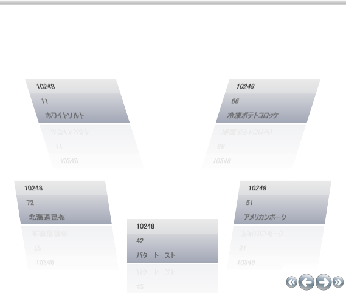
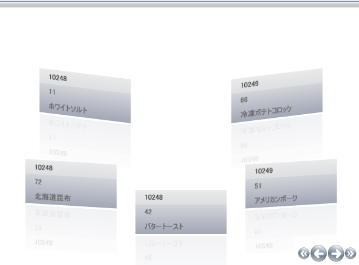

////

|metadata|
{
    "name": "xamdatapresenter-modifying-the-skew-effect-of-items-on-a-path",
    "controlName": ["xamDataPresenter"],
    "tags": ["How Do I","Layouts","Tips and Tricks"],
    "guid": "{408903E0-5ED8-42B8-B201-068554145CF3}",  
    "buildFlags": [],
    "createdOn": "2012-01-30T19:39:53.2690069Z"
}
|metadata|
////

= パスで項目の傾斜効果を変更

xamDataPresenter のカルーセル ビューはパス上の項目を斜めにすることができます。X 軸または Y 軸のいずれかで個々に傾斜効果を設定できます。その他のパス エフェクト (不透明、スケール、Z-オーダー) と同じように、 link:{RootAssembly}{ApiVersion}~infragistics.windows.controls.carouselviewsettings.html[CarouselViewSettings] オブジェクトは link:{RootAssembly}{ApiVersion}~infragistics.windows.controls.skewanglexeffectstopcollection.html[SkewAngleXStopEffectCollection] と link:{RootAssembly}{ApiVersion}~infragistics.windows.controls.skewangleyeffectstopcollection.html[SkewAngleYStopEffectCollection] を公開します。さらに、その他の効果と同じように、 link:{RootAssembly}{ApiVersion}~infragistics.windows.controls.carouselviewsettings~skewanglexeffectstopdirectionproperty.html[SkewAngleXEffectStopDirection] プロパティと link:{RootAssembly}{ApiVersion}~infragistics.windows.controls.carouselviewsettings~skewangleyeffectstopdirectionproperty.html[SkewAngleYEffectStopDirection] プロパティを設定することによって、X および Y の傾斜両方に対して Horizontal、Vertical、または UseItemPath のいずれかに効果の方向を設定する必要があります。傾斜の値は、オブジェクトの回転を処理します。有効な値は -360 から +360 です。

[NOTE]
====
*注:* このトピックは、 link:xamdatapresenter-getting-started-with-xamdatapresenter.html[xamDataPresenter をアプリケーションに追加]でタスクを完了しており、 link:xamdatapresenter-about-carouselview.html[CarouselView について]を読んでいることが前提となります。
====

== 傾斜-X を修正

以下のコードは、パスに関連して X 軸に沿ってオブジェクトを傾斜します。最初の link:{RootAssembly}{ApiVersion}~infragistics.windows.controls.skewanglexeffectstop.html[SkewAngleXEffectStop] はパスの先頭 (オフセット 0) で 25 度傾斜します。中間点 (オフセット .5) でレコードは傾斜されません。パスの最後 (オフセット 1) でレコードは -25 度傾斜されます。

*XAML の場合:*

----
<igDP:CarouselView.ViewSettings>
    <igWindows:CarouselViewSettings SkewAngleXEffectStopDirection="UseItemPath"
          UseSkewing="True">
        <igWindows:CarouselViewSettings.SkewAngleXEffectStops>
            <igWindows:SkewAngleXEffectStopCollection>
                <igWindows:SkewAngleXEffectStop Offset="0" Value="25" />
                <igWindows:SkewAngleXEffectStop Offset=".5" Value="0" />
                <igWindows:SkewAngleXEffectStop Offset="1" Value="-25" />
            </igWindows:SkewAngleXEffectStopCollection>
        </igWindows:CarouselViewSettings.SkewAngleXEffectStops>
    </igWindows:CarouselViewSettings>
</igDP:CarouselView.ViewSettings>
----

== 傾斜-Y を修正

以下のコードは、パスに関連して Y 軸に沿ってオブジェクトを傾斜します。最初の link:{RootAssembly}{ApiVersion}~infragistics.windows.controls.skewangleyeffectstop.html[SkewAngleYEffectStop] はパスの先頭 (オフセット 0) でレコードを 10 度傾斜します。中間点 (オフセット .5) でレコードは傾斜されません。パスの最後 (オフセット 1) でレコードは -10 度傾斜されます。

*XAML の場合:*

----
<igDP:CarouselView.ViewSettings>
    <igWindows:CarouselViewSettings SkewAngleYEffectStopDirection="UseItemPath" 
          UseSkewing="True">
        <igWindows:CarouselViewSettings.SkewAngleYEffectStops>
            <igWindows:SkewAngleYEffectStopCollection>
                <igWindows:SkewAngleYEffectStop Offset="0" Value="10" />
                <igWindows:SkewAngleYEffectStop Offset=".5" Value="0" />
                <igWindows:SkewAngleYEffectStop Offset="1" value="-10" />
            </igWindows:SkewAngleYEffectStopCollection>
        </igWindows:CarouselViewSettings.SkewAngleYEffectStops>
    </igWindows:CarouselViewSettings>
</igDP:CarouselView.ViewSettings>
----

== 関連トピック

link:xamcarousel-overview-of-path-effects.html[パス エフェクトの概要]

link:xamdatapresenter-modifying-the-opacity-effect-of-items-on-a-path.html[パスで項目の不透明効果を変更]

link:xamdatapresenter-modifying-the-scale-of-elements-on-a-path.html[パスで要素のスケールを変更]