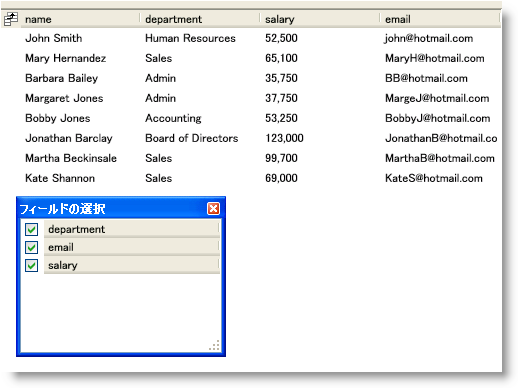

////

|metadata|
{
    "name": "xamdatapresenter-prevent-fields-from-being-hidden",
    "controlName": ["xamDataPresenter"],
    "tags": ["Layouts","Tips and Tricks"],
    "guid": "{06BE5812-54D7-4D1A-A402-43811B1C3D59}",  
    "buildFlags": [],
    "createdOn": "2012-01-30T19:39:53.2920115Z"
}
|metadata|
////

= フィールドが非表示にされることを防止する

フィールドの選択ボタンを有効にした場合、またはフィールドの選択をプログラムで表示する場合、エンド ユーザーは以下のメソッドのいずれかを使用してフィールドを非表示にすることができます。

* フィールドの選択チェックボックスを切り替えて、フィールドの可視性を切り替えます。
* フィールドをフィールドの選択にドラッグして、フィールドを非表示にします。
* コントロールの境界線の外にフィールドをドラッグします。

ただし、 link:{ApiPlatform}datapresenter{ApiVersion}~infragistics.windows.datapresenter.fieldsettings.html[FieldSettings] オブジェクトの link:{ApiPlatform}datapresenter{ApiVersion}~infragistics.windows.datapresenter.fieldsettings~allowhiding.html[AllowHiding] プロパティを AllowFieldHiding 列挙体値に設定することによって、エンド ユーザーがフィールドを非表示にする方法を変更したり、フィールドを非表示にできないようにすることができます。

以下のコード例は、フィールドを非表示にできないようにする方法を示します。

*XAML の場合:*

----
<igDP:XamDataPresenter Name="xamDataPresenter1" BindToSampleData="True">
    <!-- フィールドの選択ボタンを有効にする -->
    <igDP:XamDataPresenter.FieldLayoutSettings>
        <igDP:FieldLayoutSettings HeaderPrefixAreaDisplayMode="FieldChooserButton" />
    </igDP:XamDataPresenter.FieldLayoutSettings>
    <igDP:XamDataPresenter.FieldLayouts>
        <igDP:FieldLayout>
            <!-- 名前フィールドを非表示にできないようにする -->
            <igDP:Field Name="name">
                <igDP:Field.Settings>
                    <igDP:FieldSettings AllowHiding="Never" />
                </igDP:Field.Settings>
            </igDP:Field>
        </igDP:FieldLayout>
    </igDP:XamDataPresenter.FieldLayouts>
</igDP:XamDataPresenter>
----

*Visual Basic の場合:*

----
Imports Infragistics.Windows.DataPresenter
...
Me.xamDataPresenter1.FieldLayouts(0).Fields("name").Settings.AllowHiding = AllowFieldHiding.Never
...
----

*C# の場合:*

----
using Infragistics.Windows.DataPresenter;
...
this.xamDataPresenter1.FieldLayouts[0].Fields["name"].Settings.AllowHiding = AllowFieldHiding.Never;
...
----

== 関連トピック

link:xamdatapresenter-about-the-field-chooser.html[フィールドの選択について]

link:xamdatapresenter-display-the-field-chooser.html[フィールドの選択の表示]

link:xamdatapresenter-about-field-chooser-settings.html[フィールドの選択の設定について]

link:xamdatapresenter-create-an-external-field-chooser.html[外部のフィールドの選択の作成]

link:xamdatapresenter-change-the-display-order-of-fields-in-the-field-chooser.html[フィールドの選択でフィールドの表示順序を変更]