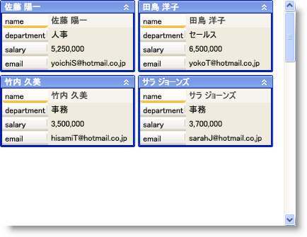

////

|metadata|
{
    "name": "xamdatapresenter-set-the-maximum-number-of-viewable-cards",
    "controlName": ["xamDataPresenter"],
    "tags": ["How Do I","Layouts","Tips and Tricks"],
    "guid": "{5D2E0BF3-3D50-492E-95AD-B9D9111AA93C}",  
    "buildFlags": [],
    "createdOn": "2012-01-30T19:39:53.3720275Z"
}
|metadata|
////

= 表示可能なカードの最大数の設定

xamDataCards™ コントロールは、WrapPanel コンテナーと同様、水平または垂直方向にカードをレイアウトできます。link:{ApiPlatform}datapresenter{ApiVersion}~infragistics.windows.datapresenter.cardviewsettings.html[CardViewSettings] オブジェクトの link:{ApiPlatform}datapresenter{ApiVersion}~infragistics.windows.datapresenter.cardviewsettings~orientation.html[Orientation] プロパティは、WrapPanel コンテナーの Orientation プロパティと同じです。それを Horizontal に設定すると、xamDataCards コントロールはカードを左から右、そして上から下にレイアウトします。一方、それを Vertical に設定すると、xamDataCards コントロールはカードを上から下、そして左から右にレイアウトします。いずれのモードでも、xamDataCards コントロールは、カードにレイアウトするために使用できるすべてのスペースを使用します。ただし、CardViewSettings オブジェクトの link:{ApiPlatform}datapresenter{ApiVersion}~infragistics.windows.datapresenter.cardviewsettings~maxcardrows.html[MaxCardRows] または link:{ApiPlatform}datapresenter{ApiVersion}~infragistics.windows.datapresenter.cardviewsettings~maxcardcols.html[MaxCardCols] プロパティをそれぞれ設定することによって、xamDataCards が作成する行または列の最大数を制限することができます。これは、一度にエンドユーザーが表示できるカードの最大数を効果的に設定します。

以下のコード例は、表示可能なカードの最大数を設定する方法を示します。

*XAML の場合:*

----
<igDP:XamDataCards Name="xamDataCards1" BindToSampleData="True">
    <igDP:XamDataCards.ViewSettings>
        <!-- ビューでの最大表示数は、8 カードです -->
        <igDP:CardViewSettings MaxCardRows="2" MaxCardCols="4" />
    </igDP:XamDataCards.ViewSettings>
</igDP:XamDataCards>
----

*Visual Basic の場合:*

----
Me.xamDataCards1.ViewSettings.MaxCardRows = 2
Me.xamDataCards1.ViewSettings.MaxCardCols = 4
----

*C# の場合:*

----
this.xamDataCards1.ViewSettings.MaxCardRows = 2;
this.xamDataCards1.ViewSettings.MaxCardCols = 4;
----

== 関連トピック

link:xamdatapresenter-about-card-settings.html[カード設定について]

link:xamdatapresenter-about-card-sizing.html[カード サイズについて]

link:xamdatapresenter-about-repositioning-animations.html[リポジション アニメーションについて]

link:xamdatapresenter-collapse-a-card.html[カードの縮小]

link:xamdatapresenter-collapse-an-empty-cell.html[空のセルの縮小]

link:xamdatapresenter-set-the-space-between-cards.html[カード間のスペースの設定]

link:xamdatapresenter-working-with-card-headers.html[カード ヘッダーでの作業]