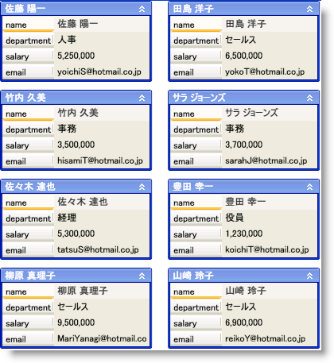

////

|metadata|
{
    "name": "xamdatapresenter-set-the-space-between-cards",
    "controlName": ["xamDataPresenter"],
    "tags": ["How Do I","Layouts","Tips and Tricks"],
    "guid": "{B71075D7-F508-4F62-897D-0E5B1F91BA40}",  
    "buildFlags": [],
    "createdOn": "2012-01-30T19:39:53.3740279Z"
}
|metadata|
////

= カード間のスペースの設定

xamDataCards™ コントロールは隣接するカード間にわずかなスペースを自動的に追加します。ただし、 link:{ApiPlatform}datapresenter{ApiVersion}~infragistics.windows.datapresenter.cardviewsettings.html[CardViewSettings] オブジェクトの link:{ApiPlatform}datapresenter{ApiVersion}~infragistics.windows.datapresenter.cardviewsettings~intercardspacingx.html[InterCardSpacingX] および link:{ApiPlatform}datapresenter{ApiVersion}~infragistics.windows.datapresenter.cardviewsettings~intercardspacingy.html[InterCardSpacingY] プロパティを 0 より大きい double 値に設定することによって、隣接するカード間のスペースの分量を変更できます。InterCardSpacingX プロパティは各カードの右のスペースを決定し、InterCardSpacingY プロパティは各カードの下のスペースを決定します。

以下の例のコードは、カード間のスペースを設定する方法を示します。

*XAML の場合:*

----
<igDP:XamDataCards Name="xamDataCards1" BindToSampleData="True">
    <igDP:XamDataCards.ViewSettings>
        <igDP:CardViewSettings InterCardSpacingX="20" InterCardSpacingY="10" />
    </igDP:XamDataCards.ViewSettings>
</igDP:XamDataCards>
----

*Visual Basic の場合:*

----
Me.xamDataCards1.ViewSettings.InterCardSpacingX = 20
Me.xamDataCards1.ViewSettings.InterCardSpacingY = 10
----

*C# の場合:*

----
this.xamDataCards1.ViewSettings.InterCardSpacingX = 20;
this.xamDataCards1.ViewSettings.InterCardSpacingY = 10;
----

== 関連トピック

link:xamdatapresenter-about-card-settings.html[カード設定について]

link:xamdatapresenter-about-card-sizing.html[カード サイズについて]

link:xamdatapresenter-about-repositioning-animations.html[リポジション アニメーションについて]

link:xamdatapresenter-collapse-a-card.html[カードの縮小]

link:xamdatapresenter-collapse-an-empty-cell.html[空のセルの縮小]

link:xamdatapresenter-set-the-maximum-number-of-viewable-cards.html[表示可能なカードの最大数の設定]

link:xamdatapresenter-working-with-card-headers.html[カード ヘッダーでの作業]