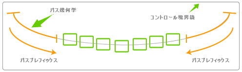
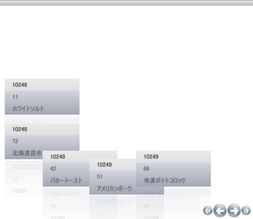

////

|metadata|
{
    "name": "xamdatapresenter-setting-padding-on-xamdatapresenters-path",
    "controlName": ["xamDataPresenter"],
    "tags": ["How Do I","Layouts"],
    "guid": "{670B1B48-017D-45FD-9767-9D60B389BBA3}",  
    "buildFlags": [],
    "createdOn": "2012-01-30T19:39:53.3320195Z"
}
|metadata|
////

= xamDataPresenter のパス上でパディングを設定

xamDataPresenter のカルーセル ビューのパスの前後にバッファ ゾーンを配置できます。カルーセル ビューは、パスに沿ってコントロールのレイアウトを計算するときにこのバッファ ゾーン、つまりパディングを使用します。

以下の画像は、パスのプレフィックスとサフィックスの機能を例示します。

以下のコードを使用して、 link:{RootAssembly}{ApiVersion}~infragistics.windows.controls.carouselviewsettings.html[CarouselViewSettings] の link:{RootAssembly}{ApiVersion}~infragistics.windows.controls.carouselviewsettings~itempathsuffixpercent.html[ItemPathPrefixPercent] プロパティと link:{RootAssembly}{ApiVersion}~infragistics.windows.controls.carouselviewsettings~itempathprefixpercent.html[ItemPathSuffixPercent] プロパティを指定します。

*XAML の場合:*

----
<igDP:XamDataPresenter.View>
        <igDP:CarouselView>
                <igDP:CarouselView.ViewSettings>
                        <igWindows:CarouselViewSettings ItemPathPrefixPercent=".2" 
                          ItemPathSuffixPercent=".4" />
                </igDP:CarouselView.ViewSettings>
        </igDP:CarouselView>
</igDP:XamDataPresenter.View>
----

この機能を表示するために、 link:xamdatapresenter-getting-started-with-xamdatapresenter.html[xamDataPresenter をアプリケーションに追加]の XamDataPresenter タグ内のコードを上記のコードで置き換えます。これを行うと、プロジェクトの実行時に、このコードによって、以下の画像のように EarthQuake Pills レコードの後、Hi-Speed Tonic レコードの前に大量のパディングが挿入されることが分かります。

