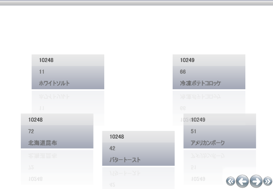

////

|metadata|
{
    "name": "xamdatapresenter-showing-more-than-three-fields-in-xamdatapresenter",
    "controlName": ["xamDataPresenter"],
    "tags": ["How Do I","Layouts"],
    "guid": "{C74BEC77-7CFB-4B7C-AA7E-ED361629EEAD}",  
    "buildFlags": [],
    "createdOn": "2012-01-30T19:39:53.3340199Z"
}
|metadata|
////

= xamDataPresenter に 3 つ以上のフィールドを表示

デフォルトで、xamDataPresenter のカルーセル ビューは表示されるときに、最初の 3 フィールドのみを表示します。

link:{ApiPlatform}datapresenter{ApiVersion}~infragistics.windows.datapresenter.fieldlayoutsettings~autoarrangemaxrows.html[AutoArrangeMaxRows] プロパティを 0 に設定することによって、すべてのフィールドが表示されるようにこの設定を変更できます。以下の例のコードは、このプロパティの設定方法を示します。

*XAML の場合:*

----
<igDP:XamDataPresenter.FieldLayoutSettings>
        <igDP:FieldLayoutSettings AutoArrangeMaxRows="0" />
</igDP:XamDataPresenter.FieldLayoutSettings>
----

link:xamdatapresenter-getting-started-with-xamdatapresenter.html[xamDataPresenter をアプリケーションに追加]からのコードとともに上記のコードを使用することができます。xamDataPresenter タグ内に上記のコードを直接配置するだけです。ここでプロジェクトを実行すると、次のように表示されます。

