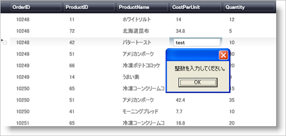

////

|metadata|
{
    "name": "xamdatapresenter-validating-edited-cell-data-in-xamdatapresenter",
    "controlName": ["xamDataPresenter"],
    "tags": ["How Do I","Validation"],
    "guid": "{A9F87008-0061-48A6-BB93-BDE36C13BD00}",  
    "buildFlags": [],
    "createdOn": "2012-01-30T19:39:53.3530237Z"
}
|metadata|
////

= xamDataPresenter で編集したセル データを検証

データ入力アプリケーションの開発の一般的なタスクは、検証ロジックを実装することです。検証ロジックは、エンドユーザーの入力が有効なデータかどうかをテストします。xamDataPresenter コントロールは、エンドユーザーがセルの編集を終了した時に link:{ApiPlatform}datapresenter{ApiVersion}~infragistics.windows.datapresenter.datapresenterbase~editmodeending_ev.html[EditModeEnding] イベントを発生させます。このイベントは、固有のカスタムのデータ検証ロジックを挿入して、検証が失敗した場合にセル編集をキャンセルする機会を提供します。

以下の手順に従って、セルの編集されたコンテンツを Integer として解析できることを検証します。

[start=1]
. コードの記述を開始する前にコード ビハインドに using/Imports のディレクティブを配置します。そうすれば、メンバーは完全に記述された名前を常にタイプする必要がなくなります。

*Visual Basic の場合:*

----
Imports Infragistics.Windows.DataPresenter.Events
----

*C# の場合:*

----
using Infragistics.Windows.DataPresenter.Events;
----

[start=2]
. EditModeEnding イベントを xamDataPresenter に接続します。

*XAML の場合:*

----
<igDP:XamDataPresenter x:Name="XamDataPresenter1" 
  ...
  EditModeEnding="XamDataPresenter1_EditModeEnding"/>
----

[start=3]
. コード ビハインドでイベント ハンドラ メソッドを作成します。 

*Visual Basic の場合:*

----
Sub XamDataPresenter1_EditModeEnding(ByVal sender As Object, _
  ByVal e As EditModeEndingEventArgs)
End Sub
----

*C# の場合:*

----
void XamDataPresenter1_EditModeEnding(object sender, EditModeEndingEventArgs e)
{
}
----

メソッドが編集されたセル データ固有の情報を含むプロパティを提供する link:{ApiPlatform}datapresenter{ApiVersion}~infragistics.windows.datapresenter.events.editmodeendingeventargs.html[EditModeEndingEventArgs] パラメーターを受け取ることに注意します。
[start=4]
. 検証ロジックをイベント ハンドラーに追加します。セルの編集されたコンテンツが Integer として解析できることを検証します。解析に失敗すると、プログラムは link:{ApiPlatform}datapresenter{ApiVersion}~infragistics.windows.datapresenter.events.editmodeendingeventargs~acceptchanges.html[AcceptChanges] プロパティを使用して変更を拒否し、MessageBox を使用して検証の失敗をエンド ユーザーに通知します。

*Visual Basic の場合:*

----
Sub XamDataPresenter1_EditModeEnding(ByVal sender As Object, _
  ByVal e As EditModeEndingEventArgs)
        ' 有効かどうかを確認するためにデータを検証しようとします。
        Dim value As Integer
        If Not Int32.TryParse(e.Editor.Text, value) Then
                ' 検証が失敗する場合には、変更を拒否します。               
                e.AcceptChanges = False
                MessageBox.Show("Data Validation Failed. Must enter an Integer")
                e.Cancel = True
        End If
End Sub
----

*C# の場合:*

----
void XamDataPresenter1_EditModeEnding(object sender, EditModeEndingEventArgs e)
{            
        // 有効かどうかを確認するためにデータを検証しようとします。
        int value;
        if (!Int32.TryParse(e.Editor.Text, out value))
        {
                // 検証が失敗する場合には、変更を拒否します。               
                e.AcceptChanges = false;
                MessageBox.Show("Data Validation Failed. Must enter an Integer");
                e.Cancel = true;
        }
}
----

[start=5]
. プロジェクトをビルドして実行します。タイプ Integer ではないデータを link:{ApiPlatform}datapresenter{ApiVersion}~infragistics.windows.datapresenter.field.html[Field] に入力すると、MessageBox を使用してプロンプトされます。

== 関連トピック

link:xamdatapresenter-enable-idataerrorinfo-interface-support.html[IDataErrorInfo インターフェイスのサポートを有効にする]

link:xamdatapresenter-validate-data-as-your-end-users-edit-a-cell.html[エンドユーザーがセルを編集するとデータを検証]

link:xamdatapresenter-styling-data-errors.html[データ エラーのスタイリング]