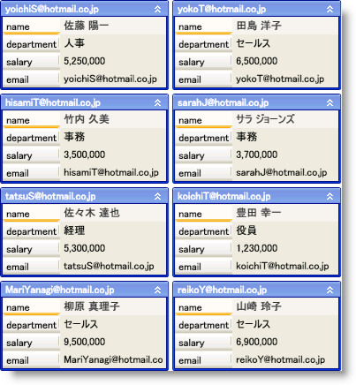

////

|metadata|
{
    "name": "xamdatapresenter-working-with-card-headers",
    "controlName": ["xamDataPresenter"],
    "tags": ["How Do I","Layouts"],
    "guid": "{26B584FE-5F9A-4DA9-848B-2A83C385E38B}",  
    "buildFlags": [],
    "createdOn": "2012-01-30T19:39:53.3770285Z"
}
|metadata|
////

= カード ヘッダーでの作業

xamDataCards™ コントロールは、各カードのヘッダーにプライマリ フィールドの値を自動的に表示します。ただし、デフォルト動作を変更すれば、xamDataCards はヘッダーに異なる値を表示したり、ヘッダー全体を非表示にすることができます。

ヘッダーのプライマリ フィールド以外の値を表示したい場合、 link:{ApiPlatform}datapresenter{ApiVersion}~infragistics.windows.datapresenter.cardviewsettings.html[CardViewSettings] オブジェクトの link:{ApiPlatform}datapresenter{ApiVersion}~infragistics.windows.datapresenter.cardviewsettings~headerpath.html[HeaderPath] プロパティをデータ項目によって公開されているプロパティ名に設定できます。

ヘッダーを非表示にしたい場合、CardViewSettings オブジェクトの link:{ApiPlatform}datapresenter{ApiVersion}~infragistics.windows.datapresenter.cardviewsettings~headervisibility.html[HeaderVisibility] プロパティを Collapsed に設定できます。ただし、ヘッダーを非表示にすると、カードの縮小ボタンおよび空のセルの縮小ボタンは、これらの機能を有効にした場合であっても使用できません。

以下のコード例は、ヘッダー キャプションを設定する方法を示しています。

*XAML の場合:*

----
<igDP:XamDataCards Name="xamDataCards1" BindToSampleData="True"> 
    <igDP:XamDataCards.ViewSettings>
        <igDP:CardViewSettings HeaderPath="email" />
    </igDP:XamDataCards.ViewSettings>
</igDP:XamDataCards>
----

*Visual Basic の場合:*

----
Me.xamDataCards1.ViewSettings.HeaderPath = "email"
----

*C# の場合:*

----
this.xamDataCards1.ViewSettings.HeaderPath = "email";
----

== 関連トピック

link:xamdatapresenter-about-card-settings.html[カード設定について]

link:xamdatapresenter-about-card-sizing.html[カード サイズについて]

link:xamdatapresenter-about-repositioning-animations.html[リポジション アニメーションについて]

link:xamdatapresenter-collapse-a-card.html[カードの縮小]

link:xamdatapresenter-collapse-an-empty-cell.html[空のセルの縮小]

link:xamdatapresenter-set-the-maximum-number-of-viewable-cards.html[表示可能なカードの最大数の設定]

link:xamdatapresenter-set-the-space-between-cards.html[カード間のスペースの設定]