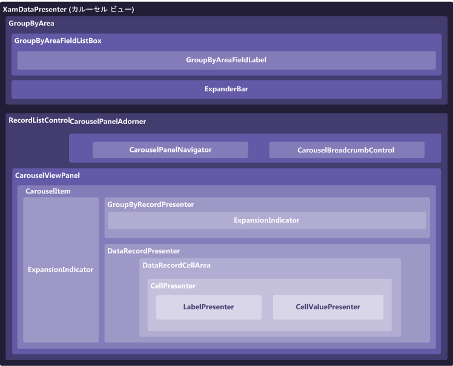

////

|metadata|
{
    "name": "xamdatapresenter-xamdatapresenters-carousel-view-composition-diagram",
    "controlName": ["xamDataPresenter"],
    "tags": ["Getting Started"],
    "guid": "{EBA18409-957E-453D-8169-5A49566D8B8B}",  
    "buildFlags": [],
    "createdOn": "2012-01-30T19:39:53.3550241Z"
}
|metadata|
////

= xamDataPresenter のカルーセル ビューの構成図

xamDataPresenter™ コントロールはさまざまな要素で構成されています。以下の図は、要素の関係を表しています。これによって xamDataPresenter の全体的な構成をより的確に理解できます。

