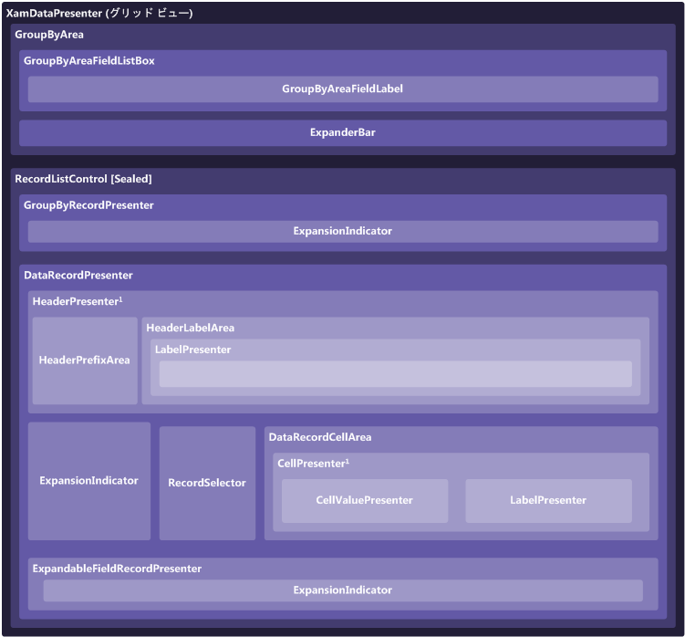

////

|metadata|
{
    "name": "xamdatapresenter-xamdatapresenters-grid-view-composition-diagram",
    "controlName": ["xamDataPresenter"],
    "tags": ["Getting Started"],
    "guid": "{002FB247-5082-4229-984E-F1B2447C6926}",  
    "buildFlags": [],
    "createdOn": "2012-01-30T19:39:53.3580247Z"
}
|metadata|
////

= xamDataPresenter のグリッド ビューの構成図

xamDataPresenter™ コントロールはさまざまな要素で構成されています。以下の図は、要素の関係を表しています。これによって xamDataPresenter の全体的な構成をより的確に理解できます。

____
*1*   ラベルが個別の領域にある場合 (つまり、 link:{ApiPlatform}datapresenter{ApiVersion}~infragistics.windows.datapresenter.headerpresenter.html[HeaderPresenter] がある場合)、 link:{ApiPlatform}datapresenter{ApiVersion}~infragistics.windows.datapresenter.cellpresenter.html[CellPresenter] を持つことができません。代わりに、 link:{ApiPlatform}datapresenter{ApiVersion}~infragistics.windows.datapresenter.cellvaluepresenter.html[CellValuePresenter] が直接 link:{ApiPlatform}datapresenter{ApiVersion}~infragistics.windows.datapresenter.datarecordcellarea.html[DataRecordCellArea] に配置されます。ラベルとセルが link:{ApiPlatform}datapresenter{ApiVersion}~infragistics.windows.datapresenter.fieldlayoutsettings~labellocation.html[FieldLayoutSettings.LabelLocation] プロパティに基づいて一緒になる時に限り、CellPresenter が使用されます。
____