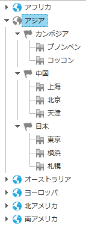

////

|metadata|
{
    "name": "xamdatatree-xamdatatree-node-connectors",
    "controlName": ["xamDataTree"],
    "tags": ["How Do I","Layouts","Styling"],
    "guid": "2b57a82d-1b62-4c1f-8089-927ca6aa14fc",  
    "buildFlags": [],
    "createdOn": "2016-05-25T18:21:54.9111209Z"
}
|metadata|
////

= ノード コネクターの表示状態の構成

xamDataTree™ コントロールのノード コネクター機能は、ツリーの各ノードを接続する線を表示します。ノード コネクターは、それぞれのノードの関係を示します。たとえば、xamDataTree のノードが展開されると、同じ線で接続されるので、xamDataTree コントロールのそれぞれの親ノードを一目で見ることができます。

デフォルトで、ノード コネクターは無効になっています。以下のコードに示すように、xamDataTree コントロールの link:{ApiPlatform}controls.menus.xamdatatree{ApiVersion}~infragistics.controls.menus.xamdatatree~nodelinevisibility.html[NodeLineVisibility] プロパティを Visible に設定して、ノード コネクターを有効にできます。

*XAML の場合:*

----
<ig:XamDataTree x:Name="MyTree" NodeLineVisibility="Visible">
<!-- TODO: Add xamDataTree Items -->
</ig:XamDataTree>
----

*Visual Basic の場合:*

----
MyTree.NodeLineVisibility = Visibility.Visible
----

*C# の場合:*

----
MyTree.NodeLineVisibility = Visibility.Visible;
----

*関連トピック*

link:xamdatatree-xamdatatree-activation.html[アクティブ化]

link:xamdatatree-active-data-item.html[アクティブなデータ アイテムの構成]

link:xamdatatree-xamdatatree-check-boxes.html[チェックボックスの表示状態の構成]

link:xamdatatree-expanded-and-collapsed-xamdatatree-nodes.html[ノードの展開と縮小状態の構成]

link:xamdatatree-xamdatatree-drag-and-drop.html[ドラッグ アンド ドロップの構成]

link:xamdatatree-xamdatatree-editing.html[編集の構成]

link:xamdatatree-xamdatatree-node-layouts.html[ノード レイアウトの構成]

link:xamdatatree-xamdatatree-selection.html[選択]