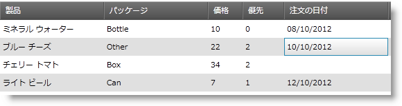

////

|metadata|
{
    "name": "xamdatetimeeditor-using-xamdatetimeeditor-as-a-field-in-xamdatagrid",
    "controlName": ["xamDateTimeEditor"],
    "tags": ["How Do I"],
    "guid": "{C22F8D98-1287-4C5A-A2E6-DE864F9E9C35}",  
    "buildFlags": [],
    "createdOn": "2012-09-05T19:05:30.1529781Z"
}
|metadata|
////

= xamDataGrid でフィールドとして xamDateTimeEditor を使用

xamCurrencyEditor コントロールの重要な機能は、xamDataGrid link:{ApiPlatform}datapresenter{ApiVersion}~infragistics.windows.datapresenter.field.html[フィールド] に組み込むことができることです。この機能によって、セルの値を修正する間にエンドユーザーはエディターの機能を十分に活用することができます。xamDataTimeEditor も日付/時間のマスクを使用して値を書式設定するため、より効果的に視覚化できます。

これらの手順に従って、xamDataGrid の Field に xamDateTimeEditor コントロールを表示します。

[start=1]
. Microsoft® Windows® Presentation Foundation Window または Page プロジェクトを作成します。
[start=2]
. 以下の名前空間宣言を開始の Page タグまたは Window タグに配置します。これらの宣言によって、 xamDataGrid、xamDateTimeEditor を参照してタイプを定義することができます (つまり Int32、Boolean)。

*XAML の場合:*

----
xmlns:igDP="http://infragistics.com/DataPresenter"
xmlns:igEditors="http://infragistics.com/Editors"
xmlns:sys="clr-namespace:System;assembly=mscorlib"
----

[start=3]
. XmlDataProvider を定義するリソース セクションを作成します。XmlDataProvider は link:resources-orders.html[Orders] XML ファイルを参照します。Grid パネル内に以下の XAML を配置します。

*XAML の場合:*

----
<Grid.Resources>
        <XmlDataProvider Source="../Data/Orders.xml" 
          x:Key="OrderData" XPath="/Orders" />
</Grid.Resources>
----

[start=4]
. XamDataGrid のインスタンスを作成して名前を指定し、前述の手順で作成された XmlDataProvider に DataSource プロパティを設定します。

*XAML の場合:*

----
<igDP:XamDataGrid x:Name="XamDataGrid1" 
  DataSource="{Binding Source={StaticResource OrderData}, XPath=Order}">
        ...      
</igDP:XamDataGrid>
----

[start=5]
. link:{ApiPlatform}datapresenter{ApiVersion}~infragistics.windows.datapresenter.fieldlayoutsettings~autogeneratefields.html[FieldLayoutSettings] オブジェクトの link:{ApiPlatform}datapresenter{ApiVersion}~infragistics.windows.datapresenter.fieldlayoutsettings.html[AutoGenerateFields] プロパティを False に設定します。前述の手順で作成されたタグの間に以下の XAML を配置します。

*XAML の場合:*

----
...
<igDP:XamDataGrid.FieldLayoutSettings>
  <igDP:FieldLayoutSettings AutoGenerateFields="False" />
</igDP:XamDataGrid.FieldLayoutSettings>
...
----

[start=6]
. Field のカスタム エディターを定義する時に、そのエディターのスタイルを指定するように link:{ApiPlatform}datapresenter{ApiVersion}~infragistics.windows.datapresenter.fieldsettings~editorstyle.html[EditorStyle] プロパティを設定しなければならない場合があります。これによって、マスクなどのエディターにプロパティを設定することも可能です。以下の XAML は XamDateTimeEditor のインスタンスをターゲットとする Style を設定し、このスタイルを EditorStyle に設定します。エディターの link:{ApiPlatform}editors{ApiVersion}~infragistics.windows.editors.xammaskededitor~mask.html[Mask] プロパティを設定するために setter を使用します。このコードを前述の手順のコードの下に配置します。

[NOTE]
====
*注:* Mask を指定する時には、{} で {...} をエスケープする必要があります。
====

*XAML の場合:*

----
...
<igDP:XamDataGrid.FieldLayouts>
        <igDP:FieldLayout>
                <igDP:FieldLayout.Fields>
                        <igDP:Field Name="ProductName" />
                        <igDP:Field Name="Quantity" />
                        <igDP:Field Name="ShipAndHandle"/>
                        <igDP:Field Name="ShipDate" BindingType="Unbound">
                                <igDP:Field.Settings>
                                        <igDP:FieldSettings 
                                          EditAsType="{x:Type sys:DateTime}">
                                                <igDP:FieldSettings.EditorStyle>
                                                        
                                                </igDP:FieldSettings.EditorStyle>
                                        </igDP:FieldSettings>
                                </igDP:Field.Settings>
                        </igDP:Field>
                </igDP:FieldLayout.Fields>
        </igDP:FieldLayout>
</igDP:XamDataGrid.FieldLayouts>
...
----

[start=7]
. プロジェクトをビルドして実行します。ShipDate フィールドでセルを選択します。xamDateTimeEditor が編集機能を提供するのが分かります。さらに、値を入力し始めて終了およびセルから移動しない場合には、値が無効であることを述べるメッセージ ボックスが表示します。

