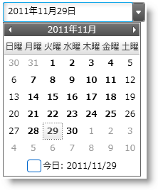
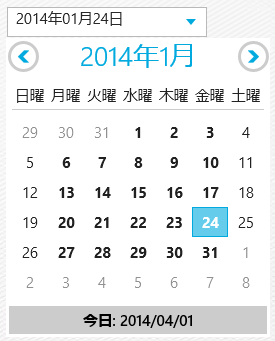

////

|metadata|
{
    "name": "xamdatetimeinput-about",
    "controlName": ["xamInputs"],
    "tags": ["Editing"],
    "guid": "20b3778b-0f10-4b18-8fce-e64c1710550a",  
    "buildFlags": [],
    "createdOn": "2016-05-25T18:21:57.0012222Z"
}
|metadata|
////

{XamDateTimeInputHeader}

= xamDateTimeInput について

xamDateTimeInput コントロールはシンプルなテキスト ボックス コントロールで、マスクを使用して、エンドユーザーが正しいフォーマットで日付/時刻の値を入力する支援します。このマスクを使用して、ユーザーの入力を、事前に決定した有効な日付と時刻の形式に制限することができます。このコントロールはカレンダー ドロップダウンも提供し、そこから日付を選択することができます。link:xamdatetimeinput-using.html[スタンドアロン テキスト ボックスとして] pick:[sl,wpf,win-rt="、または link:xaminputs-using-xaminput-controls-in-xamgrid-cells-for-data-editing.html[xamGrid™ のセル内で]"]  xamDateTimeInput コントロールを使用できます。

ifdef::sl,wpf[]

endif::sl,wpf[]

ifdef::win-rt[]

endif::win-rt[]

== 関連トピック

以下は、その他の役立つトピックです。

* link:xamdatetimeinput-using.html[xamDateTimeInput の使用]
* link:xaminputs-masks.html[マスク]
* link:xaminputs-overview-of-the-valueinput-class.html[ValueInput クラスの概要]
* link:xaminputs-using-xaminput-controls-in-xamgrid-cells-for-data-editing.html[データ編集用の xamGrid セルにおける xamInput コントロールの使用]