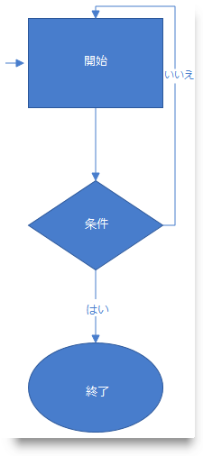
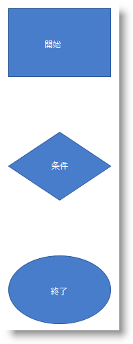
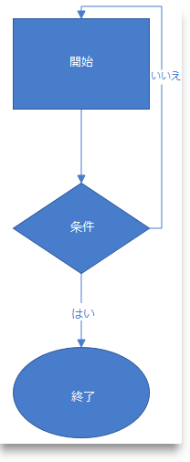

////
|metadata|
{
    "name": "xamdiagram-adding-to-a-page",
    "tags": ["Application Scenarios","Charting","Getting Started","How Do I"],
    "controlName": ["xamDiagram"],
    "guid": "253d0be2-a15b-4370-af61-06649f2050a6",
    "buildFlags": [],
    "createdOn": "2014-03-20T06:34:26.8216382Z"
}
|metadata|
////

= xamDiagram をページに追加

== トピックの概要

=== 目的

このトピックでは、 _xamDiagram_™ コントロールを {PlatformName} アプリケーションに追加する方法を説明します。

=== 前提条件

このトピックを理解するために、以下のトピックを参照することをお勧めします。

[options="header", cols="a,a"]
|====
|トピック|目的

| link:xamdiagram-overview.html[ _xamDiagram_ の概要]
|このグループのトピックでは、 _xamDiagram_ コントロールおよびその機能の概要を説明します。

|====

=== このトピックの内容

このトピックは、以下のセクションで構成されます。

* <<_Ref382754136,xamDiagram の追加 - 概念的な概要>>

** <<_Ref382308317,xamDiagram の追加の概要>>
** <<_Ref382297640,要件>>
** <<_Ref382308328,手順>>

* <<_Ref382754142,xamDiagram の追加 - 例>>

** <<_Ref382308341,概要>>
** <<_Preview,プレビュー>>
** <<_Prerequisites,前提条件>>
** <<_Overview,概要>>
** <<_Ref382308361,手順>>
** <<_Ref382317785,全コード>>

[[_Ref382308311]]

[[_Ref382754136]]
== _xamDiagram_  の追加 - 概念的な概要

[[_Ref382308317]]

=== xamDiagram の追加の概要

_xamDiagram_   コントロールをページに追加するには、コントロールのインスタンスを作成してページのルート要素に追加する必要があります。コントロールは、背景が白になるように事前に構成され、配置されているコンテナーのサイズを測定します。コントロールには、さまざまな形状のノード、および線端をさまざまに構成できる直線および直角折れ線の 2 つのタイプの接続を追加できます。_xamDiagram_   を使用すると、異なるノード間の接続を構成できるだけでなく、スタンドアロン接続を作成して画面の任意の場所に配置できます。

XAML にダイアグラム ノードを追加する場合、ダイアグラム ノードはダイアグラムの link:{ApiPlatform}controls.charts.xamdiagram{ApiVersion}~infragistics.controls.charts.xamdiagram~items.html[Items] コレクションに追加されます。`Items` プロパティには、`ContentPropertyAttribute` のマークが付けられます。

アクティビティ フローを表示している矢印線は、 link:{ApiPlatform}controls.charts.xamdiagram{ApiVersion}~infragistics.controls.charts.diagramconnection_members.html[DiagramConnection] オブジェクトとして構成されます。

[[_Ref382297640]]

=== 要件

以下は、 _xamDiagram_  追加の一般的な要件です。

* NuGet パッケージの参照:

** Infragistics.WPF.Diagram

NuGet フィードのセットアップと NuGet パッケージの追加の詳細については、link:nuget-feeds.html[NuGet フィード] ドキュメントを参照してください。

* 名前空間:

** Infragistics® 名前空間への参照: `(xmlns:ig="http://schemas.infragistics.com/xaml")`

[[_Ref382308328]]

=== 手順

以下は、 _xamDiagram_   を追加する一般的な手順です。

[start=1]
. *xamDiagram コントロールの追加* 
[start=2]
. *ノードの追加* 
[start=3]
. *接続の追加* 

[[_Ref382308334]]

[[_Ref382754142]]
== _xamDiagram_  の追加 - 例

[[_Ref382308341]]

=== 概要

以下の手順で、 _xamDiagram_   コントロールのインスタンスを作成し、それを WPF アプリケーションに追加します。次に処理の開始、終了、条件を表す 3 つのノード (長方形、菱形、楕円) でダイアグラム構造を構成して追加します。

ノードは 2 つの直線、および方向が直角に変化する 1 つの直角折れ線によって接続されます (<<_Preview,プレビュー>>表示内の No オプション)。

アクティビティ フローのエントリ ポイントは、スタンドアロン接続で示されます。

[[_Preview]]

=== プレビュー

以下のスクリーンショットは最終結果のプレビューです。

[[_Prerequisites]]

=== 前提条件

この手順を実行するには、以下が必要です。

* ページがある Microsoft® Visual Studio® WPF プロジェクト
* プロジェクトに追加した必要なアッセンブリ参照および名前空間 (<<_Ref382297640,要件>>を参照)

[[_Overview]]

=== 概要

以下はプロセスの概要です。

*1. _xamDiagram_  コントロールの追加*

*2.ノードの追加*

*3.ノード間の接続の追加*

*4.スタンドアロン接続の追加*

[[_Ref382308361]]

=== 手順

以下のステップでは、 _xamDiagram_   をページに追加する方法を示します。

=== 1.xamDiagram コントロールの追加

**  _xamDiagram_    *宣言をページのルート*  `Grid`  *要素に追加します。次に、任意の*  `Height`  *および*  `Width` を設定します。

*XAML の場合:*

[source,XAML]
---- 
<ig:XamDiagram x:Name="diagram"
            Width="700"
            Height="700">
</ig:XamDiagram>
----

この宣言は、コントロールのデフォルト背景色が白で、表示されるパーツがない空白のダイアグラムのインスタンスを作成します。そのため、追加で構成を行う必要があります。

=== 2.ノードの追加

** link:{ApiPlatform}controls.charts.xamdiagram{ApiVersion}~infragistics.controls.charts.diagramnode_members.html[DiagramNode]  *オブジェクトを構成して、*  _xamDiagram_    *コントロール* に追加するには、ダイアグラムの link:{ApiPlatform}controls.charts.xamdiagram{ApiVersion}~infragistics.controls.charts.xamdiagram~items.html[Items] コレクションにノードを追加します。`Items` プロパティには、`ContentPropertyAttribute` のマークが付けられます。

この手順例では、形状の異なる 3 つのノードを作成します。 *1.長方形のノードを作成します。* 

`Height` が `100px`、 _Width_   が `150px` の長方形のノードを作成し ( _DiagramNode_   の link:{ApiPlatform}controls.charts.xamdiagram{ApiVersion}~infragistics.controls.charts.diagramnode~shapetype.html[ShapeType] プロパティが明示的に指定されていない場合、使用するノード タイプは  _"Rectangle"_   になります)、その link:{ApiPlatform}controls.charts.xamdiagram{ApiVersion}~infragistics.controls.charts.diagramitem~content.html[Content] を  _"Start"_   に、ダイアグラム上の link:{ApiPlatform}controls.charts.xamdiagram{ApiVersion}~infragistics.controls.charts.diagramnode~position.html[Position] を  _(200, 20)_   に設定します。

ノードへ、またはノードから接続が追加できるように、`Key` プロパティを文字列識別子に設定します。

*XAML の場合:*

[source,XAML]
---- 
<ig:DiagramNode Key="node1"
            Content="Start"
            Height="100"
            Width="150"
            Position="200,20"/>
----

*2.菱形のノードを作成します。*

`Height` が `100px`、 _Width_   が `150px` の菱形のノードを作成し ( _DiagramNode_   の link:{ApiPlatform}controls.charts.xamdiagram{ApiVersion}~infragistics.controls.charts.diagramnode~shapetype.html[ShapeType] プロパティを  _"Rhombus"_   に設定します)、その `Content` を  _"Condition"_   に、ダイアグラム上の `Position` を  _(200, 200)_   に設定します (この菱形は、手順 2.1 で作成した長方形の下に配置されます)。

*XAML の場合:*

[source,XAML]
---- 
<ig:DiagramNode Key="node2"
            Content="Condition"
            Height="100"
            Width="150"
            ShapeType="Rhombus"
            Position="200,200"/>
----

*3.楕円形のノードを作成します。*

`Height` が `100px`、 _Width_   が `150px` の楕円形のノードを作成し ( _DiagramNode_   の link:{ApiPlatform}controls.charts.xamdiagram{ApiVersion}~infragistics.controls.charts.diagramnode~shapetype.html[ShapeType] プロパティを  _"Ellipse"_   に設定します)、その `Content` を  _"End"_   に、ダイアグラム上の `Position` を  _(200, 380)_   に設定します (この楕円は、2.2 で作成した菱形の下に配置されます)。

*XAML の場合:*

[source,XAML]
---- 
<ig:DiagramNode Key="node3"
            Content="End"
            Height="100"
            Width="150"
            ShapeType="Ellipse"
            Position="200,380"/>
----

*4.これら 3 つのノードを  _xamDiagram_   コントロールに追加します。*
*XAML の場合:*
[source,XAML]
---- 
<ig:XamDiagram x:Name="diagram"
                        Width="700"
                        Height="700">
            <ig:DiagramNode Key="node1".../>
            <ig:DiagramNode Key="node2".../>
            <ig:DiagramNode Key="node3".../>
</ig:XamDiagram>
----

以下のスクリーンショットは、この時点でのダイアグラムのプレビューです。

=== 3.接続の追加

*1.* link:{ApiPlatform}controls.charts.xamdiagram{ApiVersion}~infragistics.controls.charts.diagramconnection_members.html[DiagramConnection] オブジェクトの link:{ApiPlatform}controls.charts.xamdiagram{ApiVersion}~infragistics.controls.charts.diagramconnection~startnodekey.html[StartNodeKey] および link:{ApiPlatform}controls.charts.xamdiagram{ApiVersion}~infragistics.controls.charts.diagramconnection~endnodekey.html[EndNodeKey] プロパティを接続対象のノードに設定して、 *ノード間に接続を追加します*

この手順例では、線端が矢印のダイアグラム接続を 3 つ作成します。

** A. 線端が矢印の直線接続を、開始ノードと条件ノードの間に作成します。

そのためには、接続の link:{ApiPlatform}controls.charts.xamdiagram{ApiVersion}~infragistics.controls.charts.diagramconnection~startnodekey.html[StartNodeKey] プロパティを  _"node1"_   に、 link:{ApiPlatform}controls.charts.xamdiagram{ApiVersion}~infragistics.controls.charts.diagramconnection~endnodekey.html[EndNodeKey] プロパティを  _"node2"_   に設定します。デフォルトでは、接続の線端は塗りつぶされた矢印であるため (link:{ApiPlatform}controls.charts.xamdiagram{ApiVersion}~infragistics.controls.charts.diagramconnection~endcaptype.html[EndCapType]= _"_   _FilledArrow_   _"_  )、直角折れ線であるこのプロパティのデフォルト設定をオーバーライドするには、この接続の link:{ApiPlatform}controls.charts.xamdiagram{ApiVersion}~infragistics.controls.charts.diagramconnection~connectiontype.html[ConnectionType] を「StraightLine」に設定する必要があります。

*XAML の場合:*

[source,XAML]
---- 
<ig:DiagramConnection Name="conn12"
                         StartNodeKey="node1"
                         EndNodeKey="node2"
                         ConnectionType="Straight"/>
----

** B. 線端が矢印の直線接続を、条件ノードと終了ノードの間に作成します。

`StartNodeKey` プロパティ、`EndNodeKey` プロパティ、および `ConnectionType` プロパティをそれぞれ手順 3.1.A. と同様に設定します。アクティビティ フローの例に終了するケースを設定するには、 link:{ApiPlatform}controls.charts.xamdiagram{ApiVersion}~infragistics.controls.charts.diagramitem~content.html[Content] プロパティを「 _Yes_  」に設定します。

*XAML の場合:*

[source,XAML]
---- 
<ig:DiagramConnection Name="conn23"
                         StartNodeKey="node2"
                         EndNodeKey="node3"
                         ConnectionType="Straight"
                         Content="Yes"/>
----

 

** C. 線端が矢印の直角折れ線接続を、開始ノードと条件ノードの間に作成します。

この接続は、アクティビティ図内でループする場合を表します。この `Content` プロパティ 「 _No_  」に設定します。(`ConnectionType` プロパティの既定値は「 __   _RightAngle_   __  」であるため、接続のタイプはこれ以上構成しません。)

** D. 接続が開始および終了する、ノード上の正確な位置を指定します。

接続のコネクタ ポイントを、 link:{ApiPlatform}controls.charts.xamdiagram{ApiVersion}~infragistics.controls.charts.diagramconnection~startnodeconnectionpointname.html[StartNodeConnectionPointName] および link:{ApiPlatform}controls.charts.xamdiagram{ApiVersion}~infragistics.controls.charts.diagramconnection~endnodeconnectionpointname.html[EndNodeConnectionPointName] プロパティを設定して指定します。基本的に、これらのプロパティをそれぞれ「 _Right_  」と 「 _Top_  」に設定すると、「 _node2_  」の最も右にあるコネクタ ポイントから始まり「 _node1_  」の最も上にあるコネクタ ポイントで終わる接続が引かれます (コネクタ ポイントの詳細は、 link:xamdiagram-overview.html[ _xamDiagram_  の概要]を参照してください)。

*XAML の場合:*

[source,XAML]
----
 <ig:DiagramConnection Name="conn21"
                       StartNodeKey="node2"
                       EndNodeKey="node1"
                       StartNodeConnectionPointName="Right"
                       EndNodeConnectionPointName="Top"
                       Content="No"/>
----

** E. 接続をダイアグラムに追加します。

*XAML の場合:*

[source,XAML]
---- 
<ig:XamDiagram x:Name="diagram"
                Width="700"
                Height="700">
   ...
    <ig:DiagramConnection Name="conn12".../>
    <ig:DiagramConnection Name="conn23".../>
    <ig:DiagramConnection Name="conn21".../>
</ig:XamDiagram>
----

以下のスクリーンショットは、この時点でのダイアグラムのプレビューです。

*2. _(オプション)_ スタンドアロン接続を追加します。*

この手順例では、アクティビティ フロー ダイアグラムのエントリ ポイントとなる接続を構成する必要があります。

** A. 接続を作成して、その link:{ApiPlatform}controls.charts.xamdiagram{ApiVersion}~infragistics.controls.charts.diagramconnection~startposition.html[StartPosition] と link:{ApiPlatform}controls.charts.xamdiagram{ApiVersion}~infragistics.controls.charts.diagramconnection~endposition.html[EndPosition] をそれぞれ  _(175, 70)_  、 _(195, 70)_   に設定します。

*XAML の場合:*

[source,XAML]
---- 
<ig:DiagramConnection Name="connStart"
                      StartPosition="175,70"
                      EndPosition="195,70"/>
----

** B. 接続をダイアグラムに追加します。

*XAML の場合:*

[source,XAML]
---- 
<ig:XamDiagram x:Name="diagram"
               Width="700"
               Height="700">
               ...
    <ig:DiagramConnection Name="connStart"
                       StartPosition="175,70"
                       EndPosition="195,70"/>
</ig:XamDiagram>
----

=== 4.(オプション) 結果を確認します。

結果を確認するには、プロジェクトを保存してビルドします。ダイアグラムは、<<_Preview,プレビュー>>に表示される状態になっているはずです。

[[_Ref382317785]]

=== 全コード

以下は、この手順の完全なコードです。

[source,XAML]
---- 
<ig:XamDiagram xmlns:ig="http://schemas.infragistics.com/xaml" x:Name="diagram"
                    Width="700"
                    Height="700">
    <ig:DiagramNode Key="node1"
                    Content="Start"
                    Height="100"
                    Width="150"
                    Position="200,20"/>
    <ig:DiagramNode Key="node2"
                    Content="Condition"
                    Height="100"
                    Width="150"
                    ShapeType="Rhombus"
                    Position="200,200"/>
    <ig:DiagramNode Key="node3"
                    Content="End"
                    Height="100"
                    Width="150"
                    ShapeType="Ellipse"
                    Position="200,380"/>
    <ig:DiagramConnection Name="conn12"
                        StartNodeKey="node1"
                        EndNodeKey="node2"
                        ConnectionType="Straight"/>
    <ig:DiagramConnection Name="conn23"
                        StartNodeKey="node2"
                        EndNodeKey="node3"
                        ConnectionType="Straight"
                        Content="Yes"/>
    <ig:DiagramConnection Name="conn21"
                        StartNodeKey="node2"
                        EndNodeKey="node1"
                        StartNodeConnectionPointName="Right"
                        EndNodeConnectionPointName="Top"
                        Content="No"/>
    <ig:DiagramConnection Name="connStart"
                        StartPosition="175,70"
                        EndPosition="195,70"/>
</ig:XamDiagram>
----