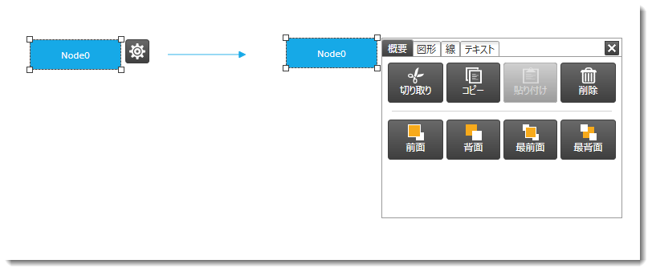
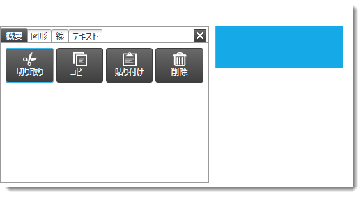
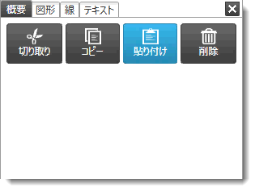
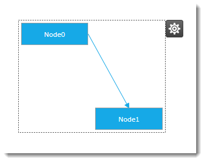

////

|metadata|
{
    "name": "xamdiagram-configuring-the-context-menu",
    "tags": ["Charting","How Do I"],
    "controlName": ["xamDiagram"],
    "guid": "dfd4a592-95cf-4d87-94b3-5d81b5ded547",  
    "buildFlags": [],
    "createdOn": "2014-06-16T09:39:19.1908682Z"
}
|metadata|
////

= コンテキスト メニューの構成 (xamDiagram)

== トピックの概要

=== 目的

このトピックでは、 _xamDiagram_™ コントロールが提供するコンテキスト メニューを使用する方法を説明します。

=== 前提条件

このトピックをより理解するために、以下のトピックを参照することをお勧めします。

[options="header", cols="a,a"]
|====
|トピック|目的

| link:xamdiagram-general-overview.html[概要 ( _xamDiagram_ )]
|このトピックでは、 _xamDiagram_ コントロールおよびその主要機能の概念的な概要を説明します。

| link:xamdiagram-adding-to-a-page.html[ _xamDiagram_ をページに追加]
|このトピックでは、 _xamDiagram_ コントロールを {PlatformName} アプリケーションに追加する方法を説明します。

|====

=== このトピックの内容

このトピックは、以下のセクションで構成されます。

*  *<<_Ref389563895,概要>>*

** <<_Ref386534590,コンテキスト メニュー構成の概要>>
** <<_Ref385408391,コンテキスト メニュー構成の概要表>>

*  *<<_ConfiguringOptionsPaneVisibility,オプション ペインの表示の構成>>*

** <<_Ref385408401,概要>>
** <<_PropertySettings1,プロパティ設定>>
** <<_Ref389558458,例>>

*  *<<_Ref389311986,オプション ペインの配置の構成>>*

** <<_Ref389311991,概要>>
** <<_Ref389311996,プロパティ設定>>
** <<_Ref389312001,例>>

*  *<<_Ref389058162,オプション ペインでのダイアグラム項目の構成可能な要素>>*

** <<_Ref389058167,オプション ペインでのコピー / 貼り付け操作>>
** <<_Ref389058170,オプション ペインでのダイアグラム ノードの構成可能な要素>>
** <<_Ref389058175,オプション ペインでのダイアグラム接続の構成可能な要素>>
** <<_Ref389058178,オプション ペインでのダイアグラム項目の構成可能な要素>>

*  *<<_Ref389058182,関連コンテンツ>>*

** <<_Ref385408435,トピック>>

[[_Ref389563895]]
== 概要

[[_Ref386534590]]

=== コンテキスト メニュー構成の概要

_xamDiagram_   コントロールのダイアグラムの項目は、コントロールのコンテキスト メニューの機能を使用して構成できます。コンテキスト メニューはオプション ペインで表示することができます。ダイアグラムの項目 (複数可) を選択すると表示されるギア アイコンをクリックすると、オプション ペインが表示されます。デフォルトでは、コンテキスト メニューはダイアグラムで無効になっています。

オプション ペインの配置は、選択された項目 (複数可) と対応させて構成することができます。これにより、左利きのユーザーと右利きのユーザーのどちらにも、ダイアグラム項目の構成で最高のユーザー エクスペリエンスを提供できます。ダイアグラムでは、利き手に関するシステム設定を読み込む定義済み機能が提供されます。これによって、ユーザーにとって最も便利な場所にメニューが表示されます。「利き手」の設定とは、右左のどちらの手を使用して文字を書くかに応じて、メニューを表示させる位置を指定します。左利きの場合はメニューが右側に表示され、右利きの場合はメニューが左側に表示されます。利き手の設定は、「Tablet PC 設定」メニューからアクセスできます。詳細は、MSDN の利き手に関する記事を参照してください。デフォルトでは、オプション ペインは項目の右側に表示されます。

オプション ペインは、 link:{ApiPlatform}controls.charts.xamdiagram{ApiVersion}~infragistics.controls.charts.diagramcommands~showoptionspane.html[ShowOptionsPane] コマンドおよび link:{ApiPlatform}controls.charts.xamdiagram{ApiVersion}~infragistics.controls.charts.diagramcommands~closeoptionspane.html[CloseOptionsPane] コマンドを使用したプログラムによる操作でも、開いたり閉じたりできます。( _xamDiagram_   で使用するコマンドの詳細は、  link:xamdiagram-configuring-ui-elements-with-commands.html[コマンドを使用した UI 要素の構成]を参照してください。)

塗りつぶし、サイズ、フォント ファミリなどダイアグラムの項目のさまざまなプロパティは、オプション ペインを使用して構成できます。これらのプロパティは、適用できるオブジェクトのタイプに基づき _図形_  、 _パス_  、 _線_  など関連するセクションに論理的にグループ化されます。コピー / 貼り付け操作 (コピー、貼り付け、削除など) のコマンドも、UI とのインタラクションによって呼び出すことができます。これらのオプションは、 _全般_  タブに配置されます。(構成可能な要素および操作の詳細は、<<_Ref389058162,オプション ペインでのダイアグラム項目の構成可能な要素>>を参照してください。)

ダイアグラムのオプション ペインは、ダイアグラムの外側に配置することもできます。この場合、 link:{ApiPlatform}controls.charts.xamdiagram{ApiVersion}~infragistics.controls.charts.primitives.diagramoptionspane_members.html[DiagramOptionsPane] インスタンスは、 link:{ApiPlatform}controls.charts.xamdiagram{ApiVersion}~infragistics.controls.charts.primitives.diagramoptionspane~diagram.html[DiagramOptionsPane.Diagram] プロパティにダイアグラムを値として指定して、オプション ペインが属するダイアグラムを示す必要があります。

オプション ペインの外観は、コントロールのテンプレートをオーバーライドすることでカスタマイズできます。コンテキスト メニューの (オプション ペインとは異なる) 別の実装を作成するために、 _xamDiagram_   は link:{ApiPlatform}controls.charts.xamdiagram{ApiVersion}~infragistics.controls.charts.primitives.diagramoptionspanedatacontext_members.html[DiagramOptionsPaneDataContext] クラスを公開します。

[[_Ref385408391]]

=== コンテキスト メニュー構成の概要表

以下の表は、ダイアグラムのコンテキスト メニューに関連して構成可能な項目を簡単に説明し、それらを構成するプロパティにマップします。

[options="header", cols="a,a,a"]
|====
|構成可能な項目|詳細|プロパティ

|[[_Hlk356484826]] 

可視性
|コンテキスト メニューを表示または非表示にする機能
|
* link:{ApiPlatform}controls.charts.xamdiagram{ApiVersion}~infragistics.controls.charts.xamdiagram~optionspanevisibility.html[OptionsPaneVisibility] 

|配置
|ダイアグラム項目に対応するオプション ペインの配置
|
* link:{ApiPlatform}controls.charts.xamdiagram{ApiVersion}~infragistics.controls.charts.xamdiagram~optionspaneplacement.html[OptionsPanePlacement] 

|====

[[_ConfiguringOptionsPaneVisibility]]
== オプション ペインの表示の構成

[[_Ref385408401]]

=== 概要

オプション ペインの可視性 (オプション ペインを表示する機能) は、プロパティ設定によって制御されます。マウスのクリックでオプション ペインを表示するギア アイコン (image:images/xamDiagram_Configuring_the_Context_Menu_2.png[]) を可視化するかどうかを指定できます。

=== プロパティ設定

以下の表は、任意の構成とそれを管理するプロパティ設定のマップを示します。

[options="header", cols="a,a,a"]
|====
|目的:|使用するプロパティ:|設定値:

|オプション ペインの可視性の構成
| link:{ApiPlatform}controls.charts.xamdiagram{ApiVersion}~infragistics.controls.charts.xamdiagram~optionspanevisibility.html[OptionsPaneVisibility]
|目的の効果に応じたプロパティ: 

* _Visible_ 

* _Hidden_ 

* _Collapsed_ 

|====

[[_Ref389558458]]

=== 例

以下のスクリーンショットは、以下の設定の結果、オプション ペインの構成がどのように表示されるかを示します。

[options="header", cols="a,a"]
|====
|プロパティ|値

| link:{ApiPlatform}controls.charts.xamdiagram{ApiVersion}~infragistics.controls.charts.xamdiagram~optionspanevisibility.html[OptionsPaneVisibility]
| _Visible_ 

|====

image::images/xamDiagram_Configuring_the_Context_Menu_3.png[]

以下のコードはこの例を実装します。

*XAML の場合:*

[source,xaml]
----
<ig:XamDiagram x:Name="diagram"
               Width="300"
               Height="250"
               Background="#F9F9F9"
               OptionsPaneVisibility=”Visible”>
    <ig:DiagramNode Position="5,125"/>
</ig:XamDiagram>
----

[[_Ref389311986]]
[[_Ref389058162]]
[[_Ref385408430]]
== オプション ペインの配置の構成

[[_Ref389311991]]

=== 概要

_xamDiagram_   コントロールは、選択された項目 (複数可) に対応し、オプション ペインの配置を指定する機能を提供します。

[[_Ref389311996]]

=== プロパティ設定

以下の表は、任意の構成とそれを管理するプロパティ設定のマップを示します。

[options="header", cols="a,a,a"]
|====
|目的:|使用するプロパティ:|設定値:

|オプション ペインの配置の構成
| link:{ApiPlatform}controls.charts.xamdiagram{ApiVersion}~infragistics.controls.charts.xamdiagram~optionspaneplacement.html[OptionsPanePlacement]
|
* _「Left」_ - オプション ペインは選択された項目の左側に表示されます。 

* _「Right」_ - オプション ペインは選択された項目の右側に表示されます。 

* _「Auto」_ -ユーザーの利き手に関するシステム設定を読み込み、各値をプロパティに適用します (戻り値が「左」の場合は、オプション ペインは選択された項目の右側に配置されます)。 

* _「ReverseAuto」_ -ユーザーの利き手に関するシステム設定を読み込み、変換値を適用します (戻り値が「left」の場合は、オプション ペインは選択された項目の左側に配置されます)。 

|====

[[_Ref389312001]]

=== 例

以下のスクリーンショットは、以下の設定の結果のオプション ペインの配置を示します。

[options="header", cols="a,a"]
|====
|プロパティ|値

| link:{ApiPlatform}controls.charts.xamdiagram{ApiVersion}~infragistics.controls.charts.xamdiagram~optionspaneplacement.html[OptionsPanePlacement]
| _Left_ 

|====

以下のコードはこの例を実装します。

*XAML の場合:*

[source,xaml]
----
<ig:XamDiagram x:Name="diagram"
               Width="330"
               Height="300"
               Background="#F9F9F9"
               OptionsPaneVisibility=”Visible”
               OptionsPanePlacement="Left">
    <ig:DiagramNode Position="200,100"/>
</ig:XamDiagram>
----

== オプション ペインでのダイアグラム項目の構成可能な要素

[[_Ref389058167]]

=== オプション ペインでのコピー / 貼り付け操作

オプション ペインを使用して呼び出すことができるコピー / 貼り付け操作は、ノード、接続またはその組み合わせの構成にタブを使用するかどうかにかかわらず、最初の「 _全般_  」タブに表示されます。ボタンには、各ボタンで制御される操作が記述されています。

[[_Ref389058170]]

=== オプション ペインでのダイアグラム ノードの構成可能な要素

以下の表は、オプション ペインで使用できるダイアグラム ノードの構成可能なオプションを示します。

[cols="a,a"]
|====
|図形
|image::images/xamDiagram_Configuring_the_Context_Menu_6.png[]

|折れ線チャート
|image::images/xamDiagram_Configuring_the_Context_Menu_7.png[]

|テキスト
|image::images/xamDiagram_Configuring_the_Context_Menu_8.png[]

|====

[[_Ref389058175]]

=== オプション ペインでのダイアグラム接続の構成可能な要素

以下の表は、オプション ペインで使用できるダイアグラム接続の構成可能なオプションを示しています。

[cols="a,a"]
|====
|図形
|image::images/xamDiagram_Configuring_the_Context_Menu_9.png[]

|折れ線チャート
|image::images/xamDiagram_Configuring_the_Context_Menu_10.png[]

|テキスト
|image::images/xamDiagram_Configuring_the_Context_Menu_11.png[]

|====

[[_Ref389058178]]

=== オプション ペインでのダイアグラム項目の構成可能な要素

コンテキスト メニューは、ダイアグラムのノードおよび接続のプロパティの構成に使用します。そのため、ノードと接続の両方を含むダイアグラムで選択されると、オプション ペインにはダイアグラムの項目に共通するプロパティのみが表示されます。

以下の表は、オプション ペインで使用できるダイアグラム項目が混在した選択の構成可能なオプションを示します。

[cols="a,a"]
|====
|図形
|image::images/xamDiagram_Configuring_the_Context_Menu_13.png[]

|折れ線チャート
|image::images/xamDiagram_Configuring_the_Context_Menu_14.png[]

|テキスト
|image::images/xamDiagram_Configuring_the_Context_Menu_15.png[]

|====

[[_Ref389058182]]
== 関連コンテンツ

[[_Ref385408435]]

=== トピック

このトピックの追加情報については、以下のトピックも合わせてご参照ください。

[options="header", cols="a,a"]
|====
|トピック|目的

| link:xamdiagram-user-interactions-configuration-overview.html[ユーザー インタラクションの構成の概要 ( _xamDiagram_ )]
|このトピックでは、 _xamDiagram_ コントロールで実行されるユーザー インタラクションのすべてのタスクの概要を説明します。

| link:xamdiagram-configuring-keyboard-shortcuts.html[キーボード ショートカットの構成 ( _xamDiagram_ )]
|このトピックでは、 _xamDiagram_ コントロールが提供するコマンドを使用する方法、およびコマンドに関連付けられたキーボードのショートカットを変更する方法を説明します。

|====

=== リソース

以下に、このトピックに関連する追加情報を示します (Infragistics® のコンテンツ ファミリー以外にも使用できます)。

[options="header", cols="a,a"]
|====
|タイトル|目的

| link:http://msdn.microsoft.com/ja-jp/library/ms819495.aspx[左利きと右利き]
|利き手の概念に関する情報を提供する MSDN の記事です。

|====