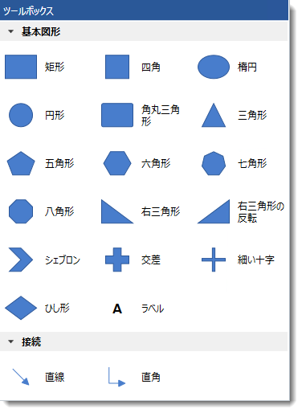
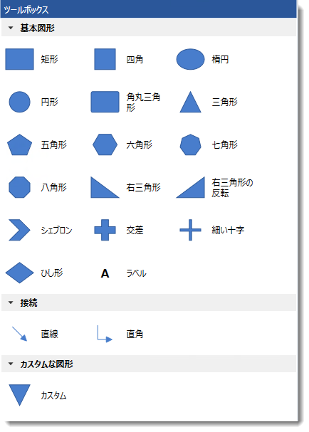

////

|metadata|
{
    "name": "xamdiagram-configuring-the-toolbox",
    "tags": ["Application Scenarios","Charting","How Do I"],
    "controlName": ["xamDiagram"],
    "guid": "7f67b9a4-137b-42ff-b37b-e631bd384e97",  
    "buildFlags": [],
    "createdOn": "2014-06-16T09:41:07.107889Z"
}
|metadata|
////

= ツールボックスの構成 (xamDiagram)

== トピックの概要

=== 目的

このトピックでは、 _xamDiagram_™ のダイアグラム ツールボックスの構成方法と使用方法について説明します。

=== 前提条件

このトピックをより理解するために、以下のトピックを参照することをお勧めします。

[options="header", cols="a,a"]
|====
|トピック|目的

| link:xamdiagram-general-overview.html[概要 ( _xamDiagram_ )]
|このトピックでは、 _xamDiagram_ コントロールおよびその主要機能の概念的な概要を説明します。

| link:xamdiagram-adding-to-a-page.html[ _xamDiagram_ をページに追加]
|このトピックでは、 _xamDiagram_ コントロールを {PlatformName} アプリケーションに追加する方法を説明します。

|====

=== このトピックの内容

このトピックは、以下のセクションで構成されます。

* <<_Ref389563895, 概要 >>

** <<_Ref386534590,ツールボックスの構成の概要>>
** <<_Ref385408391,ツールボックスの構成の概要表>>

* <<_Ref390245325, ツールボックスのカテゴリの拡張 >>

** <<_Ref385408401,概要>>
** <<_PropertySettings,プロパティ設定>>
** <<_Ref389558458,例>>

* <<_Ref385408430, 関連コンテンツ >>

** <<_Ref385408435,トピック>>

[[_Ref389563895]]
== 概要

[[_Ref386534590]]

=== ツールボックスの構成の概要

_xamDiagram_   コントロールは、定義済みの図形セットから直接ダイアグラム領域にダイアグラム項目をドラッグ アンド ドロップできる機能を提供します。この機能は、 _xamDiagramToolbox_   コントロールにより提供されます。デフォルトでは、2 つの事前構成済みの図形カテゴリ (ラベルを表すノードなど、現在サポートされているすべてのダイアグラム ノード タイプ、および 2 つのタイプのダイアグラム接続を含む  _Basic Shapes_   と  _Connections_  ) があります。

ダイアグラムのツールボックスの図形カテゴリは、オーバーライドまたは拡張できます。ツールボックスに表示された図形のデフォルト サイズは  _30, 30_   または  _30, 40_   (ピクセル単位で幅、高さ) で、図形のタイプに応じて異なります。

ツールボックスは、アプリケーション関連のロジックの実装に使用できる、 link:{ApiPlatform}controls.charts.xamdiagram{ApiVersion}~infragistics.controls.charts.xamdiagramtoolbox~categoryadding_ev.html[CategoryAdding] と link:{ApiPlatform}controls.charts.xamdiagram{ApiVersion}~infragistics.controls.charts.xamdiagramtoolbox~categoryadded_ev.html[CategoryAdded] の 2 つのイベントを公開します。

[[_Ref385408391]]

=== ツールボックスの構成の概要表

以下の表は、ダイアグラムのツールボックスの構成可能な要素を簡単に説明し、それらを構成するプロパティにマップします。

[options="header", cols="a,a,a"]
|====
|構成可能な項目|詳細|プロパティ/イベント

|[[_Hlk356484826]] 

ヘッダー
|ヘッダーはツールボックスのカテゴリの上に表示され、表示状態、背景や前景などの視覚要素での構成、または `Header` プロパティを使用して完全なオーバーライドができます。
|
* link:{ApiPlatform}controls.charts.xamdiagram{ApiVersion}~infragistics.controls.charts.xamdiagramtoolbox~header.html[Header] 

* link:{ApiPlatform}controls.charts.xamdiagram{ApiVersion}~infragistics.controls.charts.xamdiagramtoolbox~headerbackground.html[HeaderBackground] 

* link:{ApiPlatform}controls.charts.xamdiagram{ApiVersion}~infragistics.controls.charts.xamdiagramtoolbox~headerborderbrush.html[HeaderBorderBrush] 

* link:{ApiPlatform}controls.charts.xamdiagram{ApiVersion}~infragistics.controls.charts.xamdiagramtoolbox~headerborderthickness.html[HeaderBorderThickness] 

* link:{ApiPlatform}controls.charts.xamdiagram{ApiVersion}~infragistics.controls.charts.xamdiagramtoolbox~headerforeground.html[HeaderForeground] 

* link:{ApiPlatform}controls.charts.xamdiagram{ApiVersion}~infragistics.controls.charts.xamdiagramtoolbox~headervisibility.html[HeaderVisibility] 

|ツールボックスのカテゴリ
|ダイアグラム項目の図形が表示されるカテゴリ。上書きまたは拡張できます。
|
* link:{ApiPlatform}controls.charts.xamdiagram{ApiVersion}~infragistics.controls.charts.xamdiagramtoolbox~categories.html[Categories] 

* link:{ApiPlatform}controls.charts.xamdiagram{ApiVersion}~infragistics.controls.charts.xamdiagramtoolbox~customcategories.html[CustomCategories] 

|ツールボックスの定義済み図形セットのフィルタリング
| link:{ApiPlatform}controls.charts.xamdiagram{ApiVersion}~infragistics.controls.charts.xamdiagramtoolbox~categoryadding_ev.html[CategoryAdding] イベントの処理で、追加操作のキャンセルや、構成済みのカテゴリまたはカスタムで作成したカテゴリで表示する図形のフィルタリングができます。
|
* link:{ApiPlatform}controls.charts.xamdiagram{ApiVersion}~infragistics.controls.charts.xamdiagramtoolbox~categoryadding_ev.html[CategoryAdding] 

|作成済みのカテゴリの変更
| link:{ApiPlatform}controls.charts.xamdiagram{ApiVersion}~infragistics.controls.charts.xamdiagramtoolbox~categoryadded_ev.html[CategoryAdded] イベントの処理で、ビューの縮小など作成されたカテゴリを変更することができます。
|
* link:{ApiPlatform}controls.charts.xamdiagram{ApiVersion}~infragistics.controls.charts.xamdiagramtoolbox~categoryadded_ev.html[CategoryAdded] 

|====

[[_Ref390245325]]
== ツールボックスのカテゴリの拡張

[[_Ref385408401]]

=== 概要

新しいカテゴリをダイアグラムのツールボックスに追加するには、1 つのカテゴリを作成し、 _xamDiagramToolbox_   の `CustomCategories` コレクションに追加する必要があります。link:{ApiPlatform}controls.charts.xamdiagram{ApiVersion}~infragistics.controls.charts.diagramtoolboxitem_members.html[DiagramToolboxItem] クラスのインスタンスを追加して、新しいカテゴリを項目に事前設定する必要があります。これらの項目をツールボックスに適切に表示するには、それらのサイズを明示的に構成する必要があります。以下の例では、ツールボックスの図形の既存のセットに逆三角形を含む新しいカテゴリを追加して、拡張する方法を説明します。

.注:
[NOTE]
====
_xamDiagramToolbox_   コントロールの既存のカテゴリのコレクションをオーバーライドする場合は、新しい link:{ApiPlatform}controls.charts.xamdiagram{ApiVersion}~infragistics.controls.charts.diagramtoolboxcategorycollection_members.html[DiagramToolboxCategoryCollection] インスタンスを作成して、ツールボックスの `Categories` プロパティに割り当てる必要があります。
====

[[_PropertySettings]]

=== プロパティ設定

以下の表は、任意の構成とそれを管理するプロパティ設定のマップを示します。

[options="header", cols="a,a,a"]
|====
|目的:|使用するプロパティ:|設定値:

|ツールボックスに追加する新しいカテゴリの構成
| link:{ApiPlatform}controls.charts.xamdiagram{ApiVersion}~infragistics.controls.charts.xamdiagramtoolbox~customcategories.html[CustomCategories]
| link:{ApiPlatform}controls.charts.xamdiagram{ApiVersion}~infragistics.controls.charts.diagramtoolboxcategorycollection_members.html[DiagramToolboxCategoryCollection] クラスのインスタンス。

|====

[[_Ref389558458]]

=== 例

以下のスクリーンショットは、以下の設定の結果、オプション ペインの構成がどのように表示されるかを示します。

[options="header", cols="a,a"]
|====
|プロパティ|値

| link:{ApiPlatform}controls.charts.xamdiagram{ApiVersion}~infragistics.controls.charts.xamdiagramtoolbox~customcategories.html[CustomCategories]
|*XAML の場合:* 
[source,xaml]
---- 
<ig:DiagramToolboxCategory Name="カスタムな図形"
                           IsExpanded="True">
      <ig:DiagramToolboxCategory.Items>
            <ig:DiagramToolboxItem Title="カスタム">
                  <ig:DiagramToolboxItem.Item>
                                <ig:DiagramNode Width="30" Height="30">
                                    <ig:DiagramNode.ConnectionPoints>
                                        <ig:DiagramConnectionPointCollection>
                                            <ig:DiagramConnectionPoint Name="Point" Point="0.5,0.5" />
                                        </ig:DiagramConnectionPointCollection>
                                    </ig:DiagramNode.ConnectionPoints>
                                    
                                    <ig:DiagramNode.Geometry>
                                        <PathGeometry>
                                            <PathGeometry.Figures>
                                        <PathFigure IsClosed="True" StartPoint="0,0">
                                            <PathFigure.Segments>
                                              <PathSegmentCollection>
                                                <LineSegment Point="100,0" />
                                                <LineSegment Point="50,100" />
                                              </PathSegmentCollection>
                                            </PathFigure.Segments>
                                          </PathFigure>
                                            </PathGeometry.Figures>
                                        </PathGeometry>
                                    </ig:DiagramNode.Geometry>
                                </ig:DiagramNode>
                  </ig:DiagramToolboxItem.Item>
            </ig:DiagramToolboxItem>
      </ig:DiagramToolboxCategory.Items>
</ig:DiagramToolboxCategory>
---- 

|====

以下のコードはこの例を実装します。

*XAML の場合:*
[source,xaml]
----
<ig:XamDiagramToolbox x:Name="Toolbox">
            <ig:XamDiagramToolbox.CustomCategories>
                <ig:DiagramToolboxCategory Name="カスタムな図形"
                                           IsExpanded="True">
                    <ig:DiagramToolboxCategory.Items>
                        <ig:DiagramToolboxItem Title="カスタム">
                            <ig:DiagramToolboxItem.Item>
                                <ig:DiagramNode Width="30" Height="30">
                                    <ig:DiagramNode.ConnectionPoints>
                                        <ig:DiagramConnectionPointCollection>
                                            <ig:DiagramConnectionPoint Name="Point" Point="0.5,0.5" />
                                        </ig:DiagramConnectionPointCollection>
                                    </ig:DiagramNode.ConnectionPoints>
                                    <ig:DiagramNode.Geometry>
                                        <PathGeometry>
                                            <PathGeometry.Figures>
                                        <PathFigure IsClosed="True" StartPoint="0,0">
                                            <PathFigure.Segments>
                                              <PathSegmentCollection>
                                                <LineSegment Point="100,0" />
                                                <LineSegment Point="50,100" />
                                              </PathSegmentCollection>
                                            </PathFigure.Segments>
                                          </PathFigure>
                                            </PathGeometry.Figures>
                                        </PathGeometry>
                                    </ig:DiagramNode.Geometry>
                                </ig:DiagramNode>
                            </ig:DiagramToolboxItem.Item>
                        </ig:DiagramToolboxItem>
                    </ig:DiagramToolboxCategory.Items>
            </ig:DiagramToolboxCategory>
      </ig:XamDiagramToolbox.CustomCategories>
</ig:XamDiagramToolbox>
----

[[_Ref385408430]]
[[_Ref389058182]]
== 関連コンテンツ

[[_Ref385408435]]

=== トピック

以下のトピックでは、このトピックに関連する追加情報を提供しています。

[options="header", cols="a,a"]
|====
|トピック|目的

| link:xamdiagram-user-interactions-configuration-overview.html[ユーザー インタラクションの構成の概要 ( _xamDiagram_ )]
|このトピックでは、 _xamDiagram_ コントロールで実行されるユーザー インタラクションのすべてのタスクの概要を説明します。

|====