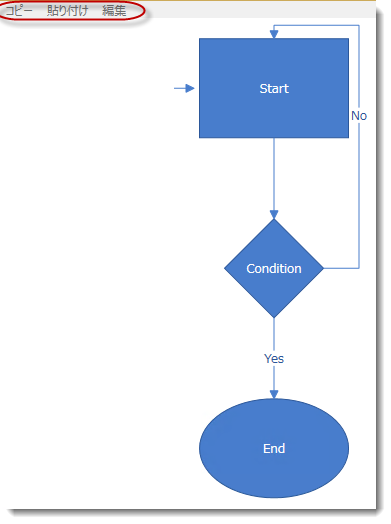

////

|metadata|
{
    "name": "xamdiagram-configuring-ui-elements-with-commands",
    "tags": ["Charting","Commands","How Do I"],
    "controlName": ["xamDiagram"],
    "guid": "30a86975-d206-44a5-aca4-3a8b27297149",  
    "buildFlags": [],
    "createdOn": "2014-06-16T09:38:00.3558436Z"
}
|metadata|
////

= xamDiagram コマンドを使用した UI 要素の構成

== トピックの概要

=== 目的

このトピックでは、 _xamDiagram_™ が提供するコマンドを、メニューやボタンなどの UI 要素で使用する方法を説明します。基本的なコマンドに関連付けられた事前構成済みのキーボード ショートカットのリストについては、 link:xamdiagram-configuring-keyboard-shortcuts.html[キーボード ショートカットの構成]を参照してください。

[[_Ref387303433]]

=== 前提条件

このトピックをより理解するために、以下のトピックを参照することをお勧めします。

[options="header", cols="a,a"]
|====
|トピック|目的

| link:xamdiagram-general-overview.html[概要 ( _xamDiagram_ )]
|このトピックでは、 _xamDiagram_ コントロールおよびその主要機能の概念的な概要を説明します。

| link:xamdiagram-commands-overview.html[コマンドの概要 ( _xamDiagram_ )]
|このトピックでは、 _xamDiagram_ コントロールで使用できるコマンドの動作ロジックを説明します。

| link:xamdiagram-adding-to-a-page.html[ _xamDiagram_ をページに追加]
|このトピックでは、 _xamDiagram_ コントロールを {PlatformName} アプリケーションに追加する方法を説明します。

|====

=== このトピックの内容

このトピックは、以下のセクションで構成されます。

* <<_Ref389233523, 概要 >>

** <<_Ref386534590, _xamDiagram_  コマンドを使用した UI 要素の構成>>
** <<_Ref389314879, _xamDiagram_  コマンドのリスト>>

* <<_Ref389233542,  _xamDiagram_  コマンドを使用した UI 要素の構成 - 手順 >>

** <<_Ref389233547,概要>>
** <<_Ref389233551,プレビュー>>
** <<_Prerequisites,前提条件>>
** <<_Overview,概要>>
** <<_Ref389233563,手順>>
** <<_Ref389233567,全コード>>

* <<_Ref385408430, 関連コンテンツ >>

** <<_Ref385408435,トピック>>

[[_Ref389233523]]
== 概要

[[_Ref386534590]]

=== xamDiagram コマンドを使用した UI 要素の構成

_xamDiagram_   コントロールは、コピー / 貼り付け、すべて選択など、一般的なユーザー操作を実行するコマンド、および項目を編集するコマンドやその項目オプション ペインの表示 / 非表示をサポートします。これらのコマンドの多くは、デフォルトでキーボード ショートカットと関連付けられています (詳細は、 link:xamdiagram-configuring-keyboard-shortcuts.html[キーボード ショートカットの構成]を参照してください)。コマンドは、 _Menu_  、 _Button_   などの他のコントロールを使用したユーザー インタラクションにより呼び出されるように構成することもできます。

コマンドの呼び出しは、アプリケーションで設定された他の UI 要素の動作と共通している場合があるため、基本的なダイアグラム操作 (コピー、貼り付け、削除、切り取り、すべて選択、元に戻す、やり直し) は、`ApplicationCommands` として API で実装されます。ダイアグラム固有のロジックを持ち、 link:{ApiPlatform}controls.charts.xamdiagram{ApiVersion}~infragistics.controls.charts.diagramcommands_members.html[DiagramCommands] クラスのメンバーとして実装された、 link:{ApiPlatform}controls.charts.xamdiagram{ApiVersion}~infragistics.controls.charts.diagramcommands~showoptionspane.html[ShowOptionsPane]、 link:{ApiPlatform}controls.charts.xamdiagram{ApiVersion}~infragistics.controls.charts.diagramcommands~entereditmode.html[EnterEditMode]、 link:{ApiPlatform}controls.charts.xamdiagram{ApiVersion}~infragistics.controls.charts.diagramcommands~closeoptionspane.html[CloseOptionsPane] などのコマンドもあります。この区別は、2 つのグループからコマンドにアクセスする方法の違いにも表れています。

コントロールがフォーカスを持ち、そのコマンドを呼び出すインタラクションが発生すると、さまざまなコマンドと関連付けられた操作が、ダイアグラムまたはそのいずれかの項目に適用されます。

[[_Ref387491174]]

=== コマンドの概要表

include::xamdiagram-commands-summary-chart.ja-JP.adoc[]

[[_Ref389233542]]
== _xamDiagram_  コマンドを使用した UI 要素の構成 - 手順

[[_Ref389233547]]

=== 概要

この手順は、一部の  _xamDiagram_   コマンドを使用して UI 要素を構成するプロセスを説明します。ここでは例として、 _Menu_   コントロールの 3 つの MenuItem を、 _xamDiagram_   の項目の Copy コマンド、Paste コマンドおよび EnterEditMode コマンドをトリガーするように構成します。

[[_Ref389233551]]

=== プレビュー

以下のスクリーンショットは、手順を実行した結果、「コピー」、「貼り付け」、「編集」オプションがダイアグラムに追加されたメニューを示しています。

[[_Prerequisites]]

=== 前提条件

この手順を実行するには、以下が必要です。

* ページを持つ Microsoft® Visual Studio® {PlatformName} アプリケーション
* プロジェクトに追加した必要なアセンブリ参照および名前空間 (詳細は、 link:xamdiagram-adding-to-a-page.html[ _xamDiagram_  をページに追加]を参照)
* ページに追加された  _xamDiagram_   コントロール(詳細は、 link:xamdiagram-adding-to-a-page.html[ _xamDiagram_  をページに追加]を参照してください。)

[[_Overview]]

=== 概要

以下はプロセスの概要です。

*1.Menu コントロールの追加*

*2.MenuItem オブジェクトを操作するコマンドの構成*

*3. _(オプション)_ 手順の結果の検証*

[[_Ref389233563]]

=== 手順

以下の手順では、 コマンドを呼び出すために、 _Menu_   コントロールの `MenuItems` を構成する方法を説明します。

=== 1.Menu コントロールの追加

*Menu コントロールのインスタンスを作成し、ページに追加します。*

*XAML の場合:*

[source,xaml]
----
<Menu VerticalAlignment="Top">
</Menu>
----

=== 2.MenuItem オブジェクトを操作するコマンドの構成

*1.メニュー項目の Copy および Paste を構成します。*

ダイアグラムの Copy コマンドおよび Paste コマンドは、`ApplicationCommands` であるため、 各 `MenuItem` の `Command` パラメータを構成し、コピー操作または貼り付け操作を実行します。この操作は、フォーカスを持つダイアグラムの項目 (およびページに存在し、フォーカスを持つ他の UI 要素) に適用されます。

*XAML の場合:*

[source,xaml]
----
<MenuItem Command=" ApplicationCommands.Copy" />
<MenuItem Command=" ApplicationCommands.Paste"/>
----

*2.編集メニューの項目を構成します。*

`EnterEditMode` コマンドは、`DiagramCommands` クラスに属するため、このコマンドを特定の `MenuItem` にバインドするには、`MenuItem` `Command` プロパティおよび `CommandTarget` プロパティを設定します。CommandTarget プロパティの設定は、コマンドのバインド対象がダイアグラムのオブジェクトであることを指定するために使用します。

*XAML の場合:*

[source,xaml]
----
<MenuItem Header="編集"
        Command="{x:Static ig:DiagramCommands.EnterEditMode}" 
        CommandTarget="{Binding ElementName=diagram}"/>
----

*3.メニュー項目をメニューに追加します。*

*XAML の場合:*

[source,xaml]
----
<Menu VerticalAlignment="Top">
<MenuItem Command=" ApplicationCommands.Copy" />
<MenuItem Command=" ApplicationCommands.Paste" />
<MenuItem Header="編集"
        Command="{x:Static ig:DiagramCommands.EnterEditMode}" 
          CommandTarget="{Binding ElementName=diagram}"/>
</Menu>
----

=== 3.(オプション) 手順の結果の検証

この手順を実行すると、<<_Ref389233551,プレビュー>>に示すような機能メニューが設定されます。

メニュー項目の機能をテストするには、ノードなどを選択し、メニューの Copy をクリックし、Paste を使用して、ダイアグラムの任意の場所に貼り付けます。

[[_Ref389233567]]

=== 全コード

以下は、この手順の完全なコードです。

*XAML の場合:*

[source,xaml]
----
<Grid.RowDefinitions>
      <RowDefinition Height="auto"/>
      <RowDefinition Height="5*"/>
            </Grid.RowDefinitions>
      <Menu VerticalAlignment="Top">
            <MenuItem Command="ApplicationCommands.Copy"/>
                <MenuItem Command="ApplicationCommands.Paste"/>
                <MenuItem Header="編集"
                          Command="{x:Static ig:DiagramCommands.EnterEditMode}" 
                          CommandTarget="{Binding ElementName=diagram}"/>
        </Menu>
      <ig:XamDiagram x:Name="diagram"
                   Width="300"
                       Height="500"
                       >
            <ig:DiagramNode Name="node1"
                            Content="Start"
                            Height="100"
                            Width="150"
                            Position="200,20"/>
            <ig:DiagramNode Name="node2"
                            Content="Condition"
                            Height="100"
                            Width="150"
                            NodeType="Rhombus"
                            Position="200,200"/>
            <ig:DiagramNode Name="node3"
                            Content="End"
                            Height="100"
                            Width="150"
                            NodeType="Ellipse"
                            Position="200,380"/>
            <ig:DiagramConnection Name="conn12"
                                  StartNodeKey="node1"
                                  EndNodeKey="node2"
                                  ConnectionType="Straight"/>
            <ig:DiagramConnection Name="conn23"
                                  StartNodeKey="node2"
                                  EndNodeKey="node3"
                                  ConnectionType="Straight"
                                  Content="Yes"/>
            <ig:DiagramConnection Name="conn21"
                                  StartNodeKey="node2"
                                  EndNodeKey="node1"
                                  StartNodeConnectionPointName="Right"
                                  EndNodeConnectionPointName="Top"
                                  Content="No"/>
            <ig:DiagramConnection Name="connStart"
                                  StartPoint="175,70"
                                  EndPoint="195,70"/>
        </ig:XamDiagram>
----

[[_Ref385408430]]
== 関連コンテンツ

[[_Ref385408435]]

=== トピック

このトピックの追加情報については、以下のトピックも合わせてご参照ください。

[options="header", cols="a,a"]
|====
|トピック|目的

| link:xamdiagram-user-interactions-configuration-overview.html[ユーザー インタラクションの構成の概要 ( _xamDiagram_ )]
|このトピックでは、 _xamDiagram_ コントロールで実行されるユーザー インタラクションのすべてのタスクの概要を説明します。

| link:xamdiagram-configuring-undo-redo-operations.html[元に戻す / やり直し操作の構成 ( _xamDiagram_ )]
|このトピックでは、 _xamDiagram_ で元に戻す / やり直し操作を構成する方法を説明します。このトピックでは、 _xamDiagram_ コントロール専用の元に戻す / やり直しマネージャーの構成を説明します。

| link:xamdiagram-configuring-keyboard-shortcuts.html[キーボード ショートカットの構成 ( _xamDiagram_ )]
|このトピックでは、 _xamDiagram_ コマンドに関連付けられたキーボード ショートカットを変更する方法について説明します。

|====