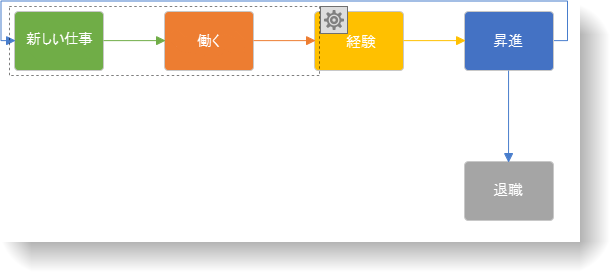
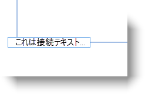
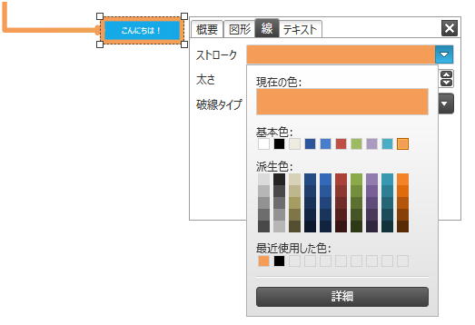
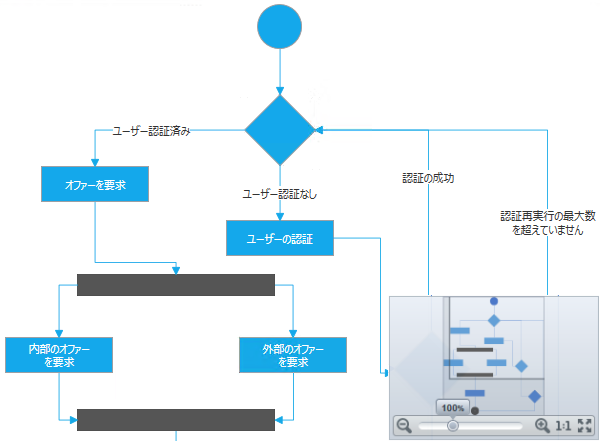
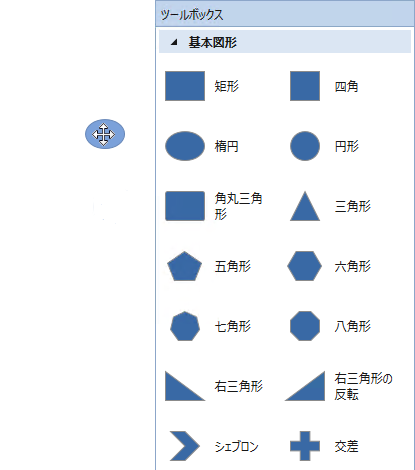

////

|metadata|
{
    "name": "xamdiagram-features-overview",
    "tags": ["Charting","Commands","Data Presentation","How Do I","Summaries"],
    "controlName": ["xamDiagram"],
    "guid": "e61f12b3-b5a2-43eb-bf17-bab72040c7fc",  
    "buildFlags": [],
    "createdOn": "2014-06-16T08:52:37.5128082Z"
}
|metadata|
////

= 機能の概要 (xamDiagram)

== トピックの概要

=== 目的

このトピックでは、 _xamDiagram_™ コントロールの主要な機能の詳細を説明します。

=== 前提条件

このトピックをより理解するためには、以下のトピックを参照することをお勧めします。

[options="header", cols="a,a"]
|====
|トピック|目的

| link:xamdiagram-general-overview.html[概要 ( _xamDiagram_ )]
|このトピックでは、 _xamDiagram_ コントロールおよびその主要機能の概念的な概要を説明します。

|====

=== このトピックの内容

このトピックは、以下のセクションで構成されます。

* <<_Ref388439055,  _xamDiagram_  の機能 >>

** <<_Ref388439132, _xamDiagram_   機能の概要表>>
** <<_Ref390272737,データ バインディング>>
** <<_Ref388439060,ナビゲーション>>
** <<_Ref388439069,選択>>
** <<_Ref388439075,項目のインタラクション>>
** <<_Ref388439079,コマンドのサポート>>
** <<_Ref388439081,元に戻す / やり直し>>
** <<_Ref388439083,コンテキスト オプション ペイン>>
** <<_Ref388439085,ナビゲーション ペイン>>
** <<_Ref388439087,形状が定義済みのツールボックス>>
** <<_Ref388439090,カスタム ノードの図形>>
** <<_Ref388439092,カスタム項目テンプレート>>
** <<_Ref388439094,仮想化>>

* <<_Ref388439099, 関連コンテンツ >>

** <<_Ref386478106,トピック>>

[[_Configuring_a_Custom]]
[[_Ref388439055]]
[[_Ref386478097]]
== _xamDiagram_   の機能

[[_Hlk389761795]]

=== xamDiagram 機能の概要

include::xamdiagram-features-summary.ja-JP.adoc[]

[[_Ref388439132]]

=== xamDiagram 機能の概要表

include::xamdiagram-feature-summary-chart.ja-JP.adoc[]

[[_Ref390272737]]

=== データ バインディング

_xamDiagram_   は以下のデータ バインディング スキームをサポートしています。

*  *ノードのみ*  - データ オブジェクトには、ノードの相互接続方法についての情報が含まれています。各データ オブジェクトは、ダイアグラム内のノードとして表されます。データ オブジェクトにより定義された論理接続については、接続が自動的に表示されます。
*  *ノードおよび接続*  - 2 つのタイプのデータ オブジェクトがあります。1 つはノードを表し、もう 1 つは接続を表します。ノード オブジェクトには、ノードの相互接続方法についての情報はありません。各データ オブジェクトについて、ノードまたは接続がダイアグラムに表示されます。
*  *混合*  - 前述の 2 つのスキームの組み合わせで、ノードのデータ オブジェクトにはノードの相互接続方法についての情報が含まれていますが、接続のデータ オブジェクトも追加して指定できます。

==== 関連トピック:

* link:xamdiagram-binding-to-data.html[データへの  _xamDiagram_  のバインド]

[[_Ref388439060]]

=== ナビゲーション

ユーザーは、マウスやキーボードを使用してダイアグラムの表示領域を変更および拡大 / 縮小できます。表示領域変更およびズームのすべての操作は、コードを使用してもコントロールできます。

==== 関連トピック:

* link:xamdiagram-configuring-the-visible-portion.html[ダイアグラムの表示部分の構成 ( _xamDiagram_ )]

[[_Ref388439069]]

=== 選択

_xamDiagram_   ではデフォルトで、ダイアグラム上でクリックや長方形範囲を選択することにより、1 つまたは複数のノードおよび接続を選択できます。プログラムで選択を管理するには、 _XamDiagram_   の link:{ApiPlatform}controls.charts.xamdiagram{ApiVersion}~infragistics.controls.charts.xamdiagram~selecteditems.html[SelectedItems] プロパティおよび link:{ApiPlatform}controls.charts.xamdiagram{ApiVersion}~infragistics.controls.charts.xamdiagram~selecteddataitems.html[SelectedDataItems] (データ バインドを使用する場合) プロパティ を使用するか、 link:{ApiPlatform}controls.charts.xamdiagram{ApiVersion}~infragistics.controls.charts.diagramitem_members.html[DiagramItem] クラス (link:{ApiPlatform}controls.charts.xamdiagram{ApiVersion}~infragistics.controls.charts.diagramnode_members.html[DiagramNode] および link:{ApiPlatform}controls.charts.xamdiagram{ApiVersion}~infragistics.controls.charts.diagramconnection_members.html[DiagramConnection] の基本クラス) の link:{ApiPlatform}controls.charts.xamdiagram{ApiVersion}~infragistics.controls.charts.diagramitem~isselected.html[IsSelected] プロパティを使用します。

以下のスクリーンショットは、 _xamDiagram_   の 選択された項目を示しています。

==== 関連トピック:

* link:xamdiagram-configuring-selection.html[選択の構成 ( _xamDiagram_ )]

[[_Ref388439075]]

=== 項目のインタラクション

1 つまたは複数の項目を選択した場合、ユーザーはすべての項目を 1 つのグループとして同時に移動できます。プログラム的には、ノードの位置は link:{ApiPlatform}controls.charts.xamdiagram{ApiVersion}~infragistics.controls.charts.diagramnode~position.html[Position] プロパティで変更できます。接続の場合は、 link:{ApiPlatform}controls.charts.xamdiagram{ApiVersion}~infragistics.controls.charts.diagramconnection~startnode.html[StartNode] / link:{ApiPlatform}controls.charts.xamdiagram{ApiVersion}~infragistics.controls.charts.diagramconnection~startnodekey.html[StartNodeKey] または link:{ApiPlatform}controls.charts.xamdiagram{ApiVersion}~infragistics.controls.charts.diagramconnection~endnode.html[EndNode] / link:{ApiPlatform}controls.charts.xamdiagram{ApiVersion}~infragistics.controls.charts.diagramconnection~endnodekey.html[EndNodeKey] プロパティをノードの文字列識別子に設定することによって、または link:{ApiPlatform}controls.charts.xamdiagram{ApiVersion}~infragistics.controls.charts.diagramconnection~startposition.html[StartPosition] および link:{ApiPlatform}controls.charts.xamdiagram{ApiVersion}~infragistics.controls.charts.diagramconnection~endposition.html[EndPosition] プロパティを設定することによって特定の 2 点間に接続線を引いて実行できます。

1 つのノードを選択すると、そのサイズを変更できます。プロポーショナルおよびフリーの両方のサイズ変更をサポートしています。接続を 1 つ選択した場合は、その始点および終点を他のノードの始点または終点、またはダイアグラム上の任意の位置に変更できます。

以下のスクリーンショットは、ノードのサイズ変更の様子を示しています。

ダイアグラムの項目が選択されている場合は、ダブルクリックまたは F2 を押すとその内容を変更できます。

以下のスクリーンショットは、編集モードの接続を示しています。

==== 関連トピック:

* link:xamdiagram-configuring-the-position-and-size-of-diagram-nodes.html[ダイアグラム ノードの位置およびサイズの構成 ( _xamDiagram_ )]
* link:xamdiagram-configuring-the-start-and-end-of-diagram-connections.html[ダイアグラム接続の開始および終了の構成 ( _xamDiagram_ )]

[[_Ref388439079]]

=== コマンドのサポート

WPF 規格に準拠して、 _xamDiagram_   はビューで使用できるコマンドを公開しています。状況に応じて、これらのコマンドは `ApplicationCommands` の各メンバーに限定されます。以下は、 _xamDiagram_   が公開するコマンドのリストです。

* すべて選択
* コピー
* 貼り付け
* 切り取り
* 削除
* 編集
* 元に戻す
* やり直し
* オプション ペインを表示
* オプション ペインを閉じる
* BringForward
* BringToFront
* SendBackward
* SendToBack

==== 関連トピック:

* link:xamdiagram-configuring-ui-elements-with-commands.html[ _xamDiagram_  コマンドを使用した UI 要素の構成]
* link:xamdiagram-configuring-keyboard-shortcuts.html[キーボード ショートカットの構成 ( _xamDiagram_ )]

[[_Ref388439081]]

=== 元に戻す / やり直し

_xamDiagram_   は、ユーザー インタラクションやコードを使用した結果生じた項目の状態の復元をサポートするために、独自の元に戻す / やり直しスタックを保持しています。元に戻す / やり直し機能は、 _Infragistics Undo Redo フレームワーク_  を使用しているため、このフレームワークを使用していずれの既存アプリケーションにも簡単に組み込むことができます。元に戻す / やり直し機能を使用しない場合は、無効にします。

==== 関連トピック:

* link:xamdiagram-configuring-undo-redo-operations.html[元に戻す / やり直し操作の構成 ( _xamDiagram_ )]

[[_Ref388439083]]

=== コンテキスト オプション ペイン

1 つまたは複数の項目を選択すると、コンテキスト オプション ペインを開くための設定ボタンが表示されます。ペイン内のオプションを使用して、ノードや接続の外観をカスタマイズできます。カスタマイズ可能な内容には、透明度、ストロークおよび塗りつぶしの色、線の太さおよび点線の種類、フォントおよびフォントのスタイルがあります。接続の場合は、線の種類 (直線または直角折れ線) を変更することができ、始点および終点の線端が選択できます。

以下のスクリーンショットは、選択した接続およびノードのストロークの色を編集している様子を示しています。

==== 関連トピック:

* link:xamdiagram-configuring-the-context-menu.html[コンテキスト メニューの構成 ( _xamDiagram_ )]

[[_Ref388439085]]

=== ナビゲーション ペイン

_xamDiagram_   は  _xamOverviewPlusDetailsPane_   コントロールを使用して、ダイアグラムの概要を表示し、クイック ナビゲーション オプションを提供します。

以下のスクリーンショットは、有効化されダイアグラムに表示されたナビゲーション ペインを示します。

==== 関連トピック:

* link:xamdiagram-configuring-the-navigation-pane.html[ナビゲーション ペインの構成 ( _xamDiagram_ )]

[[_Ref388439087]]

=== 形状が定義済みのツールボックス

_xamDiagram_   は、ダイアログと一緒に使用すると、ダイアグラム作成に関する操作性を向上させるヘルパー ツールボックス コントロールを提供します。このツールボックスにはいくつかの定義済み図形があり、ダイアグラムにドラッグできます。また、これらは簡単にカスタム図形に拡張できます。

以下のスクリーンショットは、楕円形のノードをツールボックスから空のダイアグラムにドロップする様子を示しています。

==== 関連トピック:

* link:xamdiagram-configuring-the-toolbox.html[ツールボックスの構成 ( _xamDiagram_ )]

[[_Ref388439090]]

=== カスタム ノードの図形

_xamDiagram_   には、定義済みのノードの図形が複数あります。定義済みの図形に目的の図形がない場合は、 link:{ApiPlatform}controls.charts.xamdiagram{ApiVersion}~infragistics.controls.charts.diagramnode~geometry.html[Geometry] プロパティでカスタム図形を設定できます。

以下のスクリーンショットは、定義済みの図形の一部を示します。

image::images/xamDiagram_Features_Overview_7.png[]

==== 関連トピック:

* link:xamdiagram-configuring-the-shape-of-diagram-nodes-overview.html[ダイアグラム ノードの図形の構成 ( _xamDiagram_ )]

[[_Ref388439092]]

=== カスタム項目テンプレート

ダイアグラムのノードおよび接続の内容が表示されるように、任意のカスタム データ テンプレートを指定できます。編集時には、個別のテンプレートを適用できます。

以下のスクリーンショットは、カスタム コンテンツ テンプレートを適用したノードおよび接続を示します。

image::images/xamDiagram_Features_Overview_8.png[]

==== 関連トピック:

* link:xamdiagram-styling-items-templates.html[ダイアグラム項目の内容の視覚化の構成 ( _xamDiagram_ )]

[[_Ref388439094]]

=== 仮想化

_xamDiagram_   は、大量データをサポートしながら高いパフォーマンスを維持するために現在表示されていない項目を仮想化し、ビジュアル ツリーから削除します。これにより、パフォーマンスが向上します。

[[_Ref388439099]]
== 関連コンテンツ

[[_Ref386478106]]

=== トピック

以下のトピックでは、このトピックに関連する追加情報を提供しています。

[options="header", cols="a,a"]
|====
|トピック|目的

| link:xamdiagram-visual-elements-overview.html[視覚要素の概要 ( _xamDiagram_ )]
|このトピックでは、 _xamDiagram_ コントロールの視覚要素の概要を説明します。

|====