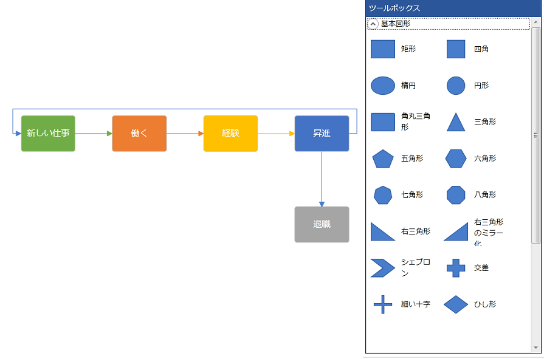

////

|metadata|
{
    "name": "xamdiagram-general-overview",
    "tags": ["API","Charting","Commands","Data Presentation","How Do I","Summaries","Virtualization"],
    "controlName": ["xamDiagram"],
    "guid": "799f85af-ff23-4fad-9a23-7dd871c049ea",  
    "buildFlags": [],
    "createdOn": "2014-06-16T08:51:54.4248334Z"
}
|metadata|
////

= 概要 (xamDiagram)

== トピックの概要

=== 目的

このトピックでは、 _xamDiagram_™ コントロールおよびその主要機能の概念的な概要を説明します。

=== このトピックの内容

このトピックは、以下のセクションで構成されます。

* <<_Ref391566716,  _xamDiagram_  の概念的な概要 >>

** <<_ConceptualOverviewSummary, _xamDiagram_  の概念的な概要>>

* <<_Ref388439055,  _xamDiagram_  の機能 >>

** <<_Ref391566797, _xamDiagram_   機能の概要>>
** <<_Ref388439132, _xamDiagram_  機能の概要表>>

* <<_Ref391566809,  _xamDiagram_  の視覚要素 >>

** <<_Ref391566815,視覚要素の概要>>

* <<_Ref391566819, ユーザー インタラクションと操作性 >>

** <<_Ref391566823,ユーザー インタラクションの概要表>>

* <<OLE_LINK79,  _xamDiagram_  コマンド >>

** <<_CommandsSummary,コマンドの概要>>

* <<_Ref391566837,  _xamDiagram_  の構成 >>

** <<_ConfigSummary, _xamDiagram_  構成の概要>>
** <<_ConfigSummaryChart, _XamDiagram_  構成の概要表>>
** <<_ItemsConfigSummaryChart, _XamDiagram_  項目の構成の概要表>>
** <<_NodesConfigSummaryChart, _XamDiagram_  ノードの構成の概要表>>
** <<_ConnectionsConfigSummaryChart, _xamDiagram_  接続の構成の概要表>>
** <<_UserInteractionsConfigSummaryChart, _xamDiagram_  ユーザー インタラクションの構成の概要表>>

* <<_LargeDataOptimization, 大規模データの最適化 >>

** <<_PerformanceOptimizationRefChart,コマンドの概要>>

* <<_Ref388439099, 関連コンテンツ >>

** <<_Ref386478106,トピック>>

[[_Configuring_a_Custom]]
[[_Ref386478097]]
[[_Ref391566716]]
== xamDiagram の概念的な概要

[[_ConceptualOverviewSummary]]

=== xamDiagram の概念的な概要

_xamDiagram_   コントロールは、スタンドアロンのダイアグラム作成ツールと同等のユーザー インタラクション機能を提供するダイアグラム作成コンポーネントです。

_xamDiagram_   は、ノードおよび接続の 2 つのタイプの項目を表示します。ノードは、四角形、楕円形、三角形など、さまざまな図形で表示できます。接続できるのは 2 つのノード、ダイアグラム上の任意の 2 つの点、または 1 つのノードと 1 つの点です。接続は必要に応じて、矢印、円、ダッシュなどのキャップを持つ、開始と終了の線として表示されます。

ユーザーは、マウスおよびキーボードを使用して簡単に  _xamDiagram_   を操作することができます。コピー、切り取り、貼り付けなど、最もポピュラーな操作はどのアプリケーションにも共通に設定されたキーボード ショートカット (Ctrl+C、Ctrl+X、Ctrl+V) によりアクセスできます。さらに、ダイアグラム領域に新しいノードや接続を追加する場合に役立つ、ツールボックス ( _xamDiagramToolbox_   コントロール) が使用できます (前述の図を参照)。

以下のスクリーンショットは、シンプルなフロー図が表示された  _xamDiagram_   を示しています。_xamDiagramToolbox_   コントロールも表示されています。

[[_Ref388439055]]
== _xamDiagram_  の機能

[[_Ref391566797]]

=== xamDiagram 機能の概要

include::xamdiagram-features-summary.ja-JP.adoc[]

[[_Ref388439132]]

=== xamDiagram 機能の概要表

include::xamdiagram-feature-summary-chart.ja-JP.adoc[]

[[_Ref391566809]]
== _xamDiagram_  の視覚要素

[[_Ref391566815]]

=== 視覚要素の概要

include::xamdiagram-visual-elements-summary.ja-JP.adoc[]

[[_Ref391566819]]
== ユーザー インタラクションと操作性

[[_Ref391566823]]

=== ユーザー インタラクションの概要表

以下の表に、 _xamDiagram_   コントロールの主な機能を簡単に説明します。

[options="header", cols="a,a,a,a"]
|====
|目的|方法|詳細|構成方法

|ダイアグラムのパン
|
* Ctrl + マウス ドラッグ 

* キーボードの矢印キー 

ナビゲーション ペインのコントロール
|ダイアグラムの現在表示されている部分の変更。
|image::images/Yes.png[] 

* link:xamdiagram-configuring-the-visible-portion.html[ダイアグラムの表示部分の構成 ( _xamDiagram_ )] 

* link:xamdiagram-configuring-the-mouse-tool-and-default-interaction.html[マウス ツールおよびデフォルトのドラッグ操作の構成 ( _xamDiagram_ )] 

|ズームインとズームアウト
|
* マウス ホイール 

* link:{ApiPlatform}controls.charts.xamdiagram{ApiVersion}~infragistics.controls.charts.diagramdraginteraction.html[ズーム] ドラッグ操作を使用したマウス ドラッグ 

* Ctrl + Shift + マウス ドラッグ 

ナビゲーション ペイン ナビゲーター
|ズーム レベルの変更。
|image::images/Yes.png[] 

* link:xamdiagram-configuring-the-visible-portion.html[ダイアグラムの表示部分の構成 ( _xamDiagram_ )] 

* link:xamdiagram-configuring-the-mouse-tool-and-default-interaction.html[マウス ツールおよびデフォルトのドラッグ操作の構成 ( _xamDiagram_ )] 

|1 つ以上の項目の選択
|
* マウス ドラッグ 

* 項目をクリック 

* Ctrl + A 

|ドラッグして選択する場合、矩形の選択領域に完全に含まれている項目がすべて選択されます。 

項目をクリックすると、クリックした項目が選択され、選択されていた項目がクリアされます。 

すべての項目の選択は、キーボード ショートカット (Ctrl + A) で実行します。
|image::images/Yes.png[] 

* link:xamdiagram-configuring-selection.html[選択の構成 ( _xamDiagram_ )] 

|項目の移動
|項目の上にマウスをドラッグ
|何かが選択された状態であれば、選択された項目の 1 つをドラッグすると、選択されたすべての項目を移動します。
|image::images/No.png[] 

* link:xamdiagram-configuring-the-position-and-size-of-diagram-nodes.html[ダイアグラム ノードの位置およびサイズの構成 ( _xamDiagram_ )] 

|ノードのサイズ変更
|サイズ変更ハンドルをマウス ドラッグ
|1 つのノードを選択すると、サイズ変更インジケーターが端や辺に表示されます。ノードの一辺からドラッグすると、ノードの選択された辺のサイズが変更されます。ノードのいずれかのコーナーからドラッグすると、ノードのサイズは縦横均等に変更されます。 

Shift キーを押すと、これらの動作が逆になります。
|image::images/Yes.png[] 

* link:xamdiagram-configuring-the-position-and-size-of-diagram-nodes.html[ダイアグラム ノードの位置およびサイズの構成 ( _xamDiagram_ )] 

|接続の始点および終点を移動
|始点 / 終点ハンドルをマウス ドラッグ
|1 つの接続を選択すると、ドラッグ可能なインジケーターがその両端に表示されます。これらのインジケーターは、ダイアグラム上の 1 つのポイントまたは 1 つのノードにドラッグできます。
|image::images/No.png[] 

* link:xamdiagram-configuring-the-start-and-end-of-diagram-connections.html[ダイアグラム接続の開始および終了の構成 ( _xamDiagram_ )] 

|接続の描画
|
* ノードの接続ポイントからマウス ドラッグ 

* link:{ApiPlatform}controls.charts.xamdiagram{ApiVersion}~infragistics.controls.charts.diagramtool.html[コネクタ] ツールの使用時に、ダイアグラム上の任意のポイントからマウス ドラッグ 

|
|image::images/Yes.png[] 

* link:xamdiagram-configuring-the-visible-portion.html[ダイアグラムの表示部分の構成 ( _xamDiagram_ )] 

* link:xamdiagram-configuring-the-mouse-tool-and-default-interaction.html[マウス ツールおよびデフォルトのドラッグ操作の構成 ( _xamDiagram_ )] 

|項目の内容を編集
|
* マウス ダブルクリック 

* *F2* キー 

|ノードまたは接続の内容編集操作を開始します。
|image::images/Yes.png[] 

* link:xamdiagram-styling-items-templates.html[ダイアグラム項目の内容の視覚化の構成 ( _xamDiagram_ )] 

|現在値の確認または改行の追加
| *Enter* キー
|ノードが編集モードのときにユーザーが *Enter* キーを押した場合、`EnterKeyBehavior` プロパティに設定された値に基づいて動作が異なります。CommitChanges 値の場合、現在値を確認し、編集モードを終了します。AddNewLineFeed 値の場合、編集モードに残り、改行を挿入します。

.注
[NOTE]
====
ユーザーは、*Shift*+*Enter* を使用して "CommitChanges" モードで改行を挿入できます。
====

|image::images/Yes.png[] 

* link:{ApiPlatform}controls.charts.xamdiagram{ApiVersion}~infragistics.controls.charts.xamdiagram~enterkeybehavior.html[EnterKeyBehavior]

|オプション ペインの表示 / 非表示
|
* 選択された項目の隣の "設定" アイコン (image:images/xamDiagram_Overview_16.png[]) をクリック 

* ダイアグラム領域上で Esc キーを押下 / マウス クリック 

|ダイアグラムの項目の外観と内容を編集するオプションを備えたコンテキスト メニューを表示または非表示にします。
|image::images/Yes.png[] 

* link:xamdiagram-configuring-the-context-menu.html[コンテキスト メニューの構成 ( _xamDiagram_ )] 

|変更を元に戻す / やり直す
|
* Ctrl + Z 

* Ctrl + U 

|元に戻す / やり直しの操作を実行します。
|image::images/Yes.png[] 

* link:xamdiagram-configuring-undo-redo-operations.html[元に戻す / やり直し操作の構成 ( _xamDiagram_ )] 

|[[_Hlk377147553]] 

項目のコピー、切り取り、貼り付け、削除
|
* Ctrl + C 

* Ctrl + X 

* Ctrl + V 

* Delete 

|ダイアグラム内の項目では、標準のクリップボード操作がサポートされます。
|image::images/Yes.png[] 

* link:xamdiagram-configuring-keyboard-shortcuts.html[キーボード ショートカットの構成 ( _xamDiagram_ )] 

* link:xamdiagram-configuring-ui-elements-with-commands.html[ _xamDiagram_ コマンドを使用した UI 要素の構成] 

|====

[[OLE_LINK79]]
== _xamDiagram_  コマンド

[[_CommandsSummary]]

=== コマンドの概要

include::xamdiagram-commands-summary.ja-JP.adoc[]

[[_Ref391566837]]
== _xamDiagram_  の構成

[[_ConfigSummary]]

=== xamDiagram 構成の概要

include::xamdiagram-configuration-summary.ja-JP.adoc[]

[[_ConfigSummaryChart]]

=== XamDiagram 構成の概要表

include::xamdiagram-configuration-summary-chart.ja-JP.adoc[]

[[_ItemsConfigSummaryChart]]

=== XamDiagram 項目の構成の概要表

include::xamdiagram-items-configuration-summary-chart.ja-JP.adoc[]

[[_NodesConfigSummaryChart]]

=== XamDiagram ノードの構成の概要表

include::xamdiagram-nodes-configuration-summary-chart.ja-JP.adoc[]

[[_ConnectionsConfigSummaryChart]]

=== xamDiagram 接続の構成の概要表

include::xamdiagram-connections-configuration-summary-chart.ja-JP.adoc[]

[[_UserInteractionsConfigSummaryChart]]

=== xamDiagram ユーザー インタラクションの構成の概要表

include::xamdiagram-user-interactions-configuration-summary-chart.ja-JP.adoc[]

[[_LargeDataOptimization]]
== 大規模データの最適化

[[_PerformanceOptimizationRefChart]]

=== xamDiagram のパフォーマンスの最適化に関する候補の一覧表

include::xamdiagram-performance-optimization-reference-chart.ja-JP.adoc[]

[[_Ref388439099]]
== 関連コンテンツ

[[_Ref386478106]]

=== トピック

このトピックの追加情報については、以下のトピックも合わせてご参照ください。

[options="header", cols="a,a"]
|====
|トピック|目的

| link:xamdiagram-features-overview.html[機能の概要 ( _xamDiagram_ )]
|このトピックでは、 _xamDiagram_ コントロールの主要な機能の詳細を説明します。

| link:xamdiagram-visual-elements-overview.html[視覚要素の概要 ( _xamDiagram_ )]
|このトピックでは、 _xamDiagram_ コントロールの視覚要素の概要を説明します。

| link:xamdiagram-commands-overview.html[コマンドの概要 ( _xamDiagram_ )]
|このトピックでは、 _xamDiagram_ コントロールで使用できるコマンドの動作ロジックを説明します。

|====