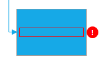
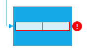

////
|metadata|
{
    "name": "xamdiagram-idataerrorinfo-support",
    "tags": ["Charting"],
    "controlName": ["xamDiagram"],
    "guid": "",
    "buildFlags": [],
    "createdOn": "2017-04-26T09:37:02.0484523Z"
}
|metadata|
////

= IDataErrorInfo サポート (xamDiagram)

== トピックの概要

=== 目的

このトピックは、コントロールが検証エラーを処理する方法を説明します。

=== 前提条件

このトピックを理解するためには、次のトピックを理解しておく必要があります。

[options="header", cols="a,a"]
|====
|トピック|目的

| link:xamdiagram-general-overview.html[概要 (xamDiagram)]
|このトピックでは、xamDiagram コントロールおよびその主要機能の概念的な概要を説明します。

|====

=== このトピックの内容

* <<Ref00001, IDataErrorInfo サポートの概要>>
* <<Ref00002, 表示テンプレートのカスタマイズ化>>
* <<Ref00003, 編集テンプレートのカスタマイズ化>>
* <<Ref00004, 関連トピック>>

[[Ref00001]]
== IDataErrorInfo サポートの概要

コントロールが IDataErrorInfo インターフェイスを実装するデータ項目のデータ ソースへバインドされる場合、検証エラーをユーザーに示すことができます。表示モードおよび編集モードでデフォルトはエラー情報の周りに赤い境界線が描画されます。エラー インジケーターを有効にするには、link:{ApiPlatform}controls.charts.xamdiagram{ApiVersion}~infragistics.controls.charts.xamdiagram~supportdataerrorinfo.html[SupportDataErrorInfo] プロパティを `true` に設定します。 

以下の画像は 2 つのダイアグラム項目を表示します。左の項目に検証エラーはありませんが、右の項目には空のフィールドがあるため、検証エラーがあります。

image::images/xamDiagram_Validation01.png[]

[[Ref00002]]
== 表示テンプレートのカスタマイズ化

以下のコード スニペットのように、`TextBlock` 型をターゲットするスタイルを定義すると、エラー検証の表示テンプレートをカスタマイズできます。

*XAML の場合:*
[source, xaml]
----

----

以下の画像は、以上のカスタム エラー検証の表示テンプレートを表示します。

.注:
[NOTE]
====
テキスト ブロックで使用されるために、以上の表示テンプレート スタイルをアプリケーション レベルで設定する必要があります。
====

[[Ref00003]]
== 編集テンプレートのカスタマイズ化

以下のコード スニペットのように、link:{ApiPlatform}controls.charts.xamdiagram{ApiVersion}~infragistics.controls.charts.primitives.advancedfocustextbox.html[AdvancedFocusTextBox] 型をターゲットするスタイルを定義すると、エラー検証の表編集ンプレートをカスタマイズできます。

*XAML の場合:*
[source, xaml]
----

----

以下の画像は、以上のカスタム エラー検証の編集テンプレートを表示します。

[[Ref00004]]
== 関連トピック

このトピックに関連する追加情報については、以下のトピックを参照してください。

[options="header", cols="a,a"]
|====
|トピック|目的

| link:xamdiagram-configuring-node-configuration-overview.html[ノードの構成の概要 (xamDiagram)]
|このトピックでは、xamDiagram コントロールの各ノードの構成可能な要素の概要を説明します。

| link:xamdiagram-configuring-the-position-and-size-of-diagram-nodes.html[ダイアグラム ノードの位置およびサイズの構成 (xamDiagram)]
|このトピックでは、xamDiagram コントロールのダイアグラムの各ノードのサイズと位置を制御する方法を説明します。

| link:xamdiagram-configuring-the-shape-of-diagram-nodes-overview.html[ダイアグラム ノードの図形の構成 (xamDiagram)]
|このトピックでは、定義済みの図形を選択、またはカスタム図形を適用して、xamDiagram コントロールのダイアグラム ノードの図形を構成する方法を説明します。

| link:xamdiagram-nodes-connection-points.html[ダイアグラム ノードの接続ポイントの構成 (xamDiagram)]
|このトピックでは、xamDiagram コントロールでダイアグラム ノードの接続ポイントを構成する方法を説明します。

|===