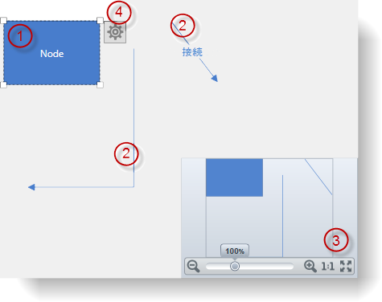
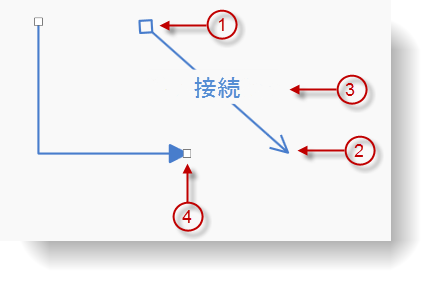
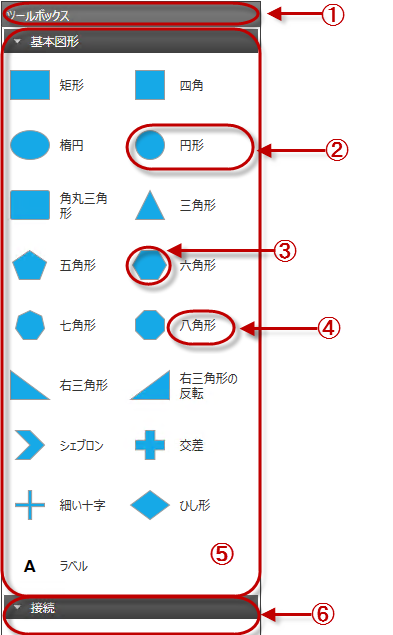

////

|metadata|
{
    "name": "xamdiagram-visual-elements-overview",
    "tags": ["Charting","Commands","How Do I","Summaries"],
    "controlName": ["xamDiagram"],
    "guid": "9a6c6b6c-84ac-466e-a080-3bdb27a1bd3d",  
    "buildFlags": [],
    "createdOn": "2014-06-16T09:13:16.8956656Z"
}
|metadata|
////

= 視覚要素の概要 (xamDiagram)

== トピックの概要

=== 目的

このトピックでは、 _xamDiagram_™ コントロールの視覚要素の概要を説明します。

=== 前提条件

このトピックをより理解するために、以下のトピックを参照することをお勧めします。

[options="header", cols="a,a"]
|====
|トピック|目的

| link:xamdiagram-general-overview.html[概要 ( _xamDiagram_ )]
|このトピックでは、 _xamDiagram_ コントロールおよびその主要機能の概念的な概要を説明します。

| link:xamdiagram-features-overview.html[機能の概要 ( _xamDiagram_ )]
|このトピックでは、 _xamDiagram_ コントロールの主要な機能の詳細を説明します。

|====

=== このトピックの内容

このトピックは、以下のセクションで構成されます。

* <<_Ref389665005, 概要 >>

** <<_VisualElementsSummary,視覚要素の概要>>

* <<_Ref389665048, ダイアグラムの視覚要素および関連プロパティ >>

** <<_Ref389665054,ダイアグラムの視覚要素の概要>>
** <<_Ref389665059,ダイアグラムの視覚要素および関連プロパティ>>

* <<_Ref389665068, ダイアグラム ノードの視覚要素および関連プロパティ >>

** <<_Ref389665104,ノードの視覚要素の概要>>
** <<_Ref389665110,ノードの視覚要素および関連プロパティ>>
** <<_Ref389665128,ノードのデフォルト サイズ>>

* <<_Ref389665283, ダイアグラム接続の視覚要素および関連プロパティ >>

** <<_Ref389665289,接続の視覚要素の概要>>
** <<_Ref389665293,接続の視覚要素および関連プロパティ>>

* <<_Ref389665311, ツールボックスの視覚要素および関連プロパティ >>

** <<_Ref389665366,ツールボックスの視覚要素の概要>>
** <<_Ref389665371,ツールボックスの視覚要素および関連プロパティ>>

* <<_Ref389665417, 関連コンテンツ >>

** <<_Ref386478106,トピック>>

[[_Ref389665005]]
== 概要

[[_VisualElementsSummary]]

=== 視覚要素の概要

include::xamdiagram-visual-elements-summary.ja-JP.adoc[]

[[_Ref389665048]]
== __ダイアグラム__ の視覚要素および関連プロパティ

[[_Ref389665054]]

=== ダイアグラムの視覚要素の概要

以下のスクリーンショットは、ダイアグラムの視覚要素を示しています。設定可能な要素を図の後に示します。

[[_Ref389665059]]

=== ダイアグラムの視覚要素および関連プロパティ

以下の表は、 link:{ApiPlatform}controls.charts.xamdiagram{ApiVersion}~infragistics.controls.charts.xamdiagram_members.html[XamDiagram] コントロールの視覚要素とそれらを構成するプロパティのマップを示します。

[options="header", cols="a,a,a"]
|====
|#|視覚要素|プロパティ

|1
|ノード
| link:{ApiPlatform}controls.charts.xamdiagram{ApiVersion}~infragistics.controls.charts.xamdiagram~items.html[Items]

|2
|接続
| link:{ApiPlatform}controls.charts.xamdiagram{ApiVersion}~infragistics.controls.charts.xamdiagram~items.html[Items]

|3
|ナビゲーション ペイン ( _OverviewPlusDetailPane_ コントロール)
| link:{ApiPlatform}controls.charts.xamdiagram{ApiVersion}~infragistics.controls.charts.xamdiagram~navigationpanevisibility.html[NavigationPaneVisibility] 

link:{ApiPlatform}controls.charts.xamdiagram{ApiVersion}~infragistics.controls.charts.xamdiagram~navigationpanehorizontalalignment.html[NavigationPaneHorizontalAlignment] 

link:{ApiPlatform}controls.charts.xamdiagram{ApiVersion}~infragistics.controls.charts.xamdiagram~navigationpaneverticalalignment.html[NavigationPaneVerticalAlignment]

|4
|オプション ペイン ボタン
| link:{ApiPlatform}controls.charts.xamdiagram{ApiVersion}~infragistics.controls.charts.xamdiagram~optionspanevisibility.html[OptionsPaneVisibility] 

link:{ApiPlatform}controls.charts.xamdiagram{ApiVersion}~infragistics.controls.charts.xamdiagram~optionspaneplacement.html[OptionsPanePlacement]

|====

[[_Configuring_a_Custom]]
[[_Ref389665068]]
[[_Ref386478097]]
[[_Ref388439099]]
== ダイアグラム ノードの視覚要素および関連プロパティ

[[_Ref389665104]]

=== ノードの視覚要素の概要

以下のスクリーンショットは、ダイアグラム ノードの視覚要素を示しています。設定可能な要素を図の後に示します。

image::images/xamDiagram_Visual_Elements_Overview_2.png[]

[[_Ref389665110]]

=== ノードの視覚要素および関連プロパティ

以下の表は、 link:{ApiPlatform}controls.charts.xamdiagram{ApiVersion}~infragistics.controls.charts.diagramnode_members.html[DiagramNode]s の視覚要素とそれらを構成するプロパティのマップを示します。

[options="header", cols="a,a,a"]
|====
|#|視覚要素|API メンバー

|1
|コンテンツ
| link:{ApiPlatform}controls.charts.xamdiagram{ApiVersion}~infragistics.controls.charts.diagramitem~content.html[Content] 

link:{ApiPlatform}controls.charts.xamdiagram{ApiVersion}~infragistics.controls.charts.diagramitem~displaytemplate.html[DisplayTemplate] 

link:{ApiPlatform}controls.charts.xamdiagram{ApiVersion}~infragistics.controls.charts.diagramitem~edittemplate.html[EditTemplate]

|2
|サイズ変更ハンドル
| link:{ApiPlatform}controls.charts.xamdiagram{ApiVersion}~infragistics.controls.charts.primitives.diagramresizehandle.html[DiagramResizeHandle] 

link:{ApiPlatform}controls.charts.xamdiagram{ApiVersion}~infragistics.controls.charts.primitives.diagramresizehandleline.html[DiagramResizeHandleLine]

|3
|接続ポイント
| link:{ApiPlatform}controls.charts.xamdiagram{ApiVersion}~infragistics.controls.charts.diagramnode~connectionpoints.html[ConnectionPoints]

|====

[[_Ref389665128]]

=== ノードのデフォルト サイズ

以下の表では、デフォルトのノード サイズ (ピクセル) を簡単に説明します。デフォルトのサイズは、ノードの図形によって変化します。(ノードに明示的なオーバーライドが適用されていない場合、デフォルトのサイズが有効になります。)

[options="header", cols="a,a,a"]
|====
|ノードの図形|幅|高さ

|シェブロン
| _80_ 
| _80_ 

|円
| _80_ 
| _80_ 

|太い十字線
| _80_ 
| _80_ 

|細い十字線
| _80_ 
| _80_ 

|楕円
| _120_ 
| _80_ 

|七角形
| _80_ 
| _80_ 

|六角形
| _92_ 
| _80_ 

|なし
| _NaN_ 
| _NaN_ 

|八角形
| _80_ 
| _80_ 

|五角形
| _84_ 
| _80_ 

|矩形
| _120_ 
| _80_ 

|長方形、角丸
| _120_ 
| _80_ 

|菱形
| _80_ 
| _80_ 

|四角
| _80_ 
| _80_ 

|三角形
| _80_ 
| _80_ 

|左下が直角の直角三角形
| _120_ 
| _80_ 

|右下が直角の直角三角形
| _120_ 
| _80_ 

|====

.注:
[NOTE]
====
ノードの `Content` プロパティの値がノードの境界内に収まらない場合、コンテンツはオーバーフローします。
====

[[_Ref389665283]]
== ダイアグラム接続の視覚要素および関連プロパティ

[[_Ref389665289]]

=== 接続の視覚要素の概要

以下のスクリーンショットは、ダイアグラム接続の視覚要素を示しています。設定可能な要素を図の後に示します。

[[_Ref389665293]]

=== 接続の視覚要素および関連プロパティ

以下の表は、 link:{ApiPlatform}controls.charts.xamdiagram{ApiVersion}~infragistics.controls.charts.diagramconnection_members.html[DiagramConnection]s の視覚要素とそれらを構成するプロパティのマップを示します。

[options="header", cols="a,a,a"]
|====
|#|視覚要素|API メンバー

|1
|開始キャップ
| link:{ApiPlatform}controls.charts.xamdiagram{ApiVersion}~infragistics.controls.charts.diagramconnection~startcaptype.html[StartCapType] 

link:{ApiPlatform}controls.charts.xamdiagram{ApiVersion}~infragistics.controls.charts.diagramconnection~startcapsize.html[StartCapSize] 

link:{ApiPlatform}controls.charts.xamdiagram{ApiVersion}~infragistics.controls.charts.diagramconnection~startcapstyle.html[StartCapStyle]

|2
|終了キャップ
| link:{ApiPlatform}controls.charts.xamdiagram{ApiVersion}~infragistics.controls.charts.diagramconnection~endcaptype.html[EndCapType] 

link:{ApiPlatform}controls.charts.xamdiagram{ApiVersion}~infragistics.controls.charts.diagramconnection~endcapsize.html[EndCapSize] 

link:{ApiPlatform}controls.charts.xamdiagram{ApiVersion}~infragistics.controls.charts.diagramconnection~endcapstyle.html[EndCapStyle]

|3
|コンテンツ
| link:{ApiPlatform}controls.charts.xamdiagram{ApiVersion}~infragistics.controls.charts.diagramitem~content.html[Content] 

link:{ApiPlatform}controls.charts.xamdiagram{ApiVersion}~infragistics.controls.charts.diagramitem~displaytemplate.html[DisplayTemplate] 

link:{ApiPlatform}controls.charts.xamdiagram{ApiVersion}~infragistics.controls.charts.diagramitem~edittemplate.html[EditTemplate]

|4
|接続ハンドル
| link:{ApiPlatform}controls.charts.xamdiagram{ApiVersion}~infragistics.controls.charts.primitives.diagramconnectionhandle.html[DiagramConnectionHandle]

|====

[[_Ref389665311]]
[[_Ref389665652]]
== ツールボックスの視覚要素および関連プロパティ

[[_Ref389665366]]

=== ツールボックスの視覚要素の概要

_xamDiagramToolbox_   は、ドラッグ アンド ドロップによる  _xamDiagram_   に項目を追加する機能を提供します。このコントロールは、ヘッダーと複数のカテゴリ (デフォルトは 2) から構成されます。カテゴリは独自の各ヘッダーを持ち、ダイアグラム項目とキャプションを表す任意の数の項目を含めることができます。以下のスクリーンショットは、 _link:{ApiPlatform}controls.charts.xamdiagram{ApiVersion}~infragistics.controls.charts.xamdiagramtoolbox_members.html[XamDiagramToolbox]_  コントロールの視覚要素を示しています。設定可能な要素を図の後に示します。

[[_Ref389665371]]

=== ツールボックスの視覚要素および関連プロパティ

以下の表は、 link:{ApiPlatform}controls.charts.xamdiagram{ApiVersion}~infragistics.controls.charts.xamdiagramtoolbox_members.html[XamDiagramToolbox] コントロールの視覚要素とそれらを構成するプロパティのマップを示します。

[options="header", cols="a,a,a"]
|====
|#|視覚要素|プロパティ

|1
|ヘッダー
| link:{ApiPlatform}controls.charts.xamdiagram{ApiVersion}~infragistics.controls.charts.xamdiagramtoolbox~header.html[Header]

|2
|ツールボックス項目
| link:{ApiPlatform}controls.charts.xamdiagram{ApiVersion}~infragistics.controls.charts.diagramtoolboxcategory~items.html[DiagramToolboxCategory.Items]

|3
|ツールボックス項目のダイアグラム項目
| link:{ApiPlatform}controls.charts.xamdiagram{ApiVersion}~infragistics.controls.charts.diagramtoolboxitem~item.html[DiagramToolboxItem.Item]

|4
|ツールボックス項目のタイトル
| link:{ApiPlatform}controls.charts.xamdiagram{ApiVersion}~infragistics.controls.charts.diagramtoolboxitem~title.html[DiagramToolboxItem.Title]

|5
|カテゴリ
| link:{ApiPlatform}controls.charts.xamdiagram{ApiVersion}~infragistics.controls.charts.xamdiagramtoolbox~categories.html[Categories] 

link:{ApiPlatform}controls.charts.xamdiagram{ApiVersion}~infragistics.controls.charts.xamdiagramtoolbox~customcategories.html[CustomCategories]

|6
|カテゴリ名
| link:{ApiPlatform}controls.charts.xamdiagram{ApiVersion}~infragistics.controls.charts.diagramtoolboxcategory~name.html[DiagramToolboxCategory.Name]

|====

[[_Ref389665417]]
== 関連コンテンツ

[[_Ref386478106]]

=== トピック

このトピックの追加情報については、以下のトピックも合わせてご参照ください。

[options="header", cols="a,a"]
|====
|トピック|目的

| link:xamdiagram-adding-to-a-page.html[ _xamDiagram_ をページに追加]
|このトピックでは、 _xamDiagram_ コントロールを {PlatformName} アプリケーションに追加する方法を説明します。

| link:xamdiagram-binding-to-data.html[データへの _xamDiagram_ のバインド]
|このトピックでは、 _xamDiagram_ コントロールがサポートするデータ バインディング シナリオの概要を説明します。

| link:xamdiagram-configuring-nodes.html[ノードの構成 ( _xamDiagram_ )]
|このグループのトピックでは、 _xamDiagram_ コントロールのノードを構成する方法を説明します。

| link:xamdiagram-configuring-diagram-connections.html[接続の構成 ( _xamDiagram_ )]
|このグループのトピックでは、 _xamDiagram_ コントロールの接続を構成する方法を説明します。

| link:xamdiagram-configuring-the-navigation-pane.html[ナビゲーション ペインの構成 ( _xamDiagram_ )]
|このトピックでは、 _xamDiagram_ コントロールのナビゲーション ペインを構成する方法を説明します。

| link:xamdiagram-configuring-the-toolbox.html[ツールボックスの構成 ( _xamDiagram_ )]
|このトピックでは、 _xamDiagram_ のダイアグラム ツールボックスを構成する方法について説明します。

|====