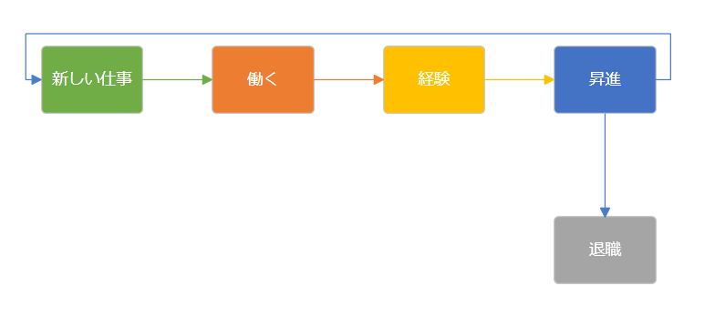

////

|metadata|
{
    "name": "xamdiagram",
    "tags": ["Getting Started","How Do I"],
    "controlName": ["xamDiagram"],
    "guid": "b11f055b-cfd4-46dc-a7c2-baa9d266352e",  
    "buildFlags": [],
    "createdOn": "2014-03-20T06:32:44.1996382Z"
}
|metadata|
////

= xamDiagram

== このグループのトピックについて

=== 概要

このグループのトピックでは、 _xamDiagram_™ コントロールとその使用について説明します。

_xamDiagram_   コントロールは、多様なアプリケーションを備えたフレキシブルで高性能なダイアグラム作成コンポーネントとして機能することを目的としています。このコントロールは、データ ビジュアライゼーション シナリオで使用することができ、スタンドアロンのダイアグラム作成ツールに求められるインタラクションをすべて提供します。

=== トピック

[options="header", cols="a,a"]
|====
|トピック|目的

| link:xamdiagram-overview.html[xamDiagram の概要]
|このグループのトピックでは、 _xamDiagram_ コントロールおよびその機能の概要を説明します。

| link:xamdiagram-adding-to-a-page.html[xamDiagram をページに追加]
|このトピックでは、 _xamDiagram_ コントロールを {PlatformName} アプリケーションに追加する方法を説明します。

| link:xamdiagram-binding-to-data.html[データへの xamDiagram のバインド]
|このトピックでは、 _xamDiagram_ コントロールがサポートするデータ バインディング シナリオの概要を説明します。

| link:xamdiagram-configuring.html[xamDiagram の構成]
|このグループのトピックでは、 _xamDiagram_ コントロールおよびその機能を構成する方法を説明します。

| link:xamdiagram-styling.html[xamDiagram のスタイル設定]
|このグループのトピックでは、 _xamDiagram_ コントロールのスタイルを設定する方法を説明します。

| link:xamdiagram-optimizing-for-handling-large-data.html[大規模なデータ処理のための xamDiagram の最適化]
|このトピックでは、大規模なデータを処理するために _xamDiagram_ コントロールを調整する方法を説明します。

| link:xamdiagram-known-issues-and-limitations.html[既知の問題と制限 (xamDiagram)]
|このトピックでは、 _xamDiagram_ の既知の問題と制限事項について説明します。

| link:xamdiagram-api-reference.html[API リファレンス (xamDiagram)]
|このトピックでは、 _xamDiagram_ コントロールに関連する最も重要な API メンバーの概要を説明します。

|====