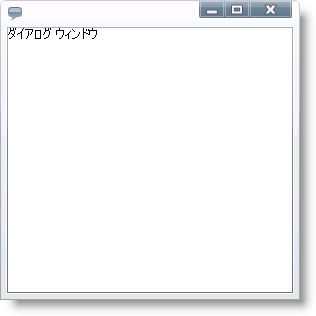

////

|metadata|
{
    "name": "xamdialogwindow-about-xamdialogwindow",
    "controlName": ["xamDialogWindow"],
    "tags": ["Getting Started","Layouts"],
    "guid": "{27932702-D38A-4E9E-A9A5-DCCAACFC4E12}",  
    "buildFlags": [],
    "createdOn": "2016-05-25T18:21:54.9641472Z"
}
|metadata|
////

= xamDialogWindow について

xamDialogWindow コントロールは、{PlatformName} アプリケーション内で多彩なデスクトップ スタイルのポップアップ ウィンドウを表示するための完全な {PlatformName} ダイアログ ウィンドウ コントロールです。

エンドユーザーはダイアログ ウィンドウを最大化、最小化、元に戻す、または閉じることができます。さらに xamDialogWindow コントロールは完全にカスタマイズ可能であるため、アプリケーション全体で同じルック アンド フィールを保持することができます。

以下は xamDialogWindow コントロールの主要な機能のリストです:

* モーダル/非モーダル - xamDialogWindow コントロールによってアプリケーションのフローを制御するためにモーダル/非モーダル ダイアログ ウィンドウを作成できます。
* カスタマイズ可能なヘッダーおよびコンテンツ - xamDialogWindow コントロールのヘッダーおよびコンテンツは 100% テンプレート可能で、アプリケーションの残りの部分との整合性を保持するようにダイアログ ウィンドウをスタイルできます。
* サイズ変更機能 - エンドユーザーは xamDialogWindow コントロールの境界線をドラッグしてサイズを変更できます。
* 場所 - xamDialogWindow コントロールを開いたときの表示位置だけでなく、コントロールを最小化したときの格納先も自由に設定できます。最小化したコントロールを別のパネルに表示することもできます。
* コンテナー内に限定する機能 - xamDialogWindow コントロールの表示領域をコンテナー内に限定できます。この機能を使用すると、コンテナーの境界線を超えてダイアログ ウィンドウを移動、最大化、配置することはできなくなります。

== 関連トピック

link:xamdialogwindow-adding-xamdialogwindow-to-your-page.html[xamGrid をページに追加]

link:xamdialogwindow-using-xamdialogwindow.html[xamDialogWindow の使用]