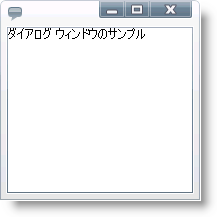

////
|metadata|
{
    "name": "xamdialogwindow-adding-xamdialogwindow-to-your-page",
    "controlName": ["xamDialogWindow"],
    "tags": ["Getting Started"],
    "guid": "789ab412-cf0f-4c16-b80e-3c050ac2f004",
    "buildFlags": [],
    "createdOn": "2016-05-25T18:21:55.0351114Z"
}
|metadata|
////

= xamDialogWindow をアプリケーションに追加

== 始める前に

このトピックではユーザーができるだけ早く操作に慣れることができるよう、XAML を使用して xamDialogWindow™ コントロールをページに追加するために必要な基本手順について説明します。

== 達成すること

xamDialogWindow コントロールをユーザーのページに追加します。

== 次の手順を実行します

[start=1]
. Microsoft® {PlatformName} アプリケーションを作成します。
[start=2]
. 以下の NuGet パッケージをアプリケーションに追加します。

** Infragistics.WPF.DialogWindow

+
NuGet フィードのセットアップと NuGet パッケージの追加の詳細については、link:nuget-feeds.html[NuGet フィード] ドキュメントを参照してください。

[start=3]
. コード ビハインドの using/Import ディレクティブ、およびを開始  pick:[sl="UserControl"]  pick:[wpf="Window"]  タグ内の名前空間宣言を使って、以下を追加します。

*XAML  の場合:*

[source,xaml]
----
xmlns:ig="http://schemas.infragistics.com/xaml"
----

*Visual Basic の場合:*

[source,vb]
----
Imports Infragistics.Controls.Interaction
----

*C# の場合:*

[source,csharp]
----
using Infragistics.Controls.Interactions;
----

[start=4]
. xamDialogWindow コントロールを LayoutRoot という名前の Grid コンテナーに追加します。

** Width プロパティと Height プロパティを設定します。
** ダイアログ ウィンドウの Content プロパティを設定します。
** link:{ApiPlatform}controls.interactions.xamdialogwindow{ApiVersion}~infragistics.controls.interactions.xamdialogwindow~ismodal.html[IsModal] プロパティを True に設定してモーダル ダイアログ ウィンドウを作成します。詳細は、 link:xamdialogwindow-modal-and-modeless-dialog-windows.html[「モーダルおよびモーダレス ダイアログ ウィンドウ」]のトピックを参照してください。
** link:{ApiPlatform}controls.interactions.xamdialogwindow{ApiVersion}~infragistics.controls.interactions.startupposition.html[StartupPosition] を Center に設定します。

*XAML の場合:*

[source,xaml]
----
<Grid x:Name="LayoutRoot">
    <ig:XamDialogWindow 
        Width="200" Height="200" 
        Content="This is a sample dialog window" 
        IsModal="True" StartupPosition="Center" />
</Grid>
----

InitializeComponent メソッドの後でページ コンストラクターで xamDialogWindow コントロールのインスタンスを作成し、それを Grid パネルの Children コレクションに追加します。

*Visual Basic の場合:*

[source,vb]
----
Dim xamDialogWindow As New XamDialogWindow()
xamDialogWindow.Width = 200
xamDialogWindow.Height = 200
xamDialogWindow.Content = "This is a sample dialog window"
xamDialogWindow.IsModal = True
xamDialogWindow.StartupPosition = StartupPosition.Center
LayoutRoot.Children.Add(xamDialogWindow)
----

*C# の場合:*

[source,csharp]
----
XamDialogWindow xamDialogWindow = new XamDialogWindow();
xamDialogWindow.Width = 200;
xamDialogWindow.Height = 200;
xamDialogWindow.Content = "This is a sample dialog window";
xamDialogWindow.IsModal = true;
xamDialogWindow.StartupPosition = StartupPosition.Center;
LayoutRoot.Children.Add(xamDialogWindow);
----

[start=5]
. アプリケーションを保存して実行します。

== 関連トピック

link:xamdialogwindow-about-xamdialogwindow.html[xamDialogWindow について]

link:xamdialogwindow-using-xamdialogwindow.html[xamDialogWindow の使用]