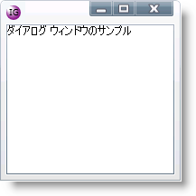

////

|metadata|
{
    "name": "xamdialogwindow-customize-the-window-header-icon",
    "controlName": ["xamDialogWindow"],
    "tags": ["How Do I","Styling"],
    "guid": "{9E8D1D01-FA4E-4401-BC5B-06E06D111105}",  
    "buildFlags": [],
    "createdOn": "2016-05-25T18:21:54.9751468Z"
}
|metadata|
////

= ウィンドウ ヘッダー アイコンのカスタマイズ

== 始める前に

xamDialogWindow コントロールのもうひとつの主要な機能はダイアログ ウィンドウのヘッダーに画像を表示する機能です。

_前提_

このトピックは、ページ上に xamDialogWindow コントロールがすでにあることを前提とします。詳細は、 link:xamdialogwindow-adding-xamdialogwindow-to-your-page.html[xamDialogWindow をページに追加]のトピックを参照してください。

== 達成すること

xamDialogWindow コントロールの link:{ApiPlatform}controls.interactions.xamdialogwindow{ApiVersion}~infragistics.controls.interactions.xamdialogwindow~headericontemplate.html[HeaderIconTemplate] プロパティをカスタムのデータ テンプレートに設定することによって、ヘッダーに表示されるデフォルトの画像をオーバーライドします。

== 次の手順を実行します

[start=1]
. ページでリソース ディクショナリを作成します。

*XAML の場合:*

----
<UserControl.Resources>
   <!-- TODO: DataTemplateを追加します -->
</UserControl.Resources>
----

[start=2]
. データ テンプレートを作成します。x:Key プロパティを HeaderIconImg を設定します。

*XAML の場合:*

----
<DataTemplate x:Key="HeaderIconImg">
   <!-- TODO: グリッド パネルを追加します -->
</DataTemplate>
----

[start=3]
. Grid パネルを DataTemplate に追加します。Ellipse を Grid パネルに追加します。以下のプロパティを設定します。

** Width - 16
** Height - 16

*XAML の場合:*

----
<Grid>
   <Ellipse Width="16" Height="16">
      <!--TODO: Ellipse プロパティを追加します --> 
   </Ellipse>
</Grid>
----

[start=4]
. Ellipse 要素の Fill 属性を設定します。RadialGradientBrush 要素を追加し、GradientOrigin プロパティを .1,.1 に設定します。

*XAML の場合:*

----
<Ellipse.Fill>
   <RadialGradientBrush GradientOrigin=".1,.1">
      <!--TODO: GradientStops を追加します -->
   </RadialGradientBrush>
</Ellipse.Fill>
----

[start=5]
. 2 つの GradientStop 要素を追加します。以下のプロパティを設定します。

** Offset - 0.3, Color - White
** Offset - 1, Color - Purple

*XAML の場合:*

----
<GradientStop Offset="0.3" Color="White"/>
<GradientStop Offset="1" Color="Purple"/>
----

[start=6]
. TextBlock コントロールを Grid パネルに追加します。以下のプロパティを設定します。

** Text - IG
** FontSize - 9
** HorizontalAlignment - Center
** VerticalAlignment - Center

*XAML の場合:*

----
<TextBlock Text="IG" FontSize="9" HorizontalAlignment="Center"  VerticalAlignment="Center"/>
----

[start=7]
. xamDialogWindow コントロールの HeaderIconTemplate プロパティを作成したデータ テンプレートに設定します。

*XAML の場合:*

----
<Grid x:Name="LayoutRoot" Width="600" Height="400">
   <ig:XamDialogWindow x:Name="DialogWindow" Width="200" 
                Height="200" Content="Sample Dialog Window" IsModal="True"  
                HeaderIconTemplate="{StaticResource HeaderIconImg}">
   </ig:XamDialogWindow>
</Grid>
----

[start=8]
. アプリケーションを保存して実行します。

== 関連トピック

link:xamdialogwindow-custom-cursors.html[カスタム カーソル]

link:xamdialogwindow-customize-modal-dialog-window-background.html[モーダル ダイアログ ウィンドウの背景のカスタマイズ]

link:xamdialogwindow-handle-moving-events.html[移動イベントの処理]

link:xamdialogwindow-handle-window-state-changing-events.html[ウィンドウ状態変更イベントの処理]

link:xamdialogwindow-keyboard-settings.html[キーボードの設定]

link:xamdialogwindow-modal-and-modeless-dialog-windows.html[モーダルおよびモーダレス ダイアログ ウィンドウ]

link:xamdialogwindow-position-minimized-dialog-window.html[最小化ダイアログ ウィンドウの配置]

link:xamdialogwindow-set-the-dialog-windows-height-and-width-when-minimized.html[最小化した時のダイアログ ウィンドウの高さと幅を設定]

link:xamdialogwindow-start-up-position-of-xamdialogwindow.html[xamDialogWindow の開始位置]

link:xamdialogwindow-the-xamdialogwindow-controls-behavior.html[xamDialogWindow コントロールの動作]

link:xamdialogwindow-window-header-controls.html[ウィンドウ ヘッダー コントロール]