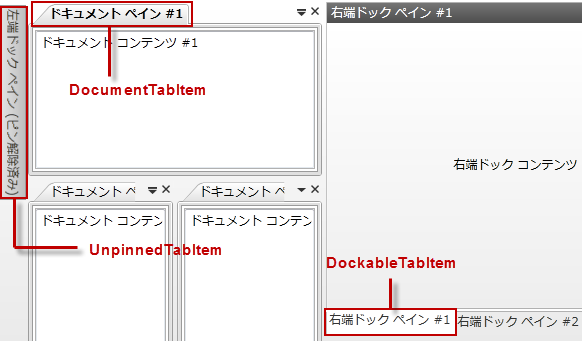
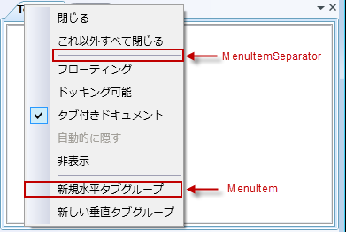
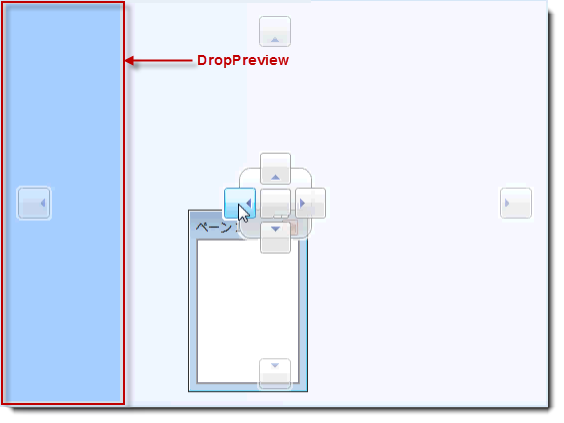
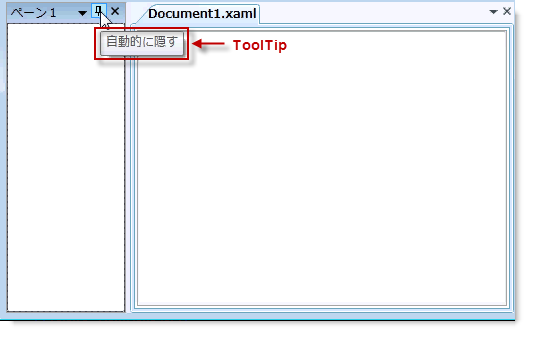

////

|metadata|
{
    "name": "xamdockmanager-about-styling",
    "controlName": ["xamDockManager"],
    "tags": ["Styling"],
    "guid": "{D08A76C2-32DA-4E89-A672-1D0DB855B52A}",  
    "buildFlags": [],
    "createdOn": "2012-01-30T19:39:53.4840499Z"
}
|metadata|
////

= スタイルについて

Microsoft Windows Presentation Foundation のコントロールのように Styles および ControlTemplates を使用して xamDockManager のスタイルを設定できます。ただし、xamDockManager を構成するさまざまなクラスは、Style または ControlTemplate の Key プロパティとして使用できる静的なプロパティを公開することによってより簡単にスタイリングできます。IxamDockManager が事前に定義されたキーを使用する Style または ControlTemplate を見つけると、xamDockManager コントロールは自動的にユーザーが作成した Style または ControlTemplate を使用します。

以下の表は、ユーザーの Styles および ControlTemplates を作成する時にユーザーがキーとして使用できる静的プロパティをリストしています。各セクションの見出しは、プロパティが公開するクラスです。プロパティ名が「TemplateKey」で終わっている場合、その要素をスタイルするために ControlTemplate を作成する必要があります。プロパティ名が "StyleKey" で終わっている場合、その要素をスタイルするために Style を作成する必要があります。たとえば、 link:{ApiPlatform}dockmanager{ApiVersion}~infragistics.windows.dockmanager.documentcontenthost.html[DocumentContentHost] オブジェクトでコンテンツペインのタブ ヘッダーをスタイルしたい場合、以下の表を使用してクラスとプロパティ名を最初に見つけます。プロパティが見つかれば、そのプロパティの名前に基づいて ControlTemplate または Style を作成します。マークアップ拡張を使用してプロパティに ControlTemplate または Style の Key プロパティを設定します。

*XAML の場合:*

----
<!--
プロパティ名が "TemplateKey" で終わっているのでコントロール テンプレートを作成します。
コントロール テンプレートの Key プロパティを PaneTabItem クラスによって公開されている静的プロパティに設定します。
コントロール テンプレートの TargetType プロパティを PaneTabItem に設定します。
-->
<ControlTemplate 
    x:Key="{x:Static igDock:PaneTabItem.DocumentTabItemTemplateKey}" 
    TargetType="{x:Type igDock:PaneTabItem}">
    <!--
    TODO: ここでテンプレートを作成し、xamDockManager は自動的に DocumentContentHost オブジェクトのタブ ヘッダーにこの ControlTemplate を使用します。
    -->
</ControlTemplate>
----

== link:{ApiPlatform}dockmanager{ApiVersion}~infragistics.windows.dockmanager.panetabitem.html[PaneTabItem] クラス

[options="header", cols="a,a"]
|====
|プロパティ名|ターゲット タイプ

| link:{ApiPlatform}dockmanager{ApiVersion}~infragistics.windows.dockmanager.panetabitem~documenttabitemtemplatekey.html[DocumentTabItemTemplateKey]
|PaneTabItem

| link:{ApiPlatform}dockmanager{ApiVersion}~infragistics.windows.dockmanager.panetabitem~dockabletabitemtemplatekey.html[DockableTabItemTemplateKey]
|PaneTabItem

| link:{ApiPlatform}dockmanager{ApiVersion}~infragistics.windows.dockmanager.panetabitem~unpinnedtabitemtemplatekey.html[UnpinnedTabItemTemplateKey]
|PaneTabItem

|====

== link:{ApiPlatform}dockmanager{ApiVersion}~infragistics.windows.dockmanager.tabgrouppane.html[TabGroupPane] クラス

[options="header", cols="a,a"]
|====
|プロパティ名|ターゲット タイプ

| link:{ApiPlatform}dockmanager{ApiVersion}~infragistics.windows.dockmanager.tabgrouppane~documenttabgrouptemplatekey.html[DocumentTabGroupTemplateKey]
|TabGroupPane

| link:{ApiPlatform}dockmanager{ApiVersion}~infragistics.windows.dockmanager.tabgrouppane~dockabletabgrouptemplatekey.html[DockableTabGroupTemplateKey]
|TabGroupPane

| link:{ApiPlatform}dockmanager{ApiVersion}~infragistics.windows.dockmanager.tabgrouppane~documentpanenavigatorbuttonstylekey.html[DocumentPaneNavigatorButtonStyleKey]
|ボタン

| link:{ApiPlatform}dockmanager{ApiVersion}~infragistics.windows.dockmanager.tabgrouppane~documentclosebuttonstylekey.html[DocumentCloseButtonStyleKey]
|ボタン

| link:{ApiPlatform}dockmanager{ApiVersion}~infragistics.windows.dockmanager.tabgrouppane~documentfilesmenuitemstylekey.html[DocumentFilesMenuItemStyleKey]
|MenuItem

|====

image::images/xamDockManager_About_Styling_xamDockManager_02.png[xamdockmanager の tabgrouppane スタイリング ポイント]

image::images/xamDockManager_About_Styling_xamDockManager_03.png[xamdockmanager の tabgrouppane スタイリング ポイント]

== link:{ApiPlatform}dockmanager{ApiVersion}~infragistics.windows.dockmanager.paneheaderpresenter.html[PaneHeaderPresenter] クラス

[options="header", cols="a,a"]
|====
|プロパティ名|ターゲット タイプ

| link:{ApiPlatform}dockmanager{ApiVersion}~infragistics.windows.dockmanager.paneheaderpresenter~closebuttonstylekey.html[CloseButtonStyleKey]
|ボタン

| link:{ApiPlatform}dockmanager{ApiVersion}~infragistics.windows.dockmanager.paneheaderpresenter~pinbuttonstylekey.html[PinButtonStyleKey]
|ボタン

| link:{ApiPlatform}dockmanager{ApiVersion}~infragistics.windows.dockmanager.paneheaderpresenter~positionmenuitemstylekey.html[PositionMenuItemStyleKey]
|MenuItem

|====

image::images/xamDockManager_About_Styling_xamDockManager_04.png[xamdockmanager の paneheaderpresenter スタイリング ポイント]

== link:{ApiPlatform}dockmanager{ApiVersion}~infragistics.windows.dockmanager.panesplitter.html[PaneSplitter] クラス

[options="header", cols="a,a"]
|====
|プロパティ名|ターゲット タイプ

| link:{ApiPlatform}dockmanager{ApiVersion}~infragistics.windows.dockmanager.panesplitter~previewstylekey.html[PreviewStyleKey]
|コントロール

|====

image::images/xamDockManager_About_Styling_xamDockManager_05.png[xamdockmanager の panesplitter スタイリング ポイント]

== link:{ApiPlatform}dockmanager{ApiVersion}~infragistics.windows.dockmanager.xamdockmanager.html[XamDockManager] クラス

[options="header", cols="a,a"]
|====
|プロパティ名|ターゲット タイプ

| link:{ApiPlatform}dockmanager{ApiVersion}~infragistics.windows.dockmanager.xamdockmanager~droppreviewstylekey.html[DropPreviewStyleKey]
|コントロール

| link:{ApiPlatform}dockmanager{ApiVersion}~infragistics.windows.dockmanager.xamdockmanager~menuitemseparatorstylekey.html[MenuItemSeparatorStyleKey]
|セパレーター

| link:{ApiPlatform}dockmanager{ApiVersion}~infragistics.windows.dockmanager.xamdockmanager~menuitemstylekey.html[MenuItemStyleKey]
|MenuItem

| link:{ApiPlatform}dockmanager{ApiVersion}~infragistics.windows.dockmanager.xamdockmanager~tooltipstylekey.html[ToolTipStyleKey]
|ToolTip

|====

[NOTE]
====
*注:* DropPreview コントロールは xamDockManager の視覚的なツリーの一部ではありません。したがって、スタイルを xamDockManager のローカル リソース ディクショナリに追加する必要があります。
====

== 関連トピック

link:xamdockmanager-styling-the-docking-indicators.html[ドッキング インジケーターのスタイリング]

link:xamdockmanager-using-xamdockmanager.html[xamDockManager を使用]