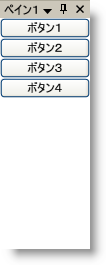

////

|metadata|
{
    "name": "xamdockmanager-add-content-to-a-contentpane",
    "controlName": ["xamDockManager"],
    "tags": ["How Do I"],
    "guid": "{EBC7F0CD-11B5-48A3-9A5A-31AB27D51152}",  
    "buildFlags": [],
    "createdOn": "2012-01-30T19:39:53.4860503Z"
}
|metadata|
////

= コンテンツを ContentPane に追加

link:{ApiPlatform}dockmanager{ApiVersion}~infragistics.windows.dockmanager.contentpane.html[ContentPane] オブジェクトは HeaderedContentControl から派生しているので、このオブジェクトの使用は Microsoft Windows® Presentation Foundation のヘッダー付きコンテンツ コントロールに似ています。Windows Presentation Foundation のコンテンツ コントロールと同じように、コンテンツ ペインの link:{ApiPlatform}dockmanager{ApiVersion}~infragistics.windows.dockmanager.contentpane.html[Content] プロパティをオブジェクトのインスタンスに設定できます。多くの場合、StackPanel などのレイアウト コンテナをルート要素として使用します (レイアウト コンテナに補足要素を追加する)。

コンテンツ ペインの Content プロパティを設定できるだけでなく、ペインのヘッダーのテキストを表示するために link:{ApiPlatform}dockmanager{ApiVersion}~infragistics.windows.dockmanager.contentpane.html[Header] プロパティを設定することもできます。コンテンツ ペインのピン固定を解除および隠すと、タブ ヘッダーが自動的にヘッダー テキストを表示します。コンテンツ ペインの link:{ApiPlatform}dockmanager{ApiVersion}~infragistics.windows.dockmanager.contentpane~tabheader.html[TabHeader] プロパティを設定して、このデフォルトの動作をオーバーライドできます。

コンテンツ ペインのドッキング関連の動作を制限する以下のプロパティも見つかります。

* link:{ApiPlatform}dockmanager{ApiVersion}~infragistics.windows.dockmanager.contentpane~allowdocking.html[AllowDocking]
* link:{ApiPlatform}dockmanager{ApiVersion}~infragistics.windows.dockmanager.contentpane~allowdockingbottom.html[AllowDockingBottom]
* link:{ApiPlatform}dockmanager{ApiVersion}~infragistics.windows.dockmanager.contentpane~allowdockingfloating.html[AllowDockingFloating]
* link:{ApiPlatform}dockmanager{ApiVersion}~infragistics.windows.dockmanager.contentpane~allowdockingintabgroup.html[AllowDockingInTabGroup]
* link:{ApiPlatform}dockmanager{ApiVersion}~infragistics.windows.dockmanager.contentpane~allowdockingleft.html[AllowDockingLeft]
* link:{ApiPlatform}dockmanager{ApiVersion}~infragistics.windows.dockmanager.contentpane~allowdockingtop.html[AllowDockingTop]
* link:{ApiPlatform}dockmanager{ApiVersion}~infragistics.windows.dockmanager.contentpane~allowfloatingonly.html[AllowFloatingOnly]
* link:{ApiPlatform}dockmanager{ApiVersion}~infragistics.windows.dockmanager.contentpane~allowindocumenthost.html[AllowInDocumentHost]
* link:{ApiPlatform}dockmanager{ApiVersion}~infragistics.windows.dockmanager.contentpane~allowpinning.html[AllowPinning]
* link:{ApiPlatform}dockmanager{ApiVersion}~infragistics.windows.dockmanager.contentpane~ispinned.html[IsPinned]

以下のコード例は、コンテンツをコンテンツ ペインに追加する方法を示します。

*XAML の場合:*

----
...
<igDock:XamDockManager Name="xamDockManager1">
    <igDock:XamDockManager.Panes>
        <igDock:SplitPane>
            <igDock:ContentPane Header="Pane 1">
                <StackPanel>
                    <Button Content="Button 1" />
                    <Button Content="Button 2" />
                    <Button Content="Button 3" />
                    <Button Content="Button 4" />
                </StackPanel>
            </igDock:ContentPane>
        </igDock:SplitPane>
    </igDock:XamDockManager.Panes>
</igDock:XamDockManager>
...
----

*Visual Basic の場合:*

----
Imports Infragistics.Windows.DockManager
...
'SplitPane オブジェクトを作成します
Dim splitPane1 As New SplitPane() 
' xamDockManager の Panes コレクションに SplitPane を追加します。
Me.xamDockManager1.Panes.Add(splitPane1) 
'ContentPane を作成し、その Header プロパティを設定します。
Dim buttonPane As New ContentPane() 
buttonPane.Header = "Pane 1" 
' SplitPane の Panes コレクションに ContentPane を追加します。
splitPane1.Panes.Add(buttonPane) 
' StackPanel を作成します。
Dim panel As New StackPanel() 
'ContentPane の Content プロパティをパネルに設定します。
buttonPane.Content = panel 
'4 つの Button コントロールを作成し、StackPanel の Children コレクションに追加します。
For i As Integer = 1 To 4 
    Dim b As New Button() 
    b.Content = "Button " + i.ToString() 
    panel.Children.Add(b) 
Next
...
----

*C# の場合:*

----
using Infragistics.Windows.DockManager;
...
//SplitPane オブジェクトを作成します
SplitPane splitPane1 = new SplitPane();
//xamDockManager の Panes コレクションに SplitPane を追加します。
this.xamDockManager1.Panes.Add(splitPane1);
//ContentPane を作成し、その Header プロパティを設定します。
ContentPane buttonPane = new ContentPane();
buttonPane.Header = "Pane 1";
//SplitPane の Panes コレクションに ContentPane を追加します。
splitPane1.Panes.Add(buttonPane);
//StackPanel を作成します。
StackPanel panel = new StackPanel();
//ContentPane の Content プロパティをパネルに設定します。
buttonPane.Content = panel;
//4 つの Button コントロールを作成し、StackPanel の Children コレクションに追加します。
for (int i = 1; i < 5; i++)
{
    Button b = new Button();
    b.Content = "Button " + i.ToString();
    panel.Children.Add(b);
}
....
----

== 関連トピック

link:xamdockmanager-about-opening-and-closing-panes.html[開始ペインと終了ペインについて]

link:xamdockmanager-add-panes-to-the-documentcontenthost-object.html[ペインを DocumentContentHost オブジェクトに追加]

link:xamdockmanager-add-panes-to-xamdockmanager.html[ペインを xamDockManager に追加]

link:xamdockmanager-creating-a-tabbed-mdi-application.html[タブ付き MDI アプリケーションを作成]

link:xamdockmanager-pin-and-unpin-a-pane.html[ペインのピンを固定および解除]

link:xamdockmanager-prevent-end-users-from-resizing-floating-panes.html[エンドユーザーがフローティング ペインのサイズを変更することを禁止]

link:xamdockmanager-set-the-location-of-a-floating-pane.html[フローティング ペインの場所を設定]

link:xamdockmanager-set-the-initial-location-of-a-pane.html[ペインの最初の位置を設定]

link:xamdockmanager-set-the-size-of-a-floating-pane.html[フローティング ペインのサイズを設定]

link:xamdockmanager-show-the-pane-navigator-programmatically.html[プログラミングによるペインナビゲータの表示]

link:xamdockmanager-end-user-settings.html[エンドユーザー設定]

link:xamdockmanager-styling-xamdockmanager.html[xamDockManager のスタイリング]