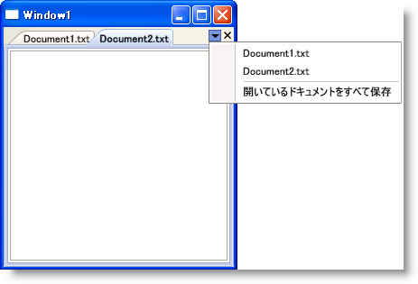

////

|metadata|
{
    "name": "xamdockmanager-add-menu-items-to-the-file-menu",
    "controlName": ["xamDockManager"],
    "tags": ["How Do I"],
    "guid": "{15B31903-1717-48EB-A72B-B3CA7AA63C89}",  
    "buildFlags": [],
    "createdOn": "2012-01-30T19:39:53.4880507Z"
}
|metadata|
////

= メニュー項目をファイル メニューに追加

開発者またはエンドユーザーがペインを xamDockManager™ コントロールの文書領域に追加する場合、小さい三角形のボタンがファイルメニューと呼ばれるタブが付いた文書領域の右上角に表示されます。デフォルトでは、ファイルメニューは文書領域の特定のタブグループ内のすべてのペインをリストし、エンドユーザーがペインを切り替えることを可能にします。link:{ApiPlatform}dockmanager{ApiVersion}~infragistics.windows.dockmanager.tabgrouppane.html[TabGroupPane] オブジェクトの link:{ApiPlatform}dockmanager{ApiVersion}~infragistics.windows.dockmanager.tabgrouppane~filesmenuopening_ev.html[FilesMenuOpening] イベントを処理して、MenuItem オブジェクトを link:{ApiPlatform}dockmanager{ApiVersion}~infragistics.windows.dockmanager.events.filesmenuopeningeventargs.html[FilesMenuOpeningEventArgs] オブジェクトの link:{ApiPlatform}dockmanager{ApiVersion}~infragistics.windows.dockmanager.events.filesmenuopeningeventargs~items.html[Items] プロパティに追加することによって、自分自身の項目をファイル メニューに追加することもできます。

ファイル メニューに追加するメニュー項目は、Microsoft® Windows® Presentation Foundation のデフォルトのスタイルを使用します。メニュー項目のスタイルと残りのコントロールとの整合性を維持するには、MenuItem オブジェクトの Style プロパティを xamDockManager によって公開されている静的な link:{ApiPlatform}dockmanager{ApiVersion}~infragistics.windows.dockmanager.xamdockmanager~menuitemstylekey.html[MenuItemStyleKey] プロパティに設定するだけです。これは、ファイル メニューに追加する Separator オブジェクトにも適用されます。ただし、MenuItemStyleKey プロパティを使用する代わりに、 link:{ApiPlatform}dockmanager{ApiVersion}~infragistics.windows.dockmanager.xamdockmanager~menuitemseparatorstylekey.html[MenuItemSeparatorStyleKey] プロパティを使用する必要があります。

以下のコード例は、セパレーターおよびメニュー項目をファイル メニューに追加する方法を示しています。

*XAML の場合:*

----
<igDock:XamDockManager 
    Name="xamDockManager1" 
    igDock:TabGroupPane.FilesMenuOpening="xamDockManager1_FilesMenuOpening">
    <igDock:DocumentContentHost>
        <igDock:SplitPane>
            <igDock:TabGroupPane>
                <igDock:ContentPane Header="Document1.txt" />
                <igDock:ContentPane Header="Document2.txt" />
            </igDock:TabGroupPane>
        </igDock:SplitPane>
    </igDock:DocumentContentHost>
</igDock:XamDockManager>
----

*Visual Basic の場合:*

----
Imports Infragistics.Windows.DockManager
Imports Infragistics.Windows.DockManager.Events
...
Private Sub xamDockManager1_FilesMenuOpening(ByVal sender As Object, ByVal e As FilesMenuOpeningEventArgs)
    ' 自身のメニュー項目と xamDockManager に作成された項目を区別するためのセパレーター
    Dim separator1 As New Separator()
    ' セパレーターのスタイル プロパティを xamDockManager の静的な MenuItemSeparatorStyleKey プロパティに設定します。
    separator1.SetResourceReference(StyleProperty, XamDockManager.MenuItemSeparatorStyleKey)
    e.Items.Add(separator1)
    Dim menuItemSaveAll As New MenuItem()
    menuItemSaveAll.Header = "Save All Open Documents"
    ' メニュー項目のスタイル プロパティを xamDockManager の静的な MenuItemStyleKey プロパティに設定します
    menuItemSaveAll.SetResourceReference(StyleProperty, XamDockManager.MenuItemStyleKey)
    AddHandler menuItemSaveAll.Click, AddressOf menuItemSaveAll_Click
    e.Items.Add(menuItemSaveAll)
End Sub
Private Sub menuItemSaveAll_Click(ByVal sender As Object, ByVal e As RoutedEventArgs)
    ' TODO: ここにアプリケーション ロジックを追加します
End Sub
...
----

*C# の場合:*

----
using Infragistics.Windows.DockManager;
using Infragistics.Windows.DockManager.Events;
...
private void xamDockManager1_FilesMenuOpening(object sender, FilesMenuOpeningEventArgs e)
{
    // 自身のメニュー項目と xamDockManager に作成された項目を区別するためのセパレーター
    Separator separator1 = new Separator();
    // セパレーターのスタイル プロパティを xamDockManager の静的な MenuItemSeparatorStyleKey プロパティに設定します。
    separator1.SetResourceReference(StyleProperty, XamDockManager.MenuItemSeparatorStyleKey);
    e.Items.Add(separator1);
    MenuItem menuItemSaveAll = new MenuItem();
    menuItemSaveAll.Header = "Save All Open Documents";
    // メニュー項目のスタイル プロパティを xamDockManager の静的な MenuItemStyleKey プロパティに設定します
    menuItemSaveAll.SetResourceReference(StyleProperty, XamDockManager.MenuItemStyleKey);
    menuItemSaveAll.Click += new RoutedEventHandler(menuItemSaveAll_Click);
    e.Items.Add(menuItemSaveAll);
}
private void menuItemSaveAll_Click(object sender, RoutedEventArgs e)
{
    // TODO: ここにアプリケーション ロジックを追加します
}
...
----

== 関連トピック

link:xamdockmanager-add-panes-to-the-documentcontenthost-object.html[ペインを DocumentContentHost オブジェクトに追加]

link:xamdockmanager-add-content-to-a-contentpane.html[コンテンツを ContentPane に追加]

link:xamdockmanager-creating-a-tabbed-mdi-application.html[タブ付き MDI アプリケーションを作成]