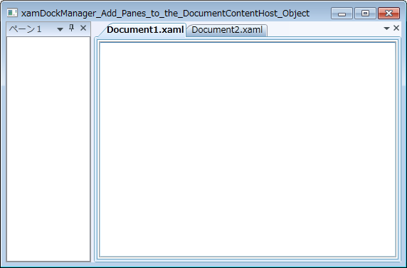

////

|metadata|
{
    "name": "xamdockmanager-add-panes-to-the-documentcontenthost-object",
    "controlName": ["xamDockManager"],
    "tags": ["How Do I","Layouts"],
    "guid": "{6984A929-A0DB-47E9-B302-5ED1C09D5DAA}",  
    "buildFlags": [],
    "createdOn": "2012-01-30T19:39:53.4910513Z"
}
|metadata|
////

= ペインを DocumentContentHost オブジェクトに追加

xamDockManager コントロールは、ドックされたペインとフローティング ペインのコンテンツに加えてコンテンツを表示できます。Microsoft® Windows® Presentation Foundation の他のコンテンツ コントロールと同じパターンを使用して、xamDockManager の link:{ApiPlatform}dockmanager{ApiVersion}~infragistics.windows.dockmanager.xamdockmanager.html[Content] プロパティを設定できます。このパターンは通常、レイアウトコンテナのインスタンスに Content プロパティを設定し、レイアウト コンテナの Children コレクションにコントロールを追加することを必要とします。ただし、xamDockManager は link:{ApiPlatform}dockmanager{ApiVersion}~infragistics.windows.dockmanager.documentcontenthost.html[DocumentContentHost] オブジェクトによってコンテンツを追加するための第 2 のソリューションも提供します。

DocumentContentHost オブジェクトは、タブ内にコンテンツ ペインを表示するための特別なコンテナです。DocumentContentHost オブジェクトによって、エンド ユーザーはペインを xamDockManager のタブ付けされた領域に移動できます。DocumentContentHost オブジェクトを xamDockManager のコンテンツとして使用しない場合、エンド ユーザーはタブ付けされた領域にペインを移動できなくなります。

以下のコード例は、ペインを DocumentContentHost オブジェクトに追加する方法を示します。

*XAML の場合:*

----
...
<igDock:XamDockManager Name="xamDockManager1">
    <igDock:XamDockManager.Panes>
        <igDock:SplitPane>
            <igDock:ContentPane Header="Pane 1">
            </igDock:ContentPane>
        </igDock:SplitPane>
    </igDock:XamDockManager.Panes>
    <igDock:DocumentContentHost>
        <igDock:SplitPane>
            <igDock:TabGroupPane>
                <igDock:ContentPane Header="Document1.xaml">
                    <RichTextBox />
                </igDock:ContentPane>
                <igDock:ContentPane Header="Document2.xaml">
                    <RichTextBox />
                </igDock:ContentPane>
            </igDock:TabGroupPane>
        </igDock:SplitPane>
    </igDock:DocumentContentHost>
</igDock:XamDockManager>
...
----

*Visual Basic の場合:*

----
Imports Infragistics.Windows.DockManager
...
Dim documentContentHost1 As New DocumentContentHost()
Me.xamDockManager1.Content = documentContentHost1
Dim splitPane1 As New SplitPane() 
documentContentHost1.Panes.Add(splitPane1) 
Dim tabGroupPane1 As New TabGroupPane() 
splitPane1.Panes.Add(tabGroupPane1) 
Dim contentPane1 As New ContentPane() 
contentPane1.Header = "Document1.xaml" 
contentPane1.Content = New RichTextBox()
Dim contentPane2 As New ContentPane() 
contentPane2.Header = "Document2.xaml" 
contentPane2.Content = New RichTextBox()
tabGroupPane1.Items.Add(contentPane1) 
tabGroupPane1.Items.Add(contentPane2)
'以下の 3 行のコードを使用して同じ結果を得ることもできます。
'Me.xamDockManager1.Content = New DocumentContentHost()
'Me.xamDockManager1.AddDocument("Document1.xaml", New RichTextBox())
'Me.xamDockManager1.AddDocument("Document2.xaml", New RichTextBox())
...
----

*C# の場合:*

----
using Infragistics.Windows.DockManager;
...
DocumentContentHost documentContentHost1 = new DocumentContentHost();
this.xamDockManager1.Content = documentContentHost1;
SplitPane splitPane1 = new SplitPane();
documentContentHost1.Panes.Add(splitPane1);
TabGroupPane tabGroupPane1 = new TabGroupPane();
splitPane1.Panes.Add(tabGroupPane1);
ContentPane contentPane1 = new ContentPane();
contentPane1.Header = "Document1.xaml";
ContentPane contentPane2 = new ContentPane();
contentPane2.Header = "Document2.xaml";
tabGroupPane1.Items.Add(contentPane1);
tabGroupPane1.Items.Add(contentPane2);
//以下の 3 行のコードを使用して同じ結果を得ることもできます。
//this.xamDockManager1.Content = new DocumentContentHost();
//this.xamDockManager1.AddDocument("Document1.xaml", new RichTextBox())
//this.xamDockManager1.AddDocument("Document2.xaml", new RichTextBox())
...
----

== 関連トピック

link:xamdockmanager-about-opening-and-closing-panes.html[開始ペインと終了ペインについて]

link:xamdockmanager-add-content-to-a-contentpane.html[コンテンツを ContentPane に追加]

link:xamdockmanager-add-panes-to-xamdockmanager.html[ペインを xamDockManager に追加]

link:xamdockmanager-creating-a-tabbed-mdi-application.html[タブ付き MDI アプリケーションを作成]

link:xamdockmanager-pin-and-unpin-a-pane.html[ペインのピンを固定および解除]

link:xamdockmanager-prevent-end-users-from-resizing-floating-panes.html[エンドユーザーがフローティング ペインのサイズを変更することを禁止]

link:xamdockmanager-set-the-location-of-a-floating-pane.html[フローティング ペインの場所を設定]

link:xamdockmanager-set-the-initial-location-of-a-pane.html[ペインの最初の位置を設定]

link:xamdockmanager-set-the-size-of-a-floating-pane.html[フローティング ペインのサイズを設定]

link:xamdockmanager-show-the-pane-navigator-programmatically.html[プログラミングによるペインナビゲータの表示]

link:xamdockmanager-end-user-settings.html[エンドユーザー設定]

link:xamdockmanager-styling-xamdockmanager.html[xamDockManager のスタイリング]