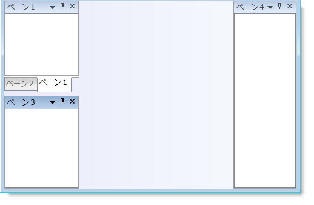

////

|metadata|
{
    "name": "xamdockmanager-add-panes-to-xamdockmanager",
    "controlName": ["xamDockManager"],
    "tags": ["How Do I"],
    "guid": "{05E7B167-F5FF-497D-812D-F696E96EA1A5}",  
    "buildFlags": [],
    "createdOn": "2012-01-30T19:39:53.4930517Z"
}
|metadata|
////

= ペインを xamDockManager に追加

xamDockManager コントロールのドッキング機能を使用するには、xamDockManager の link:{ApiPlatform}dockmanager{ApiVersion}~infragistics.windows.dockmanager.xamdockmanager~panes.html[Panes コレクション]にペインを追加する必要があります。ただし、Panes コレクションにペインを追加しなければ、 link:xamdockmanager-creating-a-tabbed-mdi-application.html[タブ付けされた MDI アプリケーションを作成]するためにこのコントロールを以前と同様に使用できます。ペインの 3 つのタイプについての詳細は、 link:xamdockmanager-understanding-xamdockmanager.html[このトピック]を参照してください。

xamDockManager の Panes コレクションのルート レベル ペインは、分割ペインでなければなりません。xamDockManager の Panes コレクションに分割ペインを追加すれば、分割ペインの link:{ApiPlatform}dockmanager{ApiVersion}~infragistics.windows.dockmanager.splitpane~panes.html[Panes コレクション]に子ペインを追加できます。

以下のコードは、いくつかの異なるタイプのペインを xamDockManager に追加する方法を示します。

*XAML の場合:*

----
...
<igDock:XamDockManager Name="xamDockManager1">
    <igDock:XamDockManager.Panes>
        <!--この SplitPane に追加されたペインは、左にドックされます。-->
        <igDock:SplitPane SplitterOrientation="Horizontal">
            <igDock:TabGroupPane>
                <igDock:ContentPane Header="Pane 1">
                    <!--TODO: ここでコンテンツを追加します-->
                </igDock:ContentPane>
                <igDock:ContentPane Header="Pane 2">
                    <!--TODO: ここでコンテンツを追加します-->
                </igDock:ContentPane>
            </igDock:TabGroupPane>
            <igDock:ContentPane Header="Pane 3">
                <!--TODO: ここでコンテンツを追加します-->
            </igDock:ContentPane>
        </igDock:SplitPane>
        <!--この SplitPane に追加されたペインは、右にドックされます。-->
        <igDock:SplitPane igDock:XamDockManager.InitialLocation="DockedRight">
            <igDock:ContentPane Header="Pane 4">
                <!--TODO: ここでコンテンツを追加します-->
            </igDock:ContentPane>
        </igDock:SplitPane>
    </igDock:XamDockManager.Panes>
</igDock:XamDockManager>
...
----

*Visual Basic の場合:*

----
Imports Infragistics.Windows.DockManager
...
'2 つの SplitPanes を作成し、方向と場所のプロパティを設定します。 
Dim splitPane1 As New SplitPane() 
splitPane1.SplitterOrientation = Orientation.Horizontal 
Dim splitPane2 As New SplitPane() 
XamDockManager.SetInitialLocation(splitPane2, InitialPaneLocation.DockedRight) 
' xamDockManager の Panes コレクションに両方の SplitPanes を追加します。 
Me.xamDockManager1.Panes.Add(splitPane1) 
Me.xamDockManager1.Panes.Add(splitPane2) 
' TabGroupPane を作成します。 
Dim tabGroupPane1 As New TabGroupPane() 
'Content Pane を作成し、その Header プロパティを設定します。 
Dim contentPane3 As New ContentPane() 
contentPane3.Header = "Pane 3" 
'TabGroupPane と ContentPane の両方を splitPane1 の Panes コレクションに追加します。 
splitPane1.Panes.Add(tabGroupPane1) 
splitPane1.Panes.Add(contentPane3) 
'2 つの ContentPane を作成し、それらの Header プロパティを設定します。 
Dim contentPane1 As New ContentPane() 
contentPane1.Header = "Pane 1" 
Dim contentPane2 As New ContentPane() 
contentPane2.Header = "Pane 2" 
' TabGroupPane の Items コレクションに両方の ContentPane を追加します。 
tabGroupPane1.Items.Add(contentPane1) 
tabGroupPane1.Items.Add(contentPane2) 
'他の ContentPane を作成し、その Header プロパティを設定します。 
Dim contentPane4 As New ContentPane() 
contentPane4.Header = "Pane 4" 
' splitPane2 の Panes コレクションに ContentPane を追加します。 
splitPane2.Panes.Add(contentPane4)
...
----

*C# の場合:*

----
using Infragistics.Windows.DockManager;
...
//2 つの SplitPanes を作成し、方向と場所のプロパティを設定します。
SplitPane splitPane1 = new SplitPane();
splitPane1.SplitterOrientation = Orientation.Horizontal;
SplitPane splitPane2 = new SplitPane();
XamDockManager.SetInitialLocation(splitPane2, InitialPaneLocation.DockedRight);
//xamDockManager の Panes コレクションに両方の SplitPanes を追加します。
this.xamDockManager1.Panes.Add(splitPane1);
this.xamDockManager1.Panes.Add(splitPane2);
// TabGroupPane を作成します。
TabGroupPane tabGroupPane1 = new TabGroupPane();
//Content Pane を作成し、その Header プロパティを設定します。
ContentPane contentPane3 = new ContentPane();
contentPane3.Header = "Pane 3";
//TabGroupPane と ContentPane の両方を splitPane1 の Panes コレクションに追加します。
splitPane1.Panes.Add(tabGroupPane1);
splitPane1.Panes.Add(contentPane3);
//2 つの ContentPane を作成し、それらの Header プロパティを設定します。
ContentPane contentPane1 = new ContentPane();
contentPane1.Header = "Pane 1";
ContentPane contentPane2 = new ContentPane();
contentPane2.Header = "Pane 2";
//TabGroupPane の Items コレクションに両方の ContentPane を追加します。
tabGroupPane1.Items.Add(contentPane1);
tabGroupPane1.Items.Add(contentPane2);
//他の ContentPane を作成し、その Header プロパティを設定します。
ContentPane contentPane4 = new ContentPane();
contentPane4.Header = "Pane 4";
//splitPane2 の Panes コレクションに ContentPane を追加します。
splitPane2.Panes.Add(contentPane4);
...
----

== 関連トピック

link:xamdockmanager-about-opening-and-closing-panes.html[開始ペインと終了ペインについて]

link:xamdockmanager-add-content-to-a-contentpane.html[コンテンツを ContentPane に追加]

link:xamdockmanager-add-panes-to-the-documentcontenthost-object.html[ペインを DocumentContentHost オブジェクトに追加]

link:xamdockmanager-creating-a-tabbed-mdi-application.html[タブ付き MDI アプリケーションを作成]

link:xamdockmanager-pin-and-unpin-a-pane.html[ペインのピンを固定および解除]

link:xamdockmanager-prevent-end-users-from-resizing-floating-panes.html[エンドユーザーがフローティング ペインのサイズを変更することを禁止]

link:xamdockmanager-set-the-location-of-a-floating-pane.html[フローティング ペインの場所を設定]

link:xamdockmanager-set-the-initial-location-of-a-pane.html[ペインの最初の位置を設定]

link:xamdockmanager-set-the-size-of-a-floating-pane.html[フローティング ペインのサイズを設定]

link:xamdockmanager-show-the-pane-navigator-programmatically.html[プログラミングによるペインナビゲータの表示]

link:xamdockmanager-end-user-settings.html[エンドユーザー設定]

link:xamdockmanager-styling-xamdockmanager.html[xamDockManager のスタイリング]