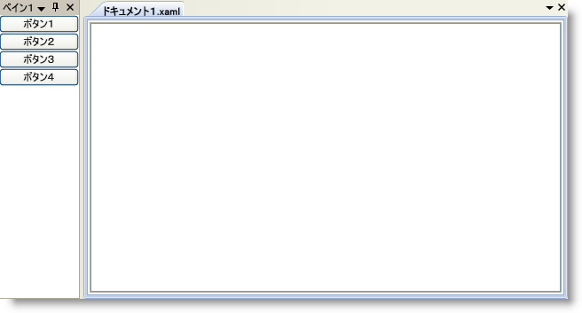

////
|metadata|
{
    "name": "xamdockmanager-getting-started-with-xamdockmanager",
    "controlName": ["xamDockManager"],
    "tags": ["Getting Started","How Do I"],
    "guid": "{5771DA8B-9B0C-48AD-9019-336866BF0DD0}",
    "buildFlags": [],
    "createdOn": "2012-01-30T19:39:53.5070545Z"
}
|metadata|
////

= xamDockManager をアプリケーションに追加

== 始める前に

Microsoft® Windows® Presentation Foundation の他のコントロールを追加する時と同じように xamDockManager を Window に追加できます。この手順は、Window のメイン コンテンツとしてレイアウト コンテナを使用し、レイアウトコンテナにコントロールを追加することが必要となります。

== 達成すること

xamDockManager を Window に追加します。次にペインの組み合わせを使用して xamDockManager の左側にボタンのセットをドックします。最後に、メイン コンテンツ領域でタブ付けされた文書を作成します。

== 次の手順を実行します

[start=1]
. Microsoft® Windows® Presentation Foundation Window プロジェクトを作成します。
[start=2]
. 以下の NuGet パッケージをアプリケーションに追加します。

** Infragistics.WPF.DockManager

+
NuGet フィードのセットアップと NuGet パッケージの追加の詳細については、link:nuget-feeds.html[NuGet フィード] ドキュメントを参照してください。

[start=3]
. xamDockManager の名前空間宣言を追加します。

*XAML の場合:*

----
xmlns:igDock="http://infragistics.com/DockManager"
----

*Visual Basic の場合:*

----
Imports Infragistics.Windows.DockManager
----

*C# の場合:*

----
using Infragistics.Windows.DockManager;
----

[start=4]
. Window でデフォルトのグリッド レイアウト パネルに名前を付け、コード ビハインドでそれを参照できます。

*XAML の場合:*

----
<Grid Name="layoutRoot">
</Grid>
----

[start=5]
. xamDockManager のインスタンスを作成します。xamDockManager コントロール タグ内で link:{ApiPlatform}dockmanager{ApiVersion}~infragistics.windows.dockmanager.xamdockmanager~panes.html[Panes コレクション]のタグを宣言します。Panes コレクションのすべてのルート レベル ペインは、 link:{ApiPlatform}dockmanager{ApiVersion}~infragistics.windows.dockmanager.splitpane.html[SplitPane] オブジェクトのインスタンスでなければなりません。

SplitPane オブジェクトを xamDockManager の Panes コレクションに追加します。分割ペインは左から右に子を配置します。link:{ApiPlatform}dockmanager{ApiVersion}~infragistics.windows.dockmanager.splitpane~splitterorientation.html[SplitterOrientation] プロパティを Horizontal に設定することでデフォルト動作を修正できます。SplitterOrientation プロパティを Horizontal に設定すると、ペイン間の垂直分割バーの代わりに水平の分割バーを作成します。その結果、分割ペインは左から右の代わりに上から下に子を配置されます。

link:{ApiPlatform}dockmanager{ApiVersion}~infragistics.windows.dockmanager.contentpane.html[ContentPane] オブジェクトを SplitPane オブジェクトの link:{ApiPlatform}dockmanager{ApiVersion}~infragistics.windows.dockmanager.splitpane~panes.html[Panes コレクション]に追加し、ContentPane の link:{ApiPlatform}dockmanager{ApiVersion}~infragistics.windows.dockmanager.contentpane.html[Header] プロパティを設定します。Panes コレクションのタグを明示的に宣言する必要はありません。

コンテンツを ContentPane オブジェクトを追加します。ひとつの StackPanel と 4 つの Button コントロールをその中に追加します。

xamDockManager コントロール タグ内の link:{ApiPlatform}dockmanager{ApiVersion}~infragistics.windows.dockmanager.documentcontenthost.html[DocumentContentHost] オブジェクトを追加します。xamDockManager の Panes コレクションの外の DocumentContentHost オブジェクトのタグを宣言する必要があります。DocumentContentHost オブジェクトの詳細については、 link:xamdockmanager-understanding-xamdockmanager.html[xamDockManager について]を参照してください。

DocumentContentHost オブジェクトの link:{ApiPlatform}dockmanager{ApiVersion}~infragistics.windows.dockmanager.documentcontenthost~panes.html[Panes コレクション]に SplitPane オブジェクトを追加します。DocumentContentHost オブジェクトの Panes コレクションのタグを明示的に宣言する必要はありません。

SplitPane オブジェクトの Panes コレクションに link:{ApiPlatform}dockmanager{ApiVersion}~infragistics.windows.dockmanager.tabgrouppane.html[TabGroupPane] オブジェクトを追加します。SplitPane オブジェクトの Panes コレクションのタグを明示的に宣言する必要はありません。タブ グループ ペインに追加する各コンテンツ ペインは、Microsoft Visual Studio® のコード ビューまたはデザイン ビューに似たタブ付けされた文書になります。

ContentPane オブジェクトを TabGroupPane オブジェクトの link:{ApiPlatform}dockmanager{ApiVersion}~infragistics.windows.dockmanager.tabgrouppane.html[Items collection] に追加し、ContentPane オブジェクトの Header プロパティを設定します。TabGroupPane オブジェクトの Items コレクションのタグを明示的に宣言する必要はありません。

RichTextBox コントロールを ContentPane オブジェクトに追加します。

*XAML の場合:*

----
<Grid Name="layoutRoot">
  <igDock:XamDockManager Name="xamDockManager1">
    <!--Panes コレクションのタグを宣言します-->
    <igDock:XamDockManager.Panes>
      <!--SplitPanes を追加します-->
      <igDock:SplitPane>
        <!--ペインを追加します-->
        <igDock:ContentPane Header="Pane 1">
          <!--コンテンツを追加します-->
          <StackPanel>
            <Button Content="Button 1" />
            <Button Content="Button 2" />
            <Button Content="Button 3" />
            <Button Content="Button 4" />
          </StackPanel>
        </igDock:ContentPane>
      </igDock:SplitPane>
    </igDock:XamDockManager.Panes>
    <!--Adding a layout container or a DocumentContentHost-->
    <igDock:DocumentContentHost>
      <!--Adding a SplitPane-->
      <igDock:SplitPane>
        <!--Adding a TabGroupPane-->
        <igDock:TabGroupPane>
          <!--Adding ContentPanes-->
          <igDock:ContentPane Header="Document1.xaml">
            <!--TODO: Add content here-->
            <RichTextBox VerticalScrollBarVisibility="Auto" />
          </igDock:ContentPane>
        </igDock:TabGroupPane>
      </igDock:SplitPane>
    </igDock:DocumentContentHost>
  </igDock:XamDockManager>
</Grid>
----

*Visual Basic の場合:*

----
Private Sub Window_Loaded(ByVal sender As Object, ByVal e As EventArgs) 
    Private xamDockManager1 As XamDockManager
    xamDockManager1 = New XamDockManager() 
    xamDockManager の Panes コレクションに SplitPanes を追加します
    Dim splitPane1 As New SplitPane()
    xamDockManager1.Panes.Add(splitPane1)
    Dim contentPane1 as New ContentPane()
    contentPane1.Header = "Pane 1"
    splitPane1.Panes.Add(contentPane1)
    Dim stackPanel1 As New StackPanel()
    contentPane1.Content = stackPanel1
    For i As Integer = 1 To 4 
      Dim b As New Button() 
      b.Content = "Button " + i.ToString() 
      stackPanel1.Children.Add(b) 
    Next
    ' xamDockManager の Content プロパティを DocumentContentHost のインスタンスに設定します
    Dim documentContentHost1 As New DocumentContentHost()
    xamDockManager1.Content = documentContentHost1
    Dim splitPane2 As New SplitPane()
    documentContentHost1.Panes.Add(splitPane2)
    Dim tabGroupPane1 As New TabGroupPane()
    splitPane2.Panes.Add(tabGroupPane1)
    Dim contentPane2 As New ContentPane()
    contentPane2.Header = "Document1.xaml"
    tabGroupPane1.Items.Add(contentPane2)
    Dim richTextBox1 As New RichTextBox()
    contentPane2.Content = richTextBox1
    ' xamDockManager をレイアウト コンテナーの Children コレクションに追加します
    Me.layoutRoot.Children.Add(xamDockManager1)
End Sub
----

*C# の場合:*

----
private void Window_Loaded(object sender, EventArgs e)
{
    private XamDockManager xamDockManager1;    
    xamDockManager1 = new XamDockManager();
    // xamDockManager の Panes コレクションに SplitPanes を追加します
    SplitPane splitPane1 = new SplitPane();
    xamDockManager1.Panes.Add(splitPane1);
    ContentPane contentPane1 = new ContentPane();
    contentPane1.Header = "Pane 1";
    splitPane1.Panes.Add(contentPane1);
    StackPanel stackPanel1 = new StackPanel();
    contentPane1.Content = stackPanel1;
    for (int i = 1; i < 5; i++)
    {
        Button b = new Button();
        b.Content = "Button " + i.ToString();
        stackPanel1.Children.Add(b);
    }
    // xamDockManager の Content プロパティを DocumentContentHost のインスタンスに設定します
    DocumentContentHost documentContentHost1 = new DocumentContentHost();
    xamDockManager1.Content = documentContentHost1;
    SplitPane splitPane2 = new SplitPane();
    documentContentHost1.Panes.Add(splitPane2);
    TabGroupPane tabGroupPane1 = new TabGroupPane();
    splitPane2.Panes.Add(tabGroupPane1);
    ContentPane contentPane2 = new ContentPane();
    contentPane2.Header = "Document1.xaml";
    tabGroupPane1.Items.Add(contentPane2);
    RichTextBox richTextBox1 = new RichTextBox();
    contentPane2.Content = richTextBox1;
    // xamDockManager をレイアウト コンテナーの Children コレクションに追加します
    this.layoutRoot.Children.Add(xamDockManager1);
}
----

[start=6]
. プロジェクトを実行すると、アプリケーションの左側に 4 つのボタンがドックされ、"Document1.xaml" という名前のタブ付けされた文書が表示されます。

