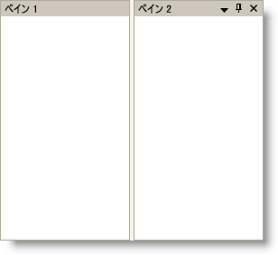

////

|metadata|
{
    "name": "xamdockmanager-hide-the-controls-in-a-content-panes-header",
    "controlName": ["xamDockManager"],
    "tags": ["How Do I"],
    "guid": "{0E3350A8-B614-4FE5-A36A-4CE72FC42521}",  
    "buildFlags": [],
    "createdOn": "2012-01-30T19:39:53.5090549Z"
}
|metadata|
////

= コンテンツ ペインのヘッダーのコントロールを非表示にする

ヘッダーのコントロールに対応する表示プロパティを設定することによって、コンテンツ ペインのヘッダーでコントロールを非表示にできます。たとえば、コンテンツ ペインは、閉じるボタン、ピン ボタン、およびウィンドウ ポジション ボタンの 3 つの個別のコントロールがヘッダーに含まれます。link:{ApiPlatform}dockmanager{ApiVersion}~infragistics.windows.dockmanager.contentpane.html[ContentPane] オブジェクトは、これらのボタンに対応する表示プロパティを公開します。つまり、 link:{ApiPlatform}dockmanager{ApiVersion}~infragistics.windows.dockmanager.contentpane~closebuttonvisibility.html[CloseButtonVisibility]、 link:{ApiPlatform}dockmanager{ApiVersion}~infragistics.windows.dockmanager.contentpane~pinbuttonvisibility.html[PinButtonVisibility]、および link:{ApiPlatform}dockmanager{ApiVersion}~infragistics.windows.dockmanager.contentpane~windowpositionmenuvisibility.html[WindowPositionMenuVisibility] プロパティで、コントロールを簡単に非表示にできます。

以下のコード例は、コンテンツ ペインのヘッダーのコントロールを非表示にする方法を示しています。

*XAML の場合:*

----
<igDock:XamDockManager Name="xamDockManager1">
    <igDock:XamDockManager.Panes>
        <igDock:SplitPane>
            <igDock:ContentPane 
                Header="Pane 1" 
                Name="paneWithNoButtons" 
                CloseButtonVisibility="Collapsed" 
                PinButtonVisibility="Collapsed" 
                WindowPositionMenuVisibility="Collapsed">
            </igDock:ContentPane>
            <igDock:ContentPane Header="Pane 2" Name="paneWithButtons">
            </igDock:ContentPane>
        </igDock:SplitPane>
    </igDock:XamDockManager.Panes>
</igDock:XamDockManager>
----

*Visual Basic の場合:*

----
Me.paneWithNoButtons.CloseButtonVisibility = Visibility.Collapsed
Me.paneWithNoButtons.PinButtonVisibility = Visibility.Collapsed
Me.paneWithNoButtons.WindowPositionMenuButtonVisibility = Visibility.Collapsed
----

*C# の場合:*

----
this.paneWithNoButtons.CloseButtonVisibility = Visibility.Collapsed;
this.paneWithNoButtons.PinButtonVisibility = Visibility.Collapsed;
this.paneWithNoButtons.WindowPositionMenuButtonVisibility = Visibility.Collapsed;
----

== 関連トピック

link:xamdockmanager-about-opening-and-closing-panes.html[開始ペインと終了ペインについて]

link:xamdockmanager-add-panes-to-xamdockmanager.html[ペインを xamDockManager に追加]

link:xamdockmanager-add-content-to-a-contentpane.html[コンテンツを ContentPane に追加]

link:xamdockmanager-pin-and-unpin-a-pane.html[ペインのピンを固定および解除]