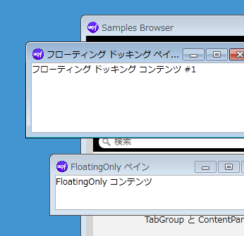
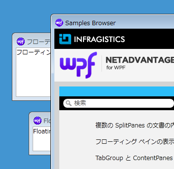
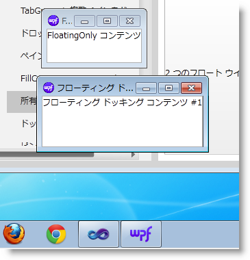
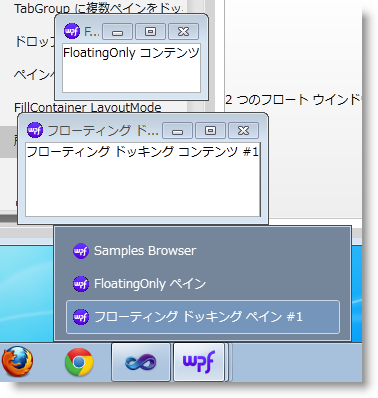

////

|metadata|
{
    "name": "xamdockmanager-owned-panes",
    "controlName": ["xamDockManager"],
    "tags": ["Getting Started","How Do I","Layouts"],
    "guid": "5aafa44f-5e19-4917-a4dc-d73d5221fcaf",  
    "buildFlags": [],
    "createdOn": "2012-01-30T19:39:53.5490629Z"
}
|metadata|
////

= 所有されるペインと所有されないペイン

所有されるペインは親ペインの背後で描画できないため、常に最小化します。これは、所有されるペインの標準的な動作で、xamDockManger によってサポートされます。以下の図 1 と図 2 で、xamDockManger での所有されるペインと所有されないペインの動作を比較します。

[cols="a,a"]
|====
|所有されるペインは、親ウィンドウが選択されていても親ペインの背後に移動できません。図 1 で、2 つの「フローティング」ペインは、親ウィンドウが選択されていても、親ペイン、xamFeatureBrowser の上に残ります。
|所有されないウィンドウは親ウィンドウの背後に移動できます。

| 

図 1: 親ペインの前にある 2 つの所有されるペイン
| 

図 2: 親ペインの後ろにある 2 つの所有されないペイン

|====

== フローティング ペインを所有に構成

link:{ApiPlatform}dockmanager{ApiVersion}~infragistics.windows.dockmanager.xamdockmanager.html[xamDockManager] の link:{ApiPlatform}dockmanager{ApiVersion}~infragistics.windows.dockmanager.xamdockmanager~useownedfloatingwindows.html[UseOwnedFloatingWindows] プロパティを True に設定することにより、フローティング ペインを所有として構成できます。フローティング ペインごとに所有されるウィンドウ設定を設定または取得するには、以下のコードを使用します。

*XAML の場合:*

[source,xaml]
----
<igDock:XamDockManager
    UseOwnedFloatingWindows="True">
   <igDock:XamDockManager.Panes>
       <igDock:SplitPane 
           igDock:XamDockManager.InitialLocation="FloatingOnly"
           igDock:XamDockManager.FloatingLocation="300,300">
           <igDock:ContentPane x:Name="floatingOnly">
               <locCtls:XdmSamplePaneContent Content="Some Content" />
           </igDock:ContentPane>
       </igDock:SplitPane>
    </igDock:XamDockManager.Panes>
</igDock:XamDockManager>
----

*Visual Basic の場合:*

[source,vb]
----
Dim tw As ToolWindow = ToolWindow.GetToolWindow(Me.floatingOnly)
If tw IsNot Nothing Then
        Dim isOwned As Boolean = tw.IsOwnedWindow
End If
----

*C# の場合:*

[source,csharp]
----
ToolWindow tw = ToolWindow.GetToolWindow(this.floatingOnly);
if (tw != null)
{
    bool isOwned = tw.IsOwnedWindow;
}
----

== フローティング ペインを個別のタスクとして表示

オペレーティング システムのタスク バーにフローティング ウィンドウを個別のタスクとして表示できます。 (図 3 と図 4 を比較します。) 

[cols="a,a"]
|====
| 

| 

|図 3: OS のタスク バーにフローティング ウィンドウが表示されない
|図 4: OS のタスク バーにフローティング ウィンドウが表示される

|====

この動作は、xamDockManger の link:{ApiPlatform}dockmanager{ApiVersion}~infragistics.windows.dockmanager.xamdockmanager~showfloatingwindowsintaskbar.html[ShowFloatingWindowsInTaskbar] プロパティを True に設定することで実行されます。

*XAML の場合:*

[source,xaml]
----
<igDock:XamDockManager
    ShowFloatingWindowsInTaskbar="True">
</igDock:XamDockManager>
----

*Visual Basic の場合:*

[source,vb]
----
Me.dockManager.ShowFloatingWindowsInTaskbar = True
----

*C# の場合:*

[source,csharp]
----
this.dockManager.ShowFloatingWindowsInTaskbar = true;
----