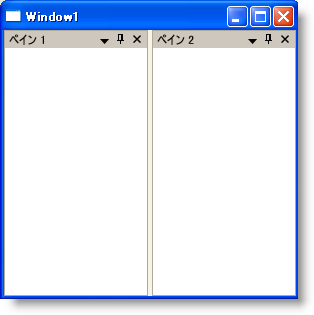

////

|metadata|
{
    "name": "xamdockmanager-prevent-xamdockmanager-from-reserving-space-for-content",
    "controlName": ["xamDockManager"],
    "tags": ["How Do I"],
    "guid": "{897B24D4-AAAE-493C-B023-135C743E5997}",  
    "buildFlags": [],
    "createdOn": "2012-01-30T19:39:53.5210573Z"
}
|metadata|
////

= xamDockManager がコンテンツ用のスペースを確保することを禁止

xamDockManager™ コントロールの link:{ApiPlatform}dockmanager{ApiVersion}~infragistics.windows.dockmanager.xamdockmanager~layoutmode.html[LayoutMode] プロパティを FillContainer に設定すると、ペインは xamDockManager コントロールですべての使用できるスペースを占有できます。ただし、xamDockManager の link:{ApiPlatform}dockmanager{ApiVersion}~infragistics.windows.dockmanager.xamdockmanager.html[Content] プロパティを設定すると、xamDockManager は自動的に標準レイアウト モードを使用してコンテンツのためにスペースを確保します。

以下のコード例は、xamDockManager がコンテンツのためにスペースを確保することを禁止する方法を示します。

*XAML の場合:*

----
<igDock:XamDockManager Name="xamDockManager1" LayoutMode="FillContainer">
    <igDock:XamDockManager.Panes>
        <igDock:SplitPane>
            <igDock:ContentPane Header="Pane 1">
            </igDock:ContentPane>
            <igDock:ContentPane Header="Pane 2">
            </igDock:ContentPane>
        </igDock:SplitPane>
    </igDock:XamDockManager.Panes>
</igDock:XamDockManager>
----

*Visual Basic の場合:*

----
Imports Infragistics.Windows.DockManager
...
Me.xamDockManager1.LayoutMode = DockedPaneLayoutMode.FillContainer
...
----

*C# の場合:*

----
using Infragistics.Windows.DockManager;
...
this.xamDockManager1.LayoutMode = DockedPaneLayoutMode.FillContainer;
...
----

== 関連トピック

link:xamdockmanager-add-panes-to-the-documentcontenthost-object.html[ペインを DocumentContentHost オブジェクトに追加]

link:xamdockmanager-add-panes-to-xamdockmanager.html[ペインを xamDockManager に追加]

link:xamdockmanager-add-content-to-a-contentpane.html[コンテンツを ContentPane に追加]