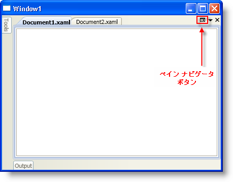
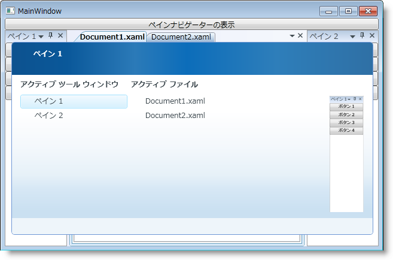

////

|metadata|
{
    "name": "xamdockmanager-show-the-pane-navigator-programmatically",
    "controlName": ["xamDockManager"],
    "tags": ["How Do I"],
    "guid": "{D5018473-014A-4C29-A592-5E112BB42488}",  
    "buildFlags": [],
    "createdOn": "2012-01-30T19:39:53.5320595Z"
}
|metadata|
////

= プログラミングによるペイン ナビゲータの表示

xamDockManager™ コントロールは、Microsoft® Visual Studio® 2008 にある IDE Navigator に似たペイン ナビゲータを装備しています。エンド ユーザーは、CTRL + TAB または ALT +F7 を押して、ペインナビゲータを使用してペインにナビゲートできます。xamDockManager の link:{ApiPlatform}dockmanager{ApiVersion}~infragistics.windows.dockmanager.xamdockmanager~panenavigatorbuttondisplaymode.html[PaneNavigatorButtonDisplayMode] プロパティを Always に設定して、ペイン ナビゲータを表示するためにエンド ユーザーがクリックできる DocumentContentHost オブジェクトでボタンを表示することもできます。ペインナビゲータを表示するための組み込みオプションに加えて、ペインナビゲータをプログラムで表示することもできます。最初のスクリーンショットは、xamDockManager の PaneNavigatorButtonDisplayMode プロパティを Always に設定した場合の Document オブジェクトのペイン ナビゲータ ボタンを示します。2 番目のスクリーンショットは、ペイン ナビゲータの例です。

以下のコード例は、ペイン ナビゲータをプログラムで表示する方法を示します。

*XAML の場合:*

----
...
<Button 
    Content="Show Pane Navigator" 
    Command="{x:Static igDock:DockManagerCommands.ShowPaneNavigator}" 
    CommandTarget="{Binding ElementName=xamDockManager1}" />
<igDock:XamDockManager Name="xamDockManager1" />
...
----

*Visual Basic の場合:*

----
Imports Infragistics.Windows.DockManager
...
Me.xamDockManager1.ExecuteCommand(DockManagerCommands.ShowPaneNavigator)
...
----

*C# の場合:*

----
using Infragistics.Windows.DockManager;
...
this.xamDockManager1.ExecuteCommand(DockManagerCommands.ShowPaneNavigator);
...
----

== 関連トピック

link:xamdockmanager-about-opening-and-closing-panes.html[開始ペインと終了ペインについて]

link:xamdockmanager-add-content-to-a-contentpane.html[コンテンツを ContentPane に追加]

link:xamdockmanager-add-panes-to-the-documentcontenthost-object.html[ペインを DocumentContentHost オブジェクトに追加]

link:xamdockmanager-add-panes-to-xamdockmanager.html[ペインを xamDockManager に追加]

link:xamdockmanager-creating-a-tabbed-mdi-application.html[タブ付き MDI アプリケーションを作成]

link:xamdockmanager-pin-and-unpin-a-pane.html[ペインのピンを固定および解除]

link:xamdockmanager-prevent-end-users-from-resizing-floating-panes.html[エンドユーザーがフローティング ペインのサイズを変更することを禁止]

link:xamdockmanager-set-the-location-of-a-floating-pane.html[フローティング ペインの場所を設定]

link:xamdockmanager-set-the-initial-location-of-a-pane.html[ペインの最初の位置を設定]

link:xamdockmanager-set-the-size-of-a-floating-pane.html[フローティング ペインのサイズを設定]

link:xamdockmanager-end-user-settings.html[エンドユーザー設定]

link:xamdockmanager-styling-xamdockmanager.html[xamDockManager のスタイリング]