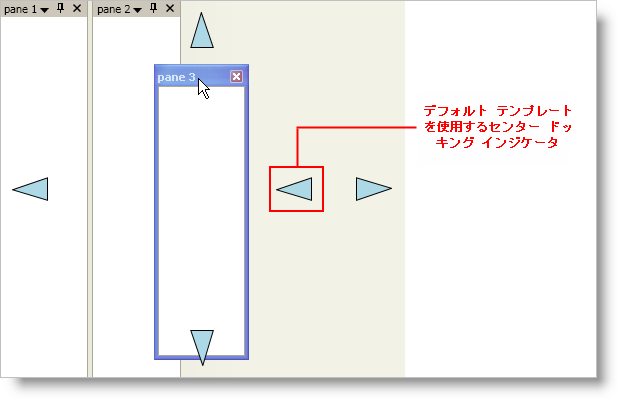

////

|metadata|
{
    "name": "xamdockmanager-styling-the-docking-indicators",
    "controlName": ["xamDockManager"],
    "tags": ["How Do I","Styling"],
    "guid": "{74BB0A9E-BB23-4FD1-815F-4F57C0ABA627}",  
    "buildFlags": [],
    "createdOn": "2012-01-30T19:39:53.5340599Z"
}
|metadata|
////

= ドッキング インジケーターのスタイリング

== 始める前に

xamDockManager™ コントロールは、エンド ユーザーがドック可能なペインのドラッグを開始すると常にドッキング インジケータを表示します。ドッキング インジケータのデフォルト スタイルは、Microsoft® Visual Studio® 2008 にあるようなドッキング インジケータのルック アンドフィールを複製します。ただし、ドッキング インジケーターを再スタイルするためにユーザー自身のコントロール テンプレートを作成することもできます。

== 達成すること

自分自身でコントロール テンプレートを作成して、以下のスクリーンショットに似た xamDockManager のデフォルトのドッキング インジケーターを再スタイルします。

image::images/xamDockManager_Styling_the_Docking_Indicators_01.png[xamdockmanager のドッキング インジケーターのスタイリング]

== 次の手順を実行します

[start=1]
. Window のローカル リソース ディクショナリのタグを追加します。

*XAML の場合:*

----
...
<Window.Resources>
    <!--TODO: ここにデータ テンプレートを追加します-->
</Window.Resources>
...
----

[start=2]
. Window のリソース ディクショナリで link:{ApiPlatform}dockmanager{ApiVersion}~infragistics.windows.dockmanager.dockingindicator.html[DockingIndicator] コントロールをターゲットとするコントロール テンプレートを作成します。

DockingIndicator コントロールは、各サイドにひとつと中央に 1 つの合計 5 つの個別のドッキング インジケーターを持ちます。コントロール テンプレートを作成して、それを DockingIndicator コントロールの link:{ApiPlatform}dockmanager{ApiVersion}~infragistics.windows.dockmanager.dockingindicator.html[Template] プロパティに指定すると、すべての 5 つのドッキング インジケーターは同じコントロール テンプレートを使用します。ただし、中央のドッキング インジケーターは動作しません。サイドのドッキング インジケーターよりもコントロール テンプレートでより視覚的な要素を必要とするからです。手順 5 は、中央のドッキング インジケーター用の個別のコントロール テンプレートを作成する手助けとなります。

*XAML の場合:*

----
...
<ControlTemplate x:Key="dockingIndicators" TargetType="{x:Type igDock:DockingIndicator}">
    <Grid Width="36" Height="36">
        <!--このパス オブジェクトはデフォルトで左をポイントします-->
        <Path 
            Name="DockingIndicatorGlyph" 
            Fill="LightBlue" 
            Stretch="Uniform" 
            Stroke="Black" 
            Data="M277,116 L227,133 277,148 z" />
    </Grid>
    <ControlTemplate.Triggers>
        <!--TODO: ここで Triggers を追加して Path オブジェクトを回転します-->
    </ControlTemplate.Triggers>
</ControlTemplate>
...
----

[start=3]
. Triggers を追加して DockingIndicator コントロールの link:{ApiPlatform}dockmanager{ApiVersion}~infragistics.windows.dockmanager.dockingindicator~position.html[Position] プロパティに基づき Path オブジェクトを修正します。

DockingIndicator コントロールはエッジに沿ってすべてのドッキング インジケーターにコントロール テンプレートを使用するので、コントロール テンプレートの視覚的な要素を修正するには Triggers を追加する必要があります。たとえば、この例ではドッキング インジケーターは左をポイントする矢印です。ドッキング インジケーターが DockingIndicator コントロールの右側にある場合、右をポイントするために矢印を回転します。

*XAML の場合:*

----
...
<!--右をポイントするように Path オブジェクトの回転を起動します-->
<Trigger Property="Position" Value="Right">
    <Setter TargetName="DockingIndicatorGlyph" Property="LayoutTransform">
        <Setter.Value>
            <RotateTransform Angle="180" />
        </Setter.Value>
    </Setter>
</Trigger>
<!--上をポイントするように Path オブジェクトの回転を起動します-->
<Trigger Property="Position" Value="Top">
    <Setter TargetName="DockingIndicatorGlyph" Property="LayoutTransform">
        <Setter.Value>
            <RotateTransform Angle="90" />
        </Setter.Value>
    </Setter>
</Trigger>
<!--下をポイントするように Path オブジェクトの回転を起動します-->
<Trigger Property="Position" Value="Bottom">
    <Setter TargetName="DockingIndicatorGlyph" Property="LayoutTransform">
        <Setter.Value>
            <RotateTransform Angle="-90" />
        </Setter.Value>
    </Setter>
</Trigger>
...
----

[start=4]
. Triggers を追加して DockingIndicator コントロールの link:{ApiPlatform}dockmanager{ApiVersion}~infragistics.windows.dockmanager.dockingindicator~hottrackposition.html[HotTrackPosition] プロパティに基づき Path オブジェクトを修正します。

エンド ユーザーのアクションに基づき視覚的なフィードバックを与えるためのホットトラッキングを実装できますが、ドッキング インジケーターを動作させるために、これを実装する必要はありません。

*XAML の場合:*

----
...
<Trigger Property="HotTrackPosition" Value="Left">
    <Setter TargetName="DockingIndicatorGlyph" Property="Fill" Value="Blue" />
</Trigger>
<Trigger Property="HotTrackPosition" Value="Right">
    <Setter TargetName="DockingIndicatorGlyph" Property="Fill" Value="Blue" />
</Trigger>
<Trigger Property="HotTrackPosition" Value="Top">
    <Setter TargetName="DockingIndicatorGlyph" Property="Fill" Value="Blue" />
</Trigger>
<Trigger Property="HotTrackPosition" Value="Bottom">
    <Setter TargetName="DockingIndicatorGlyph" Property="Fill" Value="Blue" />
</Trigger>
...
----

[start=5]
. Window のリソース ディクショナリで DockingIndicator コントロールをターゲットとする第 2 のコントロール テンプレートを作成します。

DockingIndicator コントロールの中央のドッキング インジケーターは、エンド ユーザーが xamDockManager の端にペインをドックできる、または別のペイン (タブ グループ) 内のペインをドックできるドッキング インジケーターの組み合わせです。これらのドッキング場所のそれぞれを表すためには、5 つの視覚的要素が必要です。

[NOTE]
====
*注:* PART_DockLocation 命名スキームを使用してエンド ユーザーがコンテンツ ペインをドロップする視覚的要素に名前を付ける必要があります。たとえば、エンド ユーザーがコンテンツ ペインをドロップする時には常にペインを左にドックする視覚的要素を持つ場合、"PART_DockLeft" に命名する必要があります。
====

*XAML の場合:*

----
...
<ControlTemplate x:Key="centerDockingIndicator" TargetType="{x:Type igDock:DockingIndicator}">
    <Grid>
        <Grid.RowDefinitions>
            <RowDefinition Height="30" />
            <RowDefinition Height="30" />
            <RowDefinition Height="30" />
        </Grid.RowDefinitions>
        <Grid.ColumnDefinitions>
            <ColumnDefinition Width="30" />
            <ColumnDefinition Width="30" />
            <ColumnDefinition Width="30" />
        </Grid.ColumnDefinitions>
<!--
この楕円形はドッキング インジケーターの中央で、グリッドの中央の四角の中に移動します。
この視覚的要素は、別のペイン (タブ グループ) 内にペインをドックし、"PART_DockCenter" と名前を付ける必要があります。
-->
        <Ellipse 
            Name="PART_DockCenter"
            Stroke="Black" 
            Grid.Row="1"
            Grid.Column="1"
            Fill="Green" />
<!--
このパス オブジェクトは、左をポイントし、グリッドの 1 列、2 行目に移動する三角形です。
これは受け入れ、ペインを左にドックするので、"PART_DockLeft" と名前を付ける必要があります。
-->
        <Path 
            Name="PART_DockLeft"
            Grid.Row="1" 
            Grid.Column="0" 
            Fill="LightBlue" 
            Stretch="Uniform" 
            Stroke="Black" 
            Data="M277,116 L227,133 277,148 z"/>
<!--
このパス オブジェクトは、右をポイントし、グリッドの 3 列、2 行目に移動する三角形です。
これは受け入れ、ペインを右にドックするので、"PART_DockRight" と名前を付ける必要があります。
-->
        <Path 
            Name="PART_DockRight" 
            Grid.Row="1" 
            Grid.Column="2" 
            Fill="LightBlue" 
            Stretch="Uniform" 
            Stroke="Black" 
            Data="M277,116 L227,133 277,148 z">
            <Path.LayoutTransform>
                <RotateTransform Angle="180" />
            </Path.LayoutTransform>
        </Path>
<!--
このパス オブジェクトは、上をポイントし、グリッドの 2 列、1 行目に移動する三角形です。
これは受け入れ、ペインを上にドックするので、"PART_DockTop" と名前を付ける必要があります。
-->
        <Path 
            Name="PART_DockTop" 
            Grid.Row="0" 
            Grid.Column="1" 
            Fill="LightBlue" 
            Stretch="Uniform" 
            Stroke="Black" 
            Data="M277,116 L227,133 277,148 z">
            <Path.LayoutTransform>
                <RotateTransform Angle="90" />
            </Path.LayoutTransform>
        </Path>
<!--
このパス オブジェクトは、下をポイントし、グリッドの 2 列、3 行目に移動する三角形です。
これは受け入れ、ペインを下にドックするので、"PART_DockBottom" と名前を付ける必要があります。
-->
        <Path 
            Name="PART_DockBottom" 
            Grid.Row="2" 
            Grid.Column="1" 
            Fill="LightBlue" 
            Stretch="Uniform" 
            Stroke="Black" 
            Data="M277,116 L227,133 277,148 z">
            <Path.LayoutTransform>
                <RotateTransform Angle="-90" />
            </Path.LayoutTransform>
        </Path>
    </Grid>
<!--
手順 4 の XAML に似た XAML を使用してホットトラッキング機能を実装するために Triggers をコントロール テンプレートに追加できます。
setter の TargetName プロパティを、このコントロール テンプレートの視覚的要素にひとつに変更するだけです。
-->
</ControlTemplate>
...
----

[start=6]
. 以下の xamDockManager の XAML をユーザーの Window に追加します。

XAML は、3 つの空のコンテンツ ペインと link:{ApiPlatform}dockmanager{ApiVersion}~infragistics.windows.dockmanager.documentcontenthost.html[DocumentContentHost] オブジェクトと共にユーザーの Window に xamDockManager コントロールを追加します。

*XAML の場合:*

----
...
<igDock:XamDockManager Name="xamDockManager1">
    <igDock:XamDockManager.Panes>
        <igDock:SplitPane>
            <igDock:ContentPane Header="pane 1" />
            <igDock:ContentPane Header="pane 2" />
            <igDock:ContentPane Header="pane 3" />
        </igDock:SplitPane>
    </igDock:XamDockManager.Panes>
    <igDock:DocumentContentHost />
</igDock:XamDockManager>
...
----

[start=7]
. xamDockManager のローカル リソース ディクショナリのタグを追加します。

*XAML の場合:*

----
...
<igDock:XamDockManager.Resources>
    <!--TODO: ここに Styles を作成します-->
</igDock:XamDockManager.Resources>
...
----

[start=8]
. xamDockManager のリソース ディクショナリで DockingIndicator コントロールをターゲットにするスタイルを作成します。

[NOTE]
====
*注:* DockingIndicator コントロールは xamDockManager の視覚的なツリーの一部ではありません。したがって、スタイルを xamDockManager のローカル リソース ディクショナリに追加する必要があります。
====

*XAML の場合:*

----
...

...
----

[start=9]
. 手順 2 で作成したコントロール テンプレートに Template プロパティを設定するスタイルに Setter オブジェクトを追加します。

この setter はすべてのドッキング インジケーターのテンプレートを指定します。DockingIndicator コントロールの Position プロパティに基づきテンプレートを変更する Triggers を追加できます。プロジェクトを実行してコンテンツ ペインをドラッグすると、以下のスクリーンショットのように表示されます。中央のドッキング インジケーターは、他のドッキング インジケーターと同じテンプレートを使用しています。それが機能しないことにも気づきます。中央のドッキング インジケーターが機能するようにするには、Position プロパティの値が Center である時は常にテンプレートを変更するスタイルに Trigger を追加する必要があります。

*XAML の場合:*

----
...
<Setter Property="Template" Value="{StaticResource dockingIndicators}" />
...
----

[start=10]
. Position プロパティの値が Center である時に Template プロパティを変更するスタイルに Trigger オブジェクトを追加します。

前の手順で設定したテンプレートは、DockingIndicator コントロールの中央のドッキング インジケーターでは動作しません。DockingIndicator コントロールの中央でドッキング インジケーターが動作するためには、手順 5 で作成したテンプレートを使用する必要があります。

*XAML の場合:*

----
...
<Style.Triggers>
    <Trigger Property="Position" Value="Center">
        <Setter Property="Template" Value="{StaticResource centerDockingIndicator}" />
    </Trigger>
</Style.Triggers>
...
----

[start=11]
. プロジェクトを実行し、コンテンツ ペインをドラッグするとドッキング インジケーターが表示します。

== 関連トピック

link:xamdockmanager-about-styling.html[スタイルについて]

link:xamdockmanager-using-xamdockmanager.html[xamDockManager を使用]