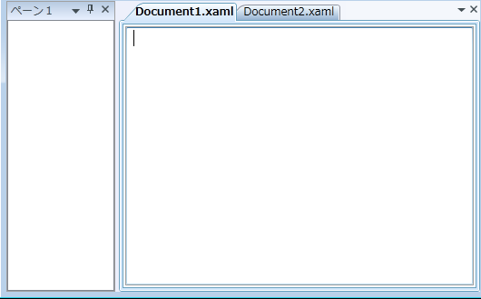
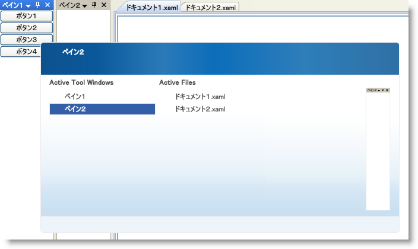
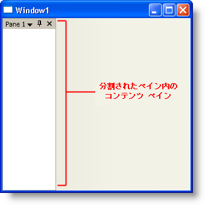
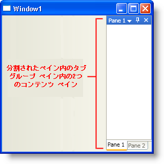

////

|metadata|
{
    "name": "xamdockmanager-understanding-xamdockmanager",
    "controlName": ["xamDockManager"],
    "tags": ["Getting Started"],
    "guid": "{26E0E5B9-2BBE-4706-88A6-51F0852407B8}",  
    "buildFlags": [],
    "createdOn": "2012-01-30T19:39:53.5390609Z"
}
|metadata|
////

= xamDockManager について

ここでは、xamDockManager™ コントロール、およびその主要な特性と機能について解説しています。このセクションのトピックを読むと、アプリケーションで xamDockManager コンポーネントを使用することの利点を理解できます。

* <<xamDockManager,xamDockManager について>>
* <<FloatingPanes,フローティング ペインについて>>
* <<AboutPanes,ペインについて>>
* <<DocumentContentHost,DocumentContentHost オブジェクトについて>>

[[xamDockManager]]

== xamDockManager について

xamDockManager™ コントロールは、アプリケーションのレイアウトを管理するためにペインのコレクションを使用するコンテンツ コントロールです。xamDockManager を使用すれば、ユーザビリティのためにエンドユーザーがカスタマイズできると同時にユーザーインターフェイスのレイアウトをコントロールできます。たとえば、作業をしながらエンド ユーザーがピン固定の解除および非表示にできるドックされたコントロールを作成できます。これによってエンドユーザーは作業に対する画面領域を最大化し、アプリケーションの機能を損なうことなう作業できます。Microsoft® Visual Studio® のユーザーであれば、ウィンドウのピン固定/ピン固定解除が生産性にとってどれほど重要であるかを既に理解しています。xamDockManager を使用することによって、この同等の機能をエンド ユーザーに提供できます。

== タブおよびタブ付けされた Multiple Document Interface (MDI)

ドックされたペインおよびフォローティング ペインに加えて、xamDockManager は、残りのクライアント領域にコンテンツを表示できます。xamDockManager コントロールは ContentControl から派生しているので、それを使用することは Microsoft Windows® Presentation Foundation の他のコンテンツ コントロールに似ています。ただし、Visual Studio のコード ビューおよびデザイン ビューと同様に、xamDockManager はタブのセット内にコンテンツを追加および表示する方法も提供します。詳細は、 link:xamdockmanager-add-panes-to-the-documentcontenthost-object.html[ペインを DocumentContentHost オブジェクトに追加]または link:xamdockmanager-creating-a-tabbed-mdi-application.html[タブ付き MDI アプリケーションを作成]を参照してください。

== ペイン ナビゲーション

ペイン ナビゲータによって、ALT + F7 (非ドキュメント ペイン) または CTRL + TAB (ドキュメント メイン) を押すことによって開いているペイン間で切り替えることができます。ペイン ナビゲータ ウィンドウは、Visual Studio 2008 の IDE Navigator のようにペインのタイトルおよび小さいプレビューを表示します。

[[FloatingPanes]]

== フローティング ペインについて

ペインは、xamDockManager™ コントロールの基本的なビルディング ブロックのコンテナです。xamDockManager コントロールはレイアウトを管理するために 3 つの異なるペインを使用します。

== ContentPane

link:{ApiPlatform}dockmanager{ApiVersion}~infragistics.windows.dockmanager.contentpane.html[ContentPane] オブジェクトは、コンテンツを含むペインです。ContentPane オブジェクトは HeaderedContentControl から派生するので、コンテンツ ペインの使用は、Microsoft® Windows® Presentation Foundation のヘッダー付きコンテンツコントロールと同じです。コンテンツペインは、ドッキングしている関連の動作を修正するために多くのプロパティも公開します。

image::images/xamDockManager_About_Panes_03.png[xamdockmanager のコンテンツ ペインを説明]

== SplitPane

link:{ApiPlatform}dockmanager{ApiVersion}~infragistics.windows.dockmanager.splitpane.html[SplitPane] オブジェクトはコンテンツコントロールではなく、子ペインのコレクションを管理するコンテナです。SplitPane オブジェクトは、 link:{ApiPlatform}dockmanager{ApiVersion}~infragistics.windows.dockmanager.splitpane~splitterorientation.html[SplitterOrientation] プロパティおよび link:{ApiPlatform}dockmanager{ApiVersion}~infragistics.windows.dockmanager.splitpane~relativesizeproperty.html[RelativeSize] 添付プロパティを公開するので、ユーザーは子ペインの方向とサイズをそれぞれ変更できます。分割ペインの分割バーを使用してランタイムに子ペインのサイズを変更することもできます。

xamDockManager の link:{ApiPlatform}dockmanager{ApiVersion}~infragistics.windows.dockmanager.xamdockmanager~panes.html[Panes] コレクションにユーザーが追加するすべてのルートレベルの分割ペインは、デフォルトで左側にドックされます。ルート レベルの分割ペインのデフォルトのドッキング位置を修正するために、xamDockManager の link:{ApiPlatform}dockmanager{ApiVersion}~infragistics.windows.dockmanager.xamdockmanager~initiallocationproperty.html[InitialLocation] 添付プロパティを設定できます。

== TabGroupPane

link:{ApiPlatform}dockmanager{ApiVersion}~infragistics.windows.dockmanager.tabgrouppane.html[TabGroupPane] オブジェクトは、タブとしてコンテンツペインを表示するペインです。分割ペインと同じように、このペインはコンテンツ コントロールではなく、他のペインのコンテナです。

[[AboutPanes]]

== ペインについて

エンド ユーザーは、コンテンツ ペインをドラッグするか、コンテンツ ペインのヘッダーをダブルクリックして、コンテンツ ペインのドロップダウン メニューからフローティング オプションを選択してコンテンツ ペインを浮かせることができます。link:{ApiPlatform}dockmanager{ApiVersion}~infragistics.windows.dockmanager.contentpanecommands~changetofloatingonly.html[ContentPaneCommands] クラスの link:{ApiPlatform}dockmanager{ApiVersion}~infragistics.windows.dockmanager.contentpanecommands~toggledockedstate.html[ChangeToFloatingOnly] または link:{ApiPlatform}dockmanager{ApiVersion}~infragistics.windows.dockmanager.contentpanecommands.html[ToggleDockedState] コマンドを実行することによってプログラムでコンテンツ ペインを浮かせることもできます。

フローティング ペインは、以下の 2 つの可能な状態を持つことができます：

* FloatingOnly - この状態はフローティング ピンが他のペインとドッキングされないようにします。これには、フローティング タブ グループを作成するために他のペインをフローティング ペインにドロップする機能が含まれます。
* DockableFloating - この状態によって、フローティング ペインは他のペインとドックできます。

以前に説明したコマンド ChangeToFloatingOnly および ToggleDockedState は、ペインをそれぞれ FloatingOnly 状態および DockableFloating 状態に浮かせます。

== フローティング ペインの制限

* エンド ユーザーがペインを浮かせると、フローティング ペインは xamDockManager™ コントロールのビジュアル ツリーの一部ではなくなります。2 つの副作用は、送られたイベントはメイン ウィンドウにバブルアップされず、メイン ウィンドウに定義されたスタイルはフローティング ペインの要素に適用されません。幸運にも、xamDockManager は、これらの影響に対するために link:{ApiPlatform}dockmanager{ApiVersion}~infragistics.windows.dockmanager.xamdockmanager~toolwindowloaded_ev.html[ToolWindowLoaded] および link:{ApiPlatform}dockmanager{ApiVersion}~infragistics.windows.dockmanager.xamdockmanager~toolwindowunloaded_ev.html[ToolWindowUnloaded] イベントを公開します。エンド ユーザーがペインを浮かす場合、ToolWindowLoaded イベントを処理してスタイルを設定したり、イベント ハンドラを接続できます。エンド ユーザーがフローティング ペインをドックする場合、ToolWindowUnloaded イベントを処理してイベント ハンドラを削除できます。
* XBAP アプリケーションでは、フローティング ペインはブラウザのクライアント領域で制限されるので、エンド ユーザーはブラウザの外のフローティング ペインをドラッグできません。

[[DocumentContentHost]]

== DocumentContentHost オブジェクトについて

xamDockManager の中央領域のすべてはコンテンツのために残して、xamDockManager™ コントロールは、フローティング ペインまたは 4 つのサイドのいずれかにドックされたペインでコンテンツを整理します。レイアウト コンテナまたは link:{ApiPlatform}dockmanager{ApiVersion}~infragistics.windows.dockmanager.documentcontenthost.html[DocumentContentHost] オブジェクトを使用してコンテンツを xamDockManager に追加できます。

DocumentContentHost オブジェクトは、タブにコンテンツを表示するための特別なコントロールです。Microsoft® Visual Studio® で作業した場合、タブ付けされたユーザーインターフェイスは、コードファイルを編集したりデザイン画面を修正する時に見るようなものです。タブ付けされたユーザー インターフェイスに加えて、xamDockManager の link:http://msdn.microsoft.com/ja-jp/library/system.windows.controls.contentcontrol.content.aspx[Content] プロパティを DocumentContentHost のインスタンスに設定すると、タブ付けされた領域の中や外にペインを移動することができます。DocumentContentHost オブジェクトの代わりにレイアウト コンテナを使用する場合、ペインをタブ付けされた領域にドラッグすることはできません。