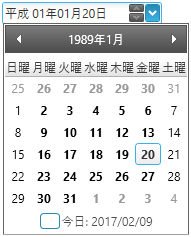

////
|metadata|
{
    "name": "xameditors-japanese-imperial-date-support",
    "controlName": [],
    "tags": ["How Do I"],
    "guid": "97B54409-E740-488D-8C5A-3E5F967E2EE8",
    "buildFlags": [],
    "createdOn": "2012-09-05T19:05:30.1729781Z"
}
|metadata|
////

= 和暦サポート (xamDateTimeEditor)

[[_topic_overview]]
== トピックの概要

[[_purpose]]
=== 目的

このトピックは、日付を和暦で表示するためにコントロールを構成する方法を紹介します。

[[_required_background]]
=== 前提条件

本トピックの理解を深めるために、以下のトピックを参照することをお勧めします。

[options="header", cols="a,a"]
|====
|トピック|目的

| link:xameditors-about-xameditors.html[xamEditors について] 
|このトピックは、"xamEditors" グループのコントロールおよび目的を説明します。 

| link:xamdatetimeeditor-about-xamdatetimeeditor.html[xamDateTimeEditor について] 
|このトピックはコントロールの概要を提供します。 

|====

[[_japanese_imperial_date_support]]
== 和暦サポート

[[_overview]]
=== 概要

グレゴリオ暦の日付形式に加え、コントロールで和暦を使用できます。和暦の年は、年号とその年号の年によって表されます。

以下の表は、入力日付形式を左右に並べて比較します。

[options="header", cols="a,a"]
|====
|グレゴリオ暦
|和暦
|image:images/xamEditors_JIDS_01.png[xamEditors_JIDS_01.png] 
| 
|====

[[_setting_the_japanese_calendar]]
=== 和暦の設定

以下のコードは、和暦を設定する方法を示します。

*C# の場合:*
[source,csharp]
----
CultureInfo ci = new CultureInfo("ja-JP");
Thread.CurrentThread.CurrentCulture = ci;
Thread.CurrentThread.CurrentUICulture = ci;

ci.DateTimeFormat.Calendar = new JapaneseCalendar();
this.xamDateTimeEditor1.FormatProvider = ci;

this.xamDateTimeEditor1.Language =
    XmlLanguage.GetLanguage(ci.IetfLanguageTag);
----

和暦が使用される場合、年はグレゴリオ暦の代わりに年号とその年号の年によって表されます。コントロールが編集モードで、カーソルが年号フィールドにある場合、ユーザーは以下の表のキーボード ショートカットを使用して特定の年号を選択できます。

[options="header", cols="a,a,a"]
|====
|年号|年号開始日|キーボード ショートカット

|明治 
|1868 / 09 / 08 
|*M* または *m* または *1*

|大正 
|1912 / 07 / 30 
|*T* または *t* または *2*

|昭和 
|1926 / 12 / 25 
|*S* または *s* または *3* 

|平成 
|1989 / 01 / 08 
|*H* または *h* または *4* 

|====

[[_related_topics]]
== 関連トピック

このトピックに関連する追加情報については、以下のトピックを参照してください。

[options="header", cols="a,a"]
|====
|トピック|目的

| link:xameditors-overview-of-the-valueeditor-class.html[ValueEditor クラスの概要] 
|このトピックでは、xamDateTimeEditor コントロールの基本クラスの概要を説明します。 

| link:xameditors-masks.html[マスク] 
|このトピックでは、カスタム マスクの定義方法の詳細を説明します。 

| link:xamdatetimeeditor-using-xamdatetimeeditor-as-a-field-in-xamdatagrid.html[xamDataGrid でフィールドとして xamDateTimeEditor を使用] 
|このトピックは、xamDataGrid コントロールで xamDateTimeEditor をエディターとして統合する方法を提供します。 

| link:xameditors-working-with-the-isalwaysineditmode-property-and-the-editors.html[IsAlwaysInEditMode プロパティおよびエディターの使用] 
|このトピックでは、コントロールの編集モードでスタンドアロン エディターおよび xamDataGrid のエディターの統合の使用での動作変更を紹介します。 

| link:xameditors-enabling-right-to-left-support.html[右から左へのサポートの有効化] 
|このトピックは、特定の言語で使用されるコントロールの右から左サポートを説明します。 

| link:xamdatetimeeditor-api-overview.html[API の概要] 
|このトピックでは、xamDateTimeEditor コントロールに関連した名前空間およびクラスに関する参考情報を提供します。 

|====