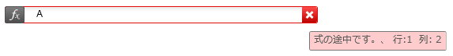
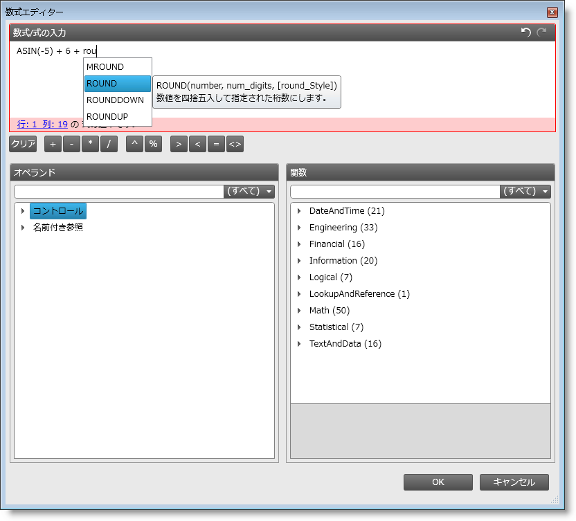

////

|metadata|
{
    "name": "xamformulaeditor-about",
    "controlName": ["xamFormulaEditor"],
    "tags": ["Calculations","Editing","Getting Started","Validation"],
    "guid": "6562ddd7-9dfd-40b4-af98-d01b7cc7f7a0",  
    "buildFlags": [],
    "createdOn": "2016-05-25T18:21:55.0781513Z"
}
|metadata|
////

= xamFormulaEditor について

== 目的

このトピックでは、xamFormulaEditor コントロールを紹介します。

== 本トピックの内容

このドキュメントには次のセクションが含まれています:

* 概要
* 主要機能

** xamFormulaEditor
** FormulaEditorDialog

* 関連トピック

== 前提条件

まず以下のトピックを読む必要があります。

* link:xamcalculationmanager-getting-started-with-xamcalculationmanager.html[xamCalculationManager を使用した作業の開始]
* link:xamcalculationmanager-using-xamcalculationmanager.html[xamCalculationManager の使用]

== 概要

xamFormulaEditor コントロールは、本格的な数式編集のエクスペリエンスをユーザーに提供します。これは xamCalcualtionManager に関連したコントロールで、xamCalcualtionManager を基に構築されており、数式のソースとターゲット、および様々な事前定義関数やカスタム関数を管理します。数式は、ソース、関数および/または埋め込みの演算子を使用する複雑な式です。ソースは数式において変数の役割を果たします。数式のソースおよびターゲットは、項目計算の任意のオブジェクトの任意のパブリック プロパティになることができます。計算結果はターゲットに適用されます。

xamFormulaEditor コントロールには、数式の編集用の 2 つの主なインターフェイス、the xamFormulaEditor および FormulaEditorDialog を持っています。以下の例は、xamFormulaEditor および FormulaEditorDialog の両方を通してコントロールを使用する方法を示しています。

== 主要機能

== 機能の概要

以下の表は、xamFormulaEditor の主な機能を簡単に説明しています。

[options="header", cols="a,a"]
|====
|機能|説明

|xamFormulaEditor
|ユーザーが数式を定義し、事前定義されたターゲットにその数式を割り当てることができるスタンドアロン エディターです。

|FormulaEditorDialog
|最もよく使用される演算子、およびソースと関数リストを挿入するための数式やボタンを編集するためのテキスト領域を含むダイアログ ウィンドウ。

|====

== xamFormulaEditor について

xamFormulaEditor は、事前定義されたターゲットの数式をユーザーが入力および編集するのを支援する、エディター コントロールです。xamFormulaEditor のターゲットは、xamCalculationManager に登録された同じページ上の別のコントロールになることができます(TextBox、TextBlock、ComboBox など)。pick:[wpf="xamFormulaEditor を使用して、xamDataGrid コントロール内のフィールドの数式を編集することもできます。"]

xamFormulaEditor には 2 つの主な部分があります。最初はユーザーが数式を入力する数式編集領域で、2番目はクリックすると FormulaEditorDialog が表示されるダイアログ ボタンです。ユーザーが xamFormulaEditor で入力すると、オートコンプリートの候補、および関数や演算子に関するコンテキスト ヘルプが表示されます。さらに、数式にエラーがある場合はエディターは赤で強調表示され、エラー インジケーター上をホバーすると、エラーの詳細が含まれるツールチップが表示されます。

== 関連トピック

* link:xamformulaeditor-using.html[xamCalculationManager での xamFormulaEditor および FormulaEditorDialog の使用]
* link:xamformulaeditor-contextualhelp.html[コンテクストのヘルプ]

== FormulaEditorDialog について

FormulaEditorDialog は、xamFormulaEditorの 2 番目の主なインターフェイスです。ユーザーが xamFormulaEditor 内のボタンをクリックすると、xamFormulaEditor の数式が含まれる FormulaEditorDialog が表示されます。FormulaEditorDialog をスタンドアロンのコントロールとして使用することもできます。

ダイアログには、ユーザーが数式を編集できるメインのテキスト編集領域があります。最もよく使用される演算子および 2 つのリストを挿入するために利用できるボタンもあります。リストの 1 つには利用可能なオペランドが含まれ、もう 1 つには関数が含まれます。関数リストは、事前定義された関数、および xamCaluculationManager コントロールの link:{ApiPlatform}calculations.xamcalculationmanager{ApiVersion}~infragistics.calculations.xamcalculationmanager~registeruserdefinedfunction.html[RegisterUserDefinedFunction メソッド]を使用して登録できる、カスタム関数で構成されています。

リストはかなり長くすることが可能なため、ユーザーは、検索テキスト ボックスに検索用語を入力してリスト内を検索できます。ユーザーがテキスト編集領域に入力すると、コンテキスト ヘルプとオートコンプリートの候補が xamFormulaEditor コントロールに表示されます。構文エラーの場合、編集領域は赤で強調表示され、テキストボックスの下にエラーが表示されます。エラー メッセージには正確なエラーおよび数式内のエラー箇所が含まれています。

[OK] ボタンを押した後に FormulaEditorDialog が xamFormulaEditor コントロールから呼び出されると、xamFormulaEditor 内の Formula が更新され、Target の値が再計算され、FormulaEditorDialog が破棄されます。

== 関連トピック

以下は、その他の役立つトピックです。

* link:xamformulaeditor-using.html[xamCalculationManager での xamFormulaEditor および FormulaEditorDialog の使用]
* link:xamformulaeditor-contextualhelp.html[コンテクストのヘルプ]
* link:xamcalculationmanager-getting-started-with-xamcalculationmanager.html[xamCalculationManager を使用した作業の開始]
* link:xamcalculationmanager-using-xamcalculationmanager.html[xamCalculationManager の使用]