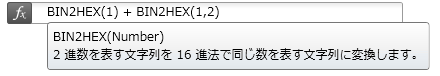
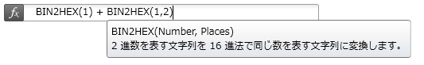
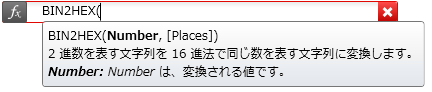
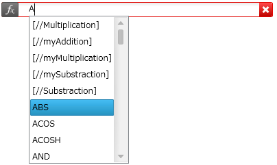
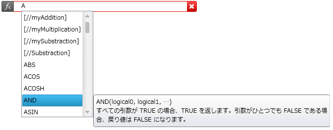

////

|metadata|
{
    "name": "xamformulaeditor-contextualhelp",
    "controlName": ["xamFormulaEditor"],
    "tags": ["Calculations","Editing","Getting Started","Validation"],
    "guid": "3de68bca-115c-49d3-9e08-05173d57c6f3",  
    "buildFlags": [],
    "createdOn": "2016-05-25T18:21:55.0831145Z"
}
|metadata|
////

= コンテクストのヘルプ

== 目的

このトピックでは、コンテキストのヘルプおよび xamFormulaEditor コントロールのオートコンプリート機能を紹介します。

== 前提条件

まず以下のトピックを読む必要があります。

* link:xamformulaeditor-about.html[xamFormulaEditor について]

== コンテキストのヘルプのタイプ

以下のコンテンツは、ユーザーがコントロールを使用して数式を入力および編集するときに、xamFormulaEditor および FormulaEditorDialog が表示するコンテキストのヘルプのタイプを簡単に説明しています。

=== マウスオーバーのヘルプ

マウスオーバーのヘルプは、機能のシグネチャと説明を表示します。ユーザーは関数の名前の上にマウスを移動させ、少し経ってから離します。マウスオーバーのヘルプが表示されており、ユーザーがマウスを関数名から離すと、マウスオーバーのヘルプは閉じます。 

関数に複数の引数が含まれている場合、関数名をホバーしている間、マウスオーバーのヘルプは定義された引数の数を表示します。オプションの引数に関しても同様ですが、提供された引数のみが関数のシグネチャに表示されます。 

 

=== 関数シグネチャーのヘルプ

関数シグネチャのヘルプは、ユーザーが関数で入力しており、開き括弧 '(' または引数のセパレーター ',' を入力したときに表示されます。関数シグネチャのヘルプは、現在の引数が強調表示された関数のシグネチャ、関数の説明、および現在の引数の説明を表示します。 

=== オートコンプリートのヘルプ
[options="header", cols="a,a"]
|====

|このアクションが発生するタイミング|結果は......

|ユーザーが関数またはオペランド名の入力を開始したとき 

|利用できるすべての関数が、関数エディター ボックスの下にリストとして表示されます 

スクロールバー、マウスまたは矢印キーを使用してリストのナビゲーションが可能です 

エディター ボックスに多数の文字が入力されると、リストのコンテンツはフィルターされます 

リスト内の一致は、ボックスに入力された正確なテキストに基づいて検索されます 

項目の一致しない場合、最も最近一致した項目 (または、以前の一致がない場合はリスト内の最初の項目) が選択されます 

|ユーザーは、リスト内の項目をダブルクリックします 

|関数名がオートコンプリートされます 

|ユーザーは Enter または Tab キーを押します 

|現在選択されたオートコンプリート項目がコミットされます 

|ユーザーは、関数またはオペランド名に現れることができない文字を入力します。例: ‘(‘ 

|現在選択されたオートコンプリート項目がコミットされます 

入力されたテキストはエディターに送信されます 

|ユーザーは関数または参照名を入力できる領域で Ctrl+Space を押します 

|オートコンプリート リストが表示されます 

|ユーザーは Escape キーを押します 

ユーザーはリスト外の画面上の任意の場所をクリックします 

左または右矢印キーを使用して、テキスト カーソルがある関数または参照名を離れます 

|リストが閉じ、テキストはそのまま残ります 

|==== 

=== オートオンプリート項目のヘルプ
オートコンプリート項目のヘルプは、オートコンプリート リストが開いているときのみ表示されます項目を短時間選択し続けると、利用可能な場合は項目の説明が現れます。項目を 10 秒よりも長く選択した場合、オートコンプリート項目のヘルプは閉じます。 

*注:* コンテキストのヘルプを xamFormulaEditor および FormulaEditorDialog コンテンツに表示したくない場合は、 link:{ApiPlatform}controls.interactions.xamformulaeditor{ApiVersion}~infragistics.controls.interactions.formulaeditorbase~showcontextualhelp.html[ShowContextualHelp] プロパティを False に設定することによって、これを無効にできます。

== 関連トピック

以下は、その他の役立つトピックです。

* link:xamformulaeditor-about.html[xamFormulaEditor について]
* link:xamformulaeditor-using.html[xamCalculationManager での xamFormulaEditor および FormulaEditorDialog の使用]