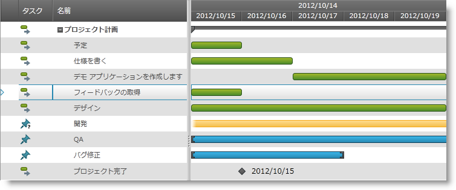

////
|metadata|
{
    "name": "xamgantt-adding-xamgantt-to-a-page",
    "controlName": ["xamGantt"],
    "tags": [],
    "guid": "0b1c1105-87ea-4ff4-be66-c1977f19898d",
    "buildFlags": [],
    "createdOn": "2016-05-25T18:21:55.2331598Z"
}
|metadata|
////

= xamGantt をページに追加

== トピックの概要

=== 目的

このトピックでは、 _xamGantt_™ コントロールをページに追加する方法について説明します。

=== このトピックの内容

このトピックは以下のセクションからなります。

* <<_Ref333582293,  _xamGantt_   をページに追加 >>

** <<_Ref333582311,はじめに>>
** <<Preview,プレビュー>>
** <<Prerequisites,前提条件>>
** <<Overview,概要>>
** <<_Ref333582325,手順>>

* <<viewmodel,コード例: ProductViewModel クラス>>
* <<_Ref334688042, 関連コンテンツ >>

** <<_Ref333582329,トピック>>

[[_Ref333582293]]
== _xamGantt_   をページに追加

[[_Ref333582311]]

=== はじめに

この手順では、 _xamGantt_ コントロールをページに追加する方法、およびプロジェクトに含める必要がある参照について説明します。

=== プレビュー

以下のスクリーンショットはその結果のプレビューです。

=== 前提条件

この手順を実行するには、以下のリソースが必要です。

* 以下の必要な NuGet パッケージへの参照を含むプロジェクト。

** Infragistics.WPF.Gantt

+
NuGet フィードのセットアップと NuGet パッケージの追加の詳細については、link:nuget-feeds.html[NuGet フィード] ドキュメントを参照してください。

* サンプル プロジェクト データを含む link:xamgantt-projectdatahelper.html[ProjectDataHelper] クラスを含むプロジェクト。

=== 概要

以下はプロセスの概念的概要です。

[start=1]
. <<step1, 必要な名前空間の追加 >>
[start=2]
. <<step2, ViewModel クラスを作成する >>
[start=3]
. <<step3,  _xamGantt_   コントロールをページに追加 >>

[[_Ref333582325]]

=== 手順

次の手順では、 _xamGantt_   コントロールをページに追加し、サンプル プロジェクト データにバインドする方法を紹介します。

[[step1]]
[start=1]
1. 必要な名前空間の追加

以下の名前空間を追加します:

*XAML の場合:*

[source,xaml]
----
xmlns:ig="http://schemas.infragistics.com/xaml"
xmlns:local="clr-namespace:[Your ViewModel Namespace]"
----

[[step2]]
[start=2]
2. ViewModel クラスを作成する

link:{ApiPlatform}controls.schedules.xamgantt{ApiVersion}~infragistics.controls.schedules.project_members.html[Project] タイプのパブリック プロパティ Project を表す ViewModel クラスを作成します。このクラスは、INotifyPropertyChanged インターフェイスを実装する ObservableModel クラスを継承します。プロジェクトのサンプル データはクラス コンストラクターに読み込まれます。

詳細については、 link:xamgantt-adding-xamgantt-to-a-page.html#viewModel[コード例: ProductViewModel クラス]を参照してください。

[[step3]]
[start=3]
3. xamGantt コントロールをページに追加

_xamGantt_   コントロールをページ Grid コンテナーに追加し、それを ProjectViewModel が提供するプロジェクト データにバインドします。

*XAML の場合:*

[source,xaml]
----
<Grid>
  <Grid.Resources>
  <!--Create a static Grid resource of type ProjectViewModel-->
    <local:ProjectViewModel x:Key="viewmodel" />
  </Grid.Resources>
  <Grid.DataContext>
  <!--Bind the Grid DataContext 
      to the created data resource -->
    <Binding Source="{StaticResource viewmodel}" />
  </Grid.DataContext>
  <!— Add a xamGantt and bind it to the data -->
    <ig:XamGantt x:Name="gantt" 
                 Project="{Binding Project}"/>
</Grid>
----

[[viewModel]]
== コード例: ProductViewModel クラス

=== 解説

ProjectViewModel クラスは、`Project` タイプのパブリック プロパティ Project を公開します。このプロパティは初期化され、ViewModel クラスのコンストラクター内のサンプル プロジェクト データを投入されます。

=== コード

*C# の場合:*

[source,csharp]
----
using System;
using System.ComponentModel;
using Infragistics.Controls.Schedules;
public class ProjectViewModel : ObservableModel
{
    public ProjectViewModel()
    {
        this._project = ProjectDataHelper.GenerateProjectData();
    }
    private Project _project;
    public Project Project
    {
        get
        {
            return this._project;
        }
        set
        {
            if (this._project != value)
            {
                this._project = value;
                this.NotifyPropertyChanged("Project");
            }
        }
    }
}
public class ObservableModel : INotifyPropertyChanged
{
    public event PropertyChangedEventHandler PropertyChanged;
    protected void NotifyPropertyChanged(String info)
    {
        if (PropertyChanged != null)
        {
            PropertyChanged(this, new PropertyChangedEventArgs(info));
        }
    }
}
----

*Visual Basic の場合:*

[source,vb]
----
Imports System.ComponentModel
Imports Infragistics.Controls.Schedules
Public Class ProjectViewModel
    Inherits ObservableModel
    Public Sub New()
        Me._project = ProjectDataHelper.GenerateProjectData()
    End Sub
    Private _project As Project
    Public Property Project() As Project
        Get
            Return Me._project
        End Get
        Set(value As Project)
            Me._project = value
            Me.NotifyPropertyChanged("Project")
        End Set
    End Property
End Class
Public Class ObservableModel
    Implements INotifyPropertyChanged
    Public Event PropertyChanged(ByVal sender As Object, ByVal e As PropertyChangedEventArgs) Implements INotifyPropertyChanged.PropertyChanged
    Protected Overridable Sub NotifyPropertyChanged(ByVal propertyName As String)
        RaiseEvent PropertyChanged(Me, New PropertyChangedEventArgs(propertyName))
    End Sub
End Class
----

[[_Ref334688042]]
== 関連コンテンツ

[[_Ref333582329]]

=== トピック

このトピックについては、以下のトピックも参照してください。

[options="header", cols="a,a"]
|====
|トピック|目的

| link:xamgantt-xamgantt-overview.html[xamGantt の概要]
|このトピックは _xamGantt_ 、プロジェクト、タスク、およびその他の _xamGantt_ 要素についての基本情報を説明します。

| link:xamgantt-xamgantt-in-detail.html[xamGantt の詳細]
|このトピックのグループは、 _xamGantt_ コントロールの詳細を説明します。

| link:xamgantt-xamgantt-data-binding.html[xamGantt のデータ バインディング]
|このグループのこのトピックでは、 _xamGantt_ コントロールを使用したデータ バインディングについて説明します。

| link:xamgantt-configuring-xamgantt.html[xamGantt の構成]
|このグループのトピックは、 _xamGantt_ コントロールの構成可能な機能を説明します。

|====