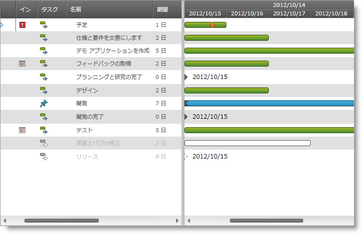

////
|metadata|
{
    "name": "xamgantt-binding-arbitrary-tasks-collection-listbackedproject",
    "controlName": ["xamGantt"],
    "tags": ["Data Binding","How Do I"],
    "guid": "bc7de55a-2030-4029-9280-b408a622413f",
    "buildFlags": [],
    "createdOn": "2016-05-25T18:21:55.2281617Z"
}
|metadata|
////

= ListBackedProject による任意のタスク コレクションとのバインディング

== トピックの概要

=== 目的

このトピックでは、ListBackedProject で  _xamGantt™_   コントロールを任意のタスク コレクションにバインドする方法を説明します。

=== 本トピックの内容

このトピックには次のセクションがあります。

* <<start, ListBackedProject による任意のタスク コレクションとのバインディング >>

** <<intro,概要>>
** <<Preview,プレビュー>>
** <<Prerequisites,前提条件>>
** <<overview,概要>>
** <<steps,手順>>

* <<CodeExamples,コード例>>
* <<ObservableModel,コード例: 監視可能なモデル>>
* <<CustomTaskModel,コード例: カスタム タスク モデル>>
* <<ViewModel,コード例: ViewModel クラス>>
* <<bindingCode,コード例: ListBackedProject で xamGantt を XAML 内のカスタム タスク データにバインド>>
* <<related, 関連コンテンツ >>

[[start]]
== ListBackedProject による任意のタスク コレクションとのバインディング

[[intro]]

=== 概要

_xamGantt_   コントロールは、カスタム タスクのコレクションにバインドできます。その場合、 link:{ApiPlatform}controls.schedules.xamgantt{ApiVersion}~infragistics.controls.schedules.listbackedproject_members.html[ListBackedProject] のインスタンスを作成して、それを _xamGantt_   の link:{ApiPlatform}controls.schedules.xamgantt{ApiVersion}~infragistics.controls.schedules.projectcontrolbase~project.html[Project] プロパティに設定します。

ListBackedProject に、その link:{ApiPlatform}controls.schedules.xamgantt{ApiVersion}~infragistics.controls.schedules.listbackedproject~taskitemssource.html[TaskItemsSource] プロパティでカスタム タスクのフラット コレクションを与え、カスタム タスク プロパティと、対応する link:{ApiPlatform}controls.schedules.xamgantt{ApiVersion}~infragistics.controls.schedules.projecttask_members.html[ProjectTask] プロパティ間のマッピングを、 link:{ApiPlatform}controls.schedules.xamgantt{ApiVersion}~infragistics.controls.schedules.listbackedproject~taskpropertymappings.html[TaskPropertyMappings] コレクションで定義します。

以下の手順では、XML ファイルからカスタム タスク コレクションをポピュレートします。この手順で、カスタム タスク Model と、XML ファイルの動作を処理する ViewModel クラスも作成できます。

=== プレビュー

以下のスクリーンショットはその結果のプレビューです。

=== 前提条件

この手順を実行するには、以下が必要です。

* 以下の必要な NuGet パッケージへの参照を含むプロジェクト。

** Infragistics.WPF.Gantt

+
NuGet フィードのセットアップと NuGet パッケージの追加の詳細については、link:nuget-feeds.html[NuGet フィード] ドキュメントを参照してください。

* link:{ApiPlatform}controls.schedules.xamgantt{ApiVersion}~infragistics.controls.schedules.listbackedproject_members.html[ListBackedProject]
* xml データを操作する拡張メソッドをおさめた link:xelementextension.html[XElementExtension] クラス
* サンプル xml データ ソース - link:xamgantt-taskdata-xml.html[TaskData.xml]

[[overview]]

=== 概要

以下はプロセスの概念的な概要です。

[start=1]
. link:xamgantt-binding-arbitrary-tasks-collection-listbackedproject.html#steps[*カスタム タスク Model クラスを作成する* ]
[start=2]
. link:xamgantt-binding-arbitrary-tasks-collection-listbackedproject.html#steps[*ViewModel クラスを作成する* ]
[start=3]
. link:xamgantt-binding-arbitrary-tasks-collection-listbackedproject.html#steps[*XAML ページに必要な名前空間を追加する* ]
[start=4]
. link:xamgantt-binding-arbitrary-tasks-collection-listbackedproject.html#steps[*ページにグリッドを追加し、その DataContext を作成した ViewModel にバインドする* ]
[start=5]
. link:xamgantt-binding-arbitrary-tasks-collection-listbackedproject.html#steps[*ListBackedProject を作成してデータにバインドする* ]
[start=6]
. link:xamgantt-binding-arbitrary-tasks-collection-listbackedproject.html#steps[*カスタム タスク プロパティ マッピングにプロジェクト タスク プロパティを作成する* ]
[start=7]
. link:xamgantt-binding-arbitrary-tasks-collection-listbackedproject.html#steps[*作成した ListBackedProject に xamGantt プロジェクト プロパティを設定する* ]

[[steps]]

=== 手順

以下の手順では、カスタム タスクのコレクションに  _xamGantt_   コントロールをバインドする方法を説明します。

[[step1]]
1. カスタム タスク Model クラスを作成する

データを表示し、INotifyPropertyChanged インターフェイスを実装するカスタム タスク モデルを作成します。

詳細については、<<_Ref334542792,>> link:xamgantt-binding-arbitrary-tasks-collection-listbackedproject.html#CustomTaskModel[コード例: カスタム タスク モデル]を参照してください。

[[step2]]
[start=2]
2. ViewModel クラスを作成する

xml データの読み込みを処理し、カスタム タスクのデータを保存する TaskModel の ObservableCollection 型の Tasks 公開メンバーがある ViewModel クラスを作成します。

詳細については、<<_Ref334543560,>> link:xamgantt-binding-arbitrary-tasks-collection-listbackedproject.html#viewModel[コード例: ViewModel クラス]を参照してください。

[[step3]]
[start=3]
3. XAML ページに必要な名前空間を追加する

XAML ページの先頭に以下の名前空間を追加します。

*XAML の場合:*

[source,xaml]
----
xmlns:ig="http://schemas.infragistics.com/xaml"
xmlns:viewmodel="clr-namespace:<Your ViewModel Namespace>"
----

[[step4]]
[start=4]
4. ページにグリッドを追加し、その DataContext を作成した ViewModel にバインドする

ページにグリッドを追加し、グリッド `DataContext` プロパティをカスタム タスク ビュー モデル クラス `ListBackedProjectViewModel` にバインドします。

*XAML の場合:*

[source,xaml]
----
<Grid x:Name="LayoutRoot">
  <Grid.Resources>
    <viewmodel:ListBackedProjectViewModel x:Key="viewmodel"/>
  </Grid.Resources>
  <Grid.DataContext>
    <Binding Source="{StaticResource viewmodel}" />
  </Grid.DataContext>
…
</Grid>
----

[[step5]]
[start=5]
5. ListBackedProject を作成してデータにバインドする

link:{ApiPlatform}controls.schedules.xamgantt{ApiVersion}~infragistics.controls.schedules.listbackedproject_members.html[ListBackedProject] は、派生した link:{ApiPlatform}controls.schedules.xamgantt{ApiVersion}~infragistics.controls.schedules.project_members.html[Project] クラスです。指定したタスク情報のフラット コレクションに基づいてタスクをポピュレートします。

`ListBackedProject` は、作成して Tasks 公開メンバーに保存したカスタム タスク データに link:{ApiPlatform}controls.schedules.xamgantt{ApiVersion}~infragistics.controls.schedules.listbackedproject~taskitemssource.html[TaskItemsSource] プロパティでバインドします。

*XAML の場合:*

[source,xaml]
----
<ig:ListBackedProject x:Name="dataProvider" 
                      TaskItemsSource="{Binding Tasks}">
</ig:ListBackedProject>
----

[[step6]]
[start=6]
6. カスタム タスク プロパティ マッピングにプロジェクト タスク プロパティを作成する

link:{ApiPlatform}controls.schedules.xamgantt{ApiVersion}~infragistics.controls.schedules.listbackedproject~taskpropertymappings.html[TaskPropertyMappings] でマッピング コレクションを作成します。

どの link:{ApiPlatform}controls.schedules.xamgantt{ApiVersion}~infragistics.controls.schedules.projecttaskpropertymapping_members.html[ProjectTaskPropertyMapping] でも link:{ApiPlatform}controls.schedules.xamgantt{ApiVersion}~infragistics.controls.schedules.projecttaskpropertymapping~taskproperty.html[TaskProperty] は link:{ApiPlatform}controls.schedules.xamgantt{ApiVersion}~infragistics.controls.schedules.projecttask_members.html[ProjectTask] プロパティを指定し、 link:{ApiPlatform}controls.schedules.xamgantt{ApiVersion}~infragistics.controls.schedules.projecttaskpropertymapping~dataobjectproperty.html[DataObjectProperty] は対応するカスタム タスク プロパティを指定します。

たとえば、 link:{ApiPlatform}controls.schedules.xamgantt{ApiVersion}~infragistics.controls.schedules.projecttask_members.html[ProjectTask] DataItemId プロパティを、カスタム TaskModel クラスに定義した TaskID プロパティにマップする例で解説します。

*XAML の場合:*

[source,xaml]
----
<ig:ListBackedProject.TaskPropertyMappings>               
  <ig:ProjectTaskPropertyMappingCollection 
      UseDefaultMappings="True">
  <ig:ProjectTaskPropertyMapping 
      TaskProperty="DataItemId" 
      DataObjectProperty="TaskID" />
  <ig:ProjectTaskPropertyMapping 
      TaskProperty="Tasks" 
      DataObjectProperty="Tasks" />
  <ig:ProjectTaskPropertyMapping 
      TaskProperty="ConstraintType" 
      DataObjectProperty="ConstraintType" />
  <ig:ProjectTaskPropertyMapping 
      TaskProperty="ConstraintDate" 
      DataObjectProperty="ConstraintDate" />
  <ig:ProjectTaskPropertyMapping 
      TaskProperty="DurationFormat" 
      DataObjectProperty="DurationFormat" />
  </ig:ProjectTaskPropertyMappingCollection>
</ig:ListBackedProject.TaskPropertyMappings>
----

完全なマッピング リストについては、<<_Ref334546439,>>link:xamgantt-binding-arbitrary-tasks-collection-listbackedproject.html#bindingCode[コード例: ListBackedProject で xamGantt を XAML のカスタム タスク データにバインド]を参照してください。

注:

[NOTE]
====
以下のマッピングは必須です。

* DataItemId – タスクを一意で識別します。
* Tasks – タスクの子タスクを保存します。
* ConstraintType/ConstraintDate
* DurationFormat – 期間の単位を指定し、その期間が過ぎ去った期間であるかどうかを追跡します。

====

注:

[NOTE]
====
タスクの進行状況をサポートしたい場合には以下のマッピングは必須です。

* ActualStart および PercentComplete
* または ActualStart および ActualDuration

====

注:

[NOTE]
====
手動タスクをサポートしたい場合には以下のマッピングは必須です。

* IsManual
* Start
* Duration
* Finish

====

注:

[NOTE]
====
タスク間のリンクを作成したい場合には以下のマッピングは必須です。

* Predecessors

====

注:

[NOTE]
====
リソースを割り当てたい場合には以下のマッピングは必須です。

* Resources

====

[[step7]]
[start=7]
7. 作成した ListBackedProject に xamGantt プロジェクト プロパティを設定する

既存の ListBackedProject に  _xamGantt_   `Project` プロパティを設定します。

*XAML の場合:*

[source,xaml]
----
<ig:XamGantt x:Name="gantt" 
    Project="{Binding ElementName=dataProvider}" />
----

[[CodeExamples]]
== コード例

=== コード例の概要

以下の表には、このトピックのコード例が示されています。

[options="header", cols="a,a"]
|====
|例|説明

| link:xamgantt-binding-arbitrary-tasks-collection-listbackedproject.html#ObservableModel[コード例: 監視可能なモデル]
|このコード例は、INotifyPropertyChanged インターフェイスを実装するクラスです。TaskModel クラスと ListBackedProjectViewModel クラスのいずれもこのクラスでプロパティの変更を知らせます。

|<<_Ref334542792,>> link:xamgantt-binding-arbitrary-tasks-collection-listbackedproject.html#CustomTaskModel[コード例: カスタム タスク モデル]
|このコード例はカスタム タスク モデルです。ObservableModel クラスを継承します。

| link:xamgantt-binding-arbitrary-tasks-collection-listbackedproject.html#ViewModel[コード例: ViewModel クラス]
|このコード例は ViewModel クラスです。xml データの読み込みを処理し、`ObservableModel` クラスを継承します。

|<<binding,>> link:xamgantt-binding-arbitrary-tasks-collection-listbackedproject.html#bindingCode[コード例: ListBackedProject で xamGantt を XAML 内のカスタム タスク データにバインド]
|このコード例では、ListBackedProject を作成し、 _xamGantt_ コントロールをデータに追加してバインドします。

|====

[[ObservableModel]]
== コード例: 監視可能なモデル

=== 説明

このコード例は、INotifyPropertyChanged インターフェイスを実装するクラスです。TaskModel クラスと ListBackedProjectViewModel クラスのいずれもこのクラスでクライアントにプロパティの変更を知らせます。

[[_Ref334542792]]

=== コード

*C# の場合:*

[source,csharp]
----
public class ObservableModel : INotifyPropertyChanged
{
    public event PropertyChangedEventHandler PropertyChanged;
    protected void NotifyPropertyChanged(String info)
    {
        if (PropertyChanged != null)
        {
            PropertyChanged(this, new PropertyChangedEventArgs(info));
        }
    }
}
----

*Visual Basic の場合:*

[source,vb]
----
Public Class ObservableModel
    Implements INotifyPropertyChanged
    Public Event PropertyChanged(ByVal sender As Object, ByVal e As PropertyChangedEventArgs) Implements INotifyPropertyChanged.PropertyChanged
    Protected Overridable Sub NotifyPropertyChanged(ByVal propertyName As String)
        RaiseEvent PropertyChanged(Me, New PropertyChangedEventArgs(propertyName))
    End Sub
End Class
----

[[CustomTaskModel]]

== コード例: カスタム タスク モデル

=== 説明

このコード例はカスタム タスク Model です。ObservableModel クラスを継承します。

リソースとサブタスクをコンマ区切りの文字列として追加できます。サブタスクの場合、入力するコンマ区切りの文字列値は、ListBackedProject の基になる ProjectTaskのDataItemId プロパティにマップするプロパティと一致する必要があります。コンマで区切られた文字列値を介して先行バージョンも追加する必要があります。

[[_Ref334543560]]

=== コード

*C# の場合:*

[source,csharp]
----
using Infragistics.Controls.Schedules;
public class TaskModel : ObservableModel
{
    private string _taskId;
    public string TaskID
    {
        get
        {
            return _taskId;
        }
        set
        {
            if (_taskId != value)
            {
                _taskId = value;
                this.NotifyPropertyChanged("TaskID");
            }
        }
    }
    private string _tasks;
    public string Tasks
    {
        get
        {
            return _tasks;
        }
        set
        {
            if (_tasks != value)
            {
                _tasks = value;
                this.NotifyPropertyChanged("Tasks");
            }
        }
    }
    private string _name;
    public string Name
    {
        get
        {
            return _name;
        }
        set
        {
            if (_name != value)
            {
                _name = value;
                this.NotifyPropertyChanged("Name");
            }
        }
    }
    private ProjectTaskConstraintType _constraintType;
    public ProjectTaskConstraintType ConstraintType
    {
        get
        {
            return _constraintType;
        }
        set
        {
            if (_constraintType != value)
            {
                _constraintType = value;
                this.NotifyPropertyChanged("ConstraintType");
            }
        }
    }
    private DateTime? _constraintDate;
    public DateTime? ConstraintDate
    {
        get
        {
            return _constraintDate;
        }
        set
        {
            if (_constraintDate != value)
            {
                _constraintDate = value;
                this.NotifyPropertyChanged("ConstraintDate");
            }
        }
    }
    private ProjectDurationFormat _durationFormat;
    public ProjectDurationFormat DurationFormat
    {
        get
        {
            return _durationFormat;
        }
        set
        {
            if (_durationFormat != value)
            {
                _durationFormat = value;
                this.NotifyPropertyChanged("DurationFormat");
            }
        }
    }
    private TimeSpan _durationInHours;
    public TimeSpan DurationInHours
    {
        get
        {
            return _durationInHours;
        }
        set
        {
            if (_durationInHours != value)
            {
                _durationInHours = value;
                this.NotifyPropertyChanged("DurationInHours");
            }
        }
    }
    private DateTime _start;
    public DateTime Start
    {
        get
        {
            return _start;
        }
        set
        {
            if (_start != value)
            {
                _start = value;
                this.NotifyPropertyChanged("Start");
            }
        }
    }
    private bool _isMilestone = false;
    public bool IsMilestone
    {
        get
        {
            return _isMilestone;
        }
        set
        {
            if (_isMilestone != value)
            {
                _isMilestone = value;
                this.NotifyPropertyChanged("IsMilestone");
            }
        }
    }
    private bool _isInProgress = true;
    public bool IsInProgress
    {
        get
        {
            return _isInProgress;
        }
        set
        {
            if (_isInProgress != value)
            {
                _isInProgress = value;
                this.NotifyPropertyChanged("IsInProgress");
            }
        }
    }
    private DateTime? _deadlineDate;
    public DateTime? DeadlineDate
    {
        get
        {
            return _deadlineDate;
        }
        set
        {
            if (_deadlineDate != value)
            {
                _deadlineDate = value;
                this.NotifyPropertyChanged("DeadlineDate");
            }
        }
    }
    private bool _isUndetermined = false;
    public bool IsUndetermined
    {
        get
        {
            return _isUndetermined;
        }
        set
        {
            if (_isUndetermined != value)
            {
                _isUndetermined = value;
                this.NotifyPropertyChanged("IsUndetermined");
            }
        }
    }
    private string _resourceName;
    public string ResourceName
    {
        get
        {
            return _resourceName;
        }
        set
        {
            if (_resourceName != value)
            {
                _resourceName = value;
                this.NotifyPropertyChanged("ResourceName");
            }
        }
    }
}
----

*Visual Basic の場合:*

[source,vb]
----
Imports Infragistics.Controls.Schedules
Public Class TaskModel
    Inherits ObservableModel
    Private _taskId As String
    Public Property TaskID() As String
        Get
            Return _taskId
        End Get
        Set(value As String)
            If _taskId <> value Then
                _taskId = value
                Me.NotifyPropertyChanged("TaskID")
            End If
        End Set
    End Property
    Private _tasks As String
    Public Property Tasks() As String
        Get
            Return _tasks
        End Get
        Set(value As String)
            If _tasks <> value Then
                _tasks = value
                Me.NotifyPropertyChanged("Tasks")
            End If
        End Set
    End Property
    Private _name As String
    Public Property Name() As String
        Get
            Return _name
        End Get
        Set(value As String)
            If _name <> value Then
                _name = value
                Me.NotifyPropertyChanged("Name")
            End If
        End Set
    End Property
    Private _constraintType As ProjectTaskConstraintType
    Public Property ConstraintType() As ProjectTaskConstraintType
        Get
            Return _constraintType
        End Get
        Set(value As ProjectTaskConstraintType)
            If _constraintType <> value Then
                _constraintType = value
                Me.NotifyPropertyChanged("ConstraintType")
            End If
        End Set
    End Property
    Private _constraintDate As System.Nullable(Of DateTime)
    Public Property ConstraintDate() As System.Nullable(Of DateTime)
        Get
            Return _constraintDate
        End Get
        Set(value As System.Nullable(Of DateTime))
            If _constraintDate <> value Then
                _constraintDate = value
                Me.NotifyPropertyChanged("ConstraintDate")
            End If
        End Set
    End Property
    Private _durationFormat As ProjectDurationFormat
    Public Property DurationFormat() As ProjectDurationFormat
        Get
            Return _durationFormat
        End Get
        Set(value As ProjectDurationFormat)
            If _durationFormat <> value Then
                _durationFormat = value
                Me.NotifyPropertyChanged("DurationFormat")
            End If
        End Set
    End Property
    Private _durationInHours As TimeSpan
    Public Property DurationInHours() As TimeSpan
        Get
            Return _durationInHours
        End Get
        Set(value As TimeSpan)
            If _durationInHours <> value Then
                _durationInHours = value
                Me.NotifyPropertyChanged("DurationInHours")
            End If
        End Set
    End Property
    Private _start As DateTime
    Public Property Start() As DateTime
        Get
            Return _start
        End Get
        Set(value As DateTime)
            If _start <> value Then
                _start = value
                Me.NotifyPropertyChanged("Start")
            End If
        End Set
    End Property
    Private _isMilestone As Boolean = False
    Public Property IsMilestone() As Boolean
        Get
            Return _isMilestone
        End Get
        Set(value As Boolean)
            If _isMilestone <> value Then
                _isMilestone = value
                Me.NotifyPropertyChanged("IsMilestone")
            End If
        End Set
    End Property
    Private _isInProgress As Boolean = True
    Public Property IsInProgress() As Boolean
        Get
            Return _isInProgress
        End Get
        Set(value As Boolean)
            If _isInProgress <> value Then
                _isInProgress = value
                Me.NotifyPropertyChanged("IsInProgress")
            End If
        End Set
    End Property
    Private _deadlineDate As System.Nullable(Of DateTime)
    Public Property DeadlineDate() As System.Nullable(Of DateTime)
        Get
            Return _deadlineDate
        End Get
        Set(value As System.Nullable(Of DateTime))
            If _deadlineDate <> value Then
                _deadlineDate = value
                Me.NotifyPropertyChanged("DeadlineDate")
            End If
        End Set
    End Property
    Private _isUndetermined As Boolean = False
    Public Property IsUndetermined() As Boolean
        Get
            Return _isUndetermined
        End Get
        Set(value As Boolean)
            If _isUndetermined <> value Then
                _isUndetermined = value
                Me.NotifyPropertyChanged("IsUndetermined")
            End If
        End Set
    End Property
    Private _resourceName As String
    Public Property ResourceName() As String
        Get
            Return _resourceName
        End Get
        Set(value As String)
            If _resourceName <> value Then
                _resourceName = value
                Me.NotifyPropertyChanged("ResourceName")
            End If
        End Set
    End Property
End Class
----

[[ViewModel]]

== コード例: ViewModel クラス

=== 説明

このコード例は ViewModel クラスです。xml データの読み込みを処理し、ObservableModel クラスを継承します。

TaskModel オブジェクトの ObservableCollection 型の公開プロパティ Tasks を作成して XML ファイルのデータでポピュレートします。このコードは link:xelementextension.html[XElementExtension] クラスの拡張メソッドを使用します。

[[_Ref334546439]]

=== コード

*C# の場合:*

[source,csharp]
----
using Infragistics.Controls.Schedules;
public class ListBackedProjectViewModel : ObservableModel
{
    public ListBackedProjectViewModel()
    {
        this.DownloadDataSource();
    }
    private ObservableCollection<TaskModel> _tasks;
    public ObservableCollection<TaskModel> Tasks
    {
        get
        {
            return _tasks;
        }
        set
        {
            if (value != null)
            {
                _tasks = value;
            }
            NotifyPropertyChanged("Tasks");
        }
    }
    private void DownloadDataSource()
    {
        ObservableCollection<TaskModel> dataSource = new ObservableCollection<TaskModel>();
        XDocument xmlDoc = XDocument.Load("TaskData.xml");
        IEnumerable<XElement> elements = xmlDoc.Root.Elements();
        foreach (XElement el in elements)
        {
            TaskModel task = new TaskModel();
            task.TaskID = el.Element("TaskID").GetString();
            task.Name = el.Element("Name").GetString();
            task.IsInProgress = el.Element("IsInProgress").GetBool();
            task.Start = DateTime.Today.ToUniversalTime();
            task.IsMilestone = el.Element("IsMilestone").GetBool();
            task.DurationInHours = TimeSpan.FromHours(el.Element("DurationInHours").GetDouble());
            task.IsUndetermined = el.Element("IsUndetermined").GetBool();
            task.ResourceName = el.Element("ResourceName").GetString();
            task.DurationFormat = ProjectDurationFormat.Days;
            if (el.Element("DeadlineDateInHours").GetInt() != 0)
            {
                task.DeadlineDate = DateTime.Today.AddHours(el.Element("DeadlineDateInHours").GetInt()).ToUniversalTime();
            }
            dataSource.Add(task);
        }
        this._tasks = dataSource;
    }        
}
----

*Visual Basic の場合:*

[source,vb]
----
Imports Infragistics.Controls.Schedules
Public Class ListBackedProjectViewModel
    Inherits ObservableModel
    Public Sub New()
        Me.DownloadDataSource()
    End Sub
    Private _tasks As ObservableCollection(Of TaskModel)
    Public Property Tasks() As ObservableCollection(Of TaskModel)
        Get
            Return _tasks
        End Get
        Set(value As ObservableCollection(Of TaskModel))
            If value IsNot Nothing Then
                _tasks = value
            End If
            NotifyPropertyChanged("Tasks")
        End Set
    End Property
    Private Sub DownloadDataSource()
        Dim dataSource As New ObservableCollection(Of TaskModel)()
        Dim xmlDoc As XDocument = XDocument.Load("TaskData.xml")
        Dim elements As IEnumerable(Of XElement) = xmlDoc.Root.Elements()
        For Each el As XElement In elements
            Dim task As New TaskModel()
            task.TaskID = el.Element("TaskID").GetString()
            task.Name = el.Element("Name").GetString()
            task.IsInProgress = el.Element("IsInProgress").GetBool()
            task.Start = DateTime.Today.ToUniversalTime()
            task.IsMilestone = el.Element("IsMilestone").GetBool()
            task.DurationInHours = TimeSpan.FromHours(el.Element("DurationInHours").GetDouble())
            task.IsUndetermined = el.Element("IsUndetermined").GetBool()
            task.ResourceName = el.Element("ResourceName").GetString()
            task.DurationFormat = ProjectDurationFormat.Days
            If el.Element("DeadlineDateInHours").GetInt() <> 0 Then
                task.DeadlineDate = DateTime.Today.AddHours(el.Element("DeadlineDateInHours").GetInt()).ToUniversalTime()
            End If
            dataSource.Add(task)
        Next
        Me._tasks = dataSource
    End Sub
End Class
----

[[bindingCode]]

== コード例: ListBackedProject で  _xamGantt_   を XAML のカスタム タスク データにバインド

=== 説明

このコード例では、ListBackedProject を作成し、 _xamGantt_   コントロールをデータに追加してバインドします。

=== コード

*XAML の場合:*

[source,xaml]
----
Code
<Grid x:Name="LayoutRoot" Background="White">
  <Grid.Resources>
    <viewmodel:ListBackedProjectViewModel x:Key="viewmodel" />
  </Grid.Resources>
  <Grid.DataContext>
    <Binding Source="{StaticResource viewmodel}" />
  </Grid.DataContext>
  <ig:ListBackedProject x:Name="dataProvider" 
                        TaskItemsSource="{Binding Tasks}">
    <ig:ListBackedProject.TaskPropertyMappings>
      <ig:ProjectTaskPropertyMappingCollection UseDefaultMappings="True">
        <ig:ProjectTaskPropertyMapping TaskProperty="DataItemId" 
                                       DataObjectProperty="TaskID" />
        <ig:ProjectTaskPropertyMapping TaskProperty="Tasks" 
                                       DataObjectProperty="Tasks" />
        <ig:ProjectTaskPropertyMapping TaskProperty="ConstraintType" 
                                       DataObjectProperty="ConstraintType" />
        <ig:ProjectTaskPropertyMapping TaskProperty="ConstraintDate" 
                                       DataObjectProperty="ConstraintDate" />
        <ig:ProjectTaskPropertyMapping TaskProperty="DurationFormat" 
                                       DataObjectProperty="DurationFormat" />
        <ig:ProjectTaskPropertyMapping TaskProperty="TaskName" 
                                       DataObjectProperty="Name" />
        <ig:ProjectTaskPropertyMapping TaskProperty="Start" 
                                       DataObjectProperty="Start" />
        <ig:ProjectTaskPropertyMapping TaskProperty="IsMilestone" 
                                       DataObjectProperty="IsMilestone" />
        <ig:ProjectTaskPropertyMapping TaskProperty="IsActive" 
                                       DataObjectProperty="IsInProgress" />
        <ig:ProjectTaskPropertyMapping TaskProperty="Duration" 
                                       DataObjectProperty="DurationInHours" />
        <ig:ProjectTaskPropertyMapping TaskProperty="Deadline" 
                                       DataObjectProperty="DeadlineDate" />
        <ig:ProjectTaskPropertyMapping TaskProperty="IsManual" 
                                       DataObjectProperty="IsUndetermined" />
        <ig:ProjectTaskPropertyMapping TaskProperty="Resources" 
                                       DataObjectProperty="ResourceName" />
      </ig:ProjectTaskPropertyMappingCollection>
    </ig:ListBackedProject.TaskPropertyMappings>
  </ig:ListBackedProject>
  <ig:XamGantt x:Name="gantt" 
               Project="{Binding ElementName=dataProvider}"/>
</Grid>
----

[[related]]
== 関連コンテンツ

このトピックについては、以下のトピックも参照してください。

[options="header", cols="a,a"]
|====
|トピック|目的

| link:xamgantt-data-binding-overview.html[データ バインディングの概要]
|このトピックは、 _xamGantt_ コントロールのデータ バインディングの概要を説明します。

| link:xamgantt-binding-to-data-using-project.html[プロジェクトを使用してデータにバインド]
|このトピックでは、Project プロパティによって _xamGantt_ コントロールをデータにバインドする方法を説明します。

| link:xamgantt-loading-project-plan-from-ms-project-xml-file.html[MS Project XML ファイルからプロジェクト計画を読み込む]
|このトピックでは、Microsoft Project™ 2010 XML ファイルに保存された、すでに作成済みのプロジェクト計画を _xamGantt_ コントロールで読み込む方法について説明します。

|====