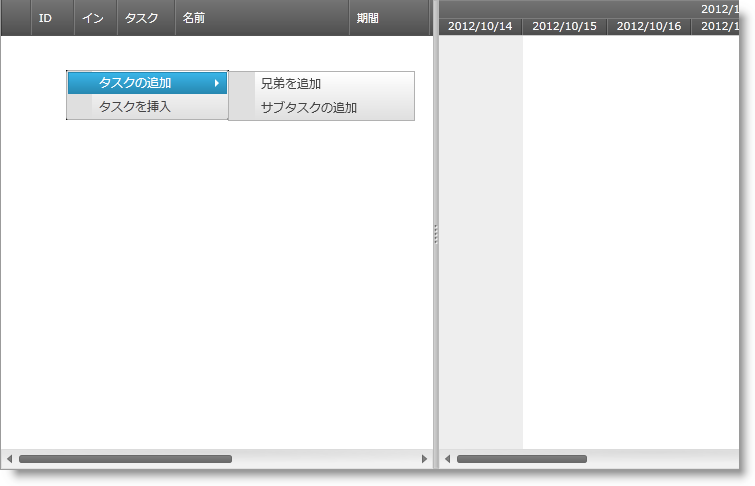

////
|metadata|
{
    "name": "xamgantt-binding-to-data-using-project",
    "controlName": ["xamGantt"],
    "tags": ["Data Binding","How Do I"],
    "guid": "94205b56-f277-4222-b11f-aa7acc6221cc",
    "buildFlags": [],
    "createdOn": "2016-05-25T18:21:55.2161599Z"
}
|metadata|
////

= プロジェクトでデータにバインド

== トピックの概要

=== 目的

このトピックでは、 link:{ApiPlatform}controls.schedules.xamgantt{ApiVersion}~infragistics.controls.schedules.projectcontrolbase~project.html[Project] プロパティによって  _xamGantt™_   コントロールをデータにバインドする方法を説明します。

=== このトピックの内容

このトピックは以下のセクションからなります。

* <<_Ref333932699, プロジェクトを使用して  _xamGantt_   をデータにバインド >>

** <<_Ref333932708,はじめに>>
** <<_Ref333934084,プレビュー>>
** <<Overview,概要>>
** <<_Ref333932716,手順>>

* <<_Ref333932730, 関連コンテンツ >>

[[_Ref333932699]]
== プロジェクトを使用して  _xamGantt_   をデータにバインド

[[_Ref333932708]]

=== はじめに

Microsoft Project 2010 XML ファイルからデータを読み込む、または空のプロジェクトを作成し、後でタスクを追加する場合、 link:{ApiPlatform}controls.schedules.xamgantt{ApiVersion}~infragistics.controls.schedules.xamgantt_members.html[XamGantt] link:{ApiPlatform}controls.schedules.xamgantt{ApiVersion}~infragistics.controls.schedules.projectcontrolbase~project.html[Project] プロパティを使用できます。

これを行うには、 link:{ApiPlatform}controls.schedules.xamgantt{ApiVersion}~infragistics.controls.schedules.project_members.html[Project] インスタンスを作成してから、 _xamGantt_   `Project` プロパティをこのインスタンスに設定します。

=== 前提条件

この手順を実行するには、以下のリソースが必要です。

* 以下の必要な NuGet パッケージへの参照を含むプロジェクト。

** Infragistics.WPF.Gantt

NuGet フィードのセットアップと NuGet パッケージの追加の詳細については、link:nuget-feeds.html[NuGet フィード] ドキュメントを参照してください。

[[_Ref333934084]]

=== プレビュー

以下のスクリーンショットはその結果のプレビューです。

=== 概要

以下はプロセスの概念的概要です。

[start=1]
. <<step1,コードビハインドでの、必要な using/Imports 名前空間の追加>>
[start=2]
. <<step2,xamGantt のインスタンスの作成>>
[start=3]
. <<step3,プロジェクトのインスタンスの作成>>
[start=4]
. <<step4,xamGantt Project プロパティを作成済みの Project インスタンスに設定>>
[start=5]
. <<step5,xamGantt コントロールをページ内の Grid コンテナーに追加>>

[[_Ref333932716]]

=== 手順

以下の手順は、Project をインスタンス化して、それを _xamGantt_   Project プロパティに追加する方法を示します。

[[step1]]
[start=1]
1. コードビハインドでの、必要な using/Imports 名前空間の追加

コード ビハインドで次の using/Import 名前空間を追加します。

*C# の場合:*

[source,csharp]
----
using Infragistics.Controls.Schedules;
----

*Visual Basic の場合:*

[source,vb]
----
Imports Infragistics.Controls.Schedules
----

[[step2]]
[start=2]
2. xamGantt のインスタンスの作成

コード ビハインドで  _xamGantt_   インスタンスを作成します。

*C# の場合:*

[source,csharp]
----
XamGantt gantt = new XamGantt();
----

*Visual Basic の場合:*

[source,vb]
----
Dim gantt As New XamGantt()
----

[[step3]]
[start=3]
3. プロジェクトのインスタンスの作成

コード ビハインドで `Project` インスタンスを作成します。

*C# の場合:*

[source,csharp]
----
Project project = new Project();
----

*Visual Basic の場合:*

[source,vb]
----
Dim project As New Project
----

[[step4]]
[start=4]
4. xamGantt Project プロパティを作成済みの Project インスタンスに設定

_xamGantt_   `Project` プロパティを、コード ビハインドで新しく作成された `Project` インスタンスに設定します。

*C# の場合:*

[source,csharp]
----
gantt.Project = project;
----

*Visual Basic の場合:*

[source,vb]
----
gantt.Project = project
----

[[step5]]
[start=5]
5. xamGantt コントロールをページ内の Grid コンテナーに追加

_xamGantt_   コントロールを、LayoutRoot という名前の Grid コンテナーの子として追加します。

*C# の場合:*

[source,csharp]
----
this.LayoutRoot.Children.Add(gantt);
----

*Visual Basic の場合:*

[source,vb]
----
Me.LayoutRoot.Children.Add(gantt)
----

[[_Ref333932730]]
== 関連コンテンツ

このトピックについては、以下のトピックも参照してください。

[options="header", cols="a,a"]
|====
|トピック|目的

| link:xamgantt-data-binding-overview.html[データ バインディングの概要]
|このトピックは、 _xamGantt_ コントロールのデータ バインディングの概要を説明します。

| link:xamgantt-binding-arbitrary-tasks-collection-listbackedproject.html[ListBackedProject を使用した、任意のタスク コレクションへのバインディング]
|このトピックでは、ListBackedProject で _xamGantt_ コントロールを任意のタスク コレクションにバインドする方法を説明します。

| link:xamgantt-loading-project-plan-from-ms-project-xml-file.html[MS プロジェクト XML ファイルからプロジェクト プランを読み込み]
|このトピックでは、Microsoft Project™ 2010 XML ファイルに保存された、すでに作成済みのプロジェクト計画を _xamGantt_ コントロールで読み込む方法について説明します。

|====
