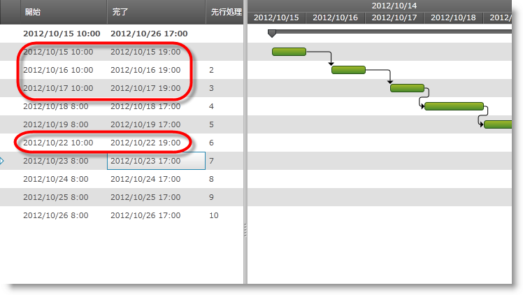

////

|metadata|
{
    "name": "xamgantt-code-example-changing-the-working-time",
    "controlName": ["xamGantt"],
    "tags": ["Data Presentation","Formatting","Grids","Patterns and Practices","Scheduling"],
    "guid": "b45870e3-51e0-45ac-8878-c13d16cd068e",  
    "buildFlags": [],
    "createdOn": "2016-05-25T18:21:55.4921747Z"
}
|metadata|
////

= コード例: 稼働時間の変更 (xamGantt)

== トピックの概要

=== 目的

週の曜日ごとに稼働時間を指定して、曜日が稼働日かどうかを指定できます。

=== 前提条件

このトピックを理解するためには、以下のトピックを理解しておく必要があります。

[options="header", cols="a,a"]
|====
|トピック|目的

| link:xamgantt-adding-xamgantt-to-a-page.html[xamGantt をページに追加]
|このトピックでは、xamGantt™ コントロールをページに追加する方法を説明します。

|====

=== 本トピックの内容

このトピックには次のセクションがあります。

* <<_Code_Example_Changing_the_working_time, コード例: 稼働時間の変更 >>

** <<_Ref334464968,説明>>

** <<_Ref334102005,前提条件>>

** <<_Ref334102013,プレビュー>>

** <<_Ref334464995,コード>>

* <<_Related_Content, 関連コンテンツ >>

[[_Code_Example_Changing_the_working_time]]
== コード例: 稼働時間の変更

[[_Ref334464968]]

=== 説明

以下のコード例は link:{ApiPlatform}controls.schedules.xamgantt{ApiVersion}~infragistics.controls.schedules.projectcalendar_members.html[ProjectCalendar] を作成します。次に、 link:{ApiPlatform}controls.schedules{ApiVersion}~infragistics.controls.schedules.scheduledayofweek_members.html[ScheduleDayOfWeek] のインスタンス 3 つと TimeRanges の配列を作成します。これは稼働時間を指定するために使用されます。次に月曜日、火曜日、水曜日に新しい link:{ApiPlatform}controls.schedules{ApiVersion}~infragistics.controls.schedules.daysettings_members.html[DaySettings] を設定し、新しい稼働時間を指定します。後で、それらのカスタム設定が適用される Date 範囲を述べるために link:{ApiPlatform}controls.schedules.xamgantt{ApiVersion}~infragistics.controls.schedules.projectcalendarworkweek_members.html[ProjectCalendarWorkWeek] が使用されます。

コード例には、デフォルトの稼働時間がある日よりも変更された稼働時間のある日を強調表示するためのタスクのコレクションが含まれています。

[[_Ref334102005]]

=== 前提条件

コード例を完了するには xamGantt プロジェクトが必要です。サンプルの xamGantt プロジェクトを作成するためには、 link:xamgantt-adding-xamgantt-to-a-page.html[ _xamGantt_  をページに追加]の指示に従ってください。次に、このトピックで示すように、ViewModel を置き換えて ViewModel クラス、`ProjectViewModel` を設定します。

[[_Ref334102013]]

=== プレビュー

以下は完全なサンプル プロジェクトのプレビューです。異なる稼働時間を持つ日があることを確認できます。コードによればプロジェクト カレンダーは 7 日間に適用されます。スクリーンショットがアプリケーションで撮られ、月曜日に実行されます。影響を受ける日は現在の週の月曜日、火曜日、水曜日と翌週の月曜日です。

注:

[NOTE]
====
その他の稼働日でアプリケーションを実行する場合、スクリーンショットは若干異なります。異なる日付の他に、火曜日にアプリケーションを実行し、それが稼働日の場合、影響を受ける日は現在の週の火曜日と水曜日、そして翌週の月曜日と火曜日になります。
====

[[_Ref334464995]]

=== コード

*C# の場合:*

[source,csharp]
----
public class WorkingTimeViewModel : INotifyPropertyChanged
    {
        private Project project;
        public Project Project
        {
            get
            {
                if (project == null)
                {
                    project = ProjectChangedWorkingTime();
                }
                return project;
            }
        }
        public Project ProjectChangedWorkingTime()
        {
            Project project = new Project();
            ProjectCalendar projectCalendar = new ProjectCalendar() { UniqueId = "Shift calendar" };
            ScheduleDayOfWeek monday = new ScheduleDayOfWeek();
            ScheduleDayOfWeek tuesday = new ScheduleDayOfWeek();
            ScheduleDayOfWeek wednesday = new ScheduleDayOfWeek();
            TimeRange[] ranges10to19 = new TimeRange[] { 
                new TimeRange { Start = new TimeSpan(10, 00, 0), End = new TimeSpan(14, 0, 0) }, 
                new TimeRange { Start = new TimeSpan(15,00, 0), End = new TimeSpan(19, 0, 0) }};
            DaySettings daySettings = new DaySettings { WorkingHours = new WorkingHoursCollection(ranges10to19) };
            monday.DaySettings = daySettings;
            tuesday.DaySettings = daySettings;
            wednesday.DaySettings = daySettings;
            ScheduleDaysOfWeek scheduleWeek = new ScheduleDaysOfWeek { Monday = monday, Tuesday = tuesday, Wednesday = wednesday };
            ProjectCalendarWorkWeek projectWorkWeek = new ProjectCalendarWorkWeek
            {
                DateRange = new DateRange(DateTime.Today, DateTime.Today.AddDays(7)),
                DaysOfWeek = scheduleWeek
            };
            projectCalendar.WorkWeeks.Add(projectWorkWeek);
            project.Calendars.Add(projectCalendar);
            project.CalendarId = "Shift calendar";
            project.Start = DateTime.Today;
            AddSampleWorkingHours(project);
            return project;
        }
        // これはヘルパー メソッド。10 のタスクを追加し関係を構築する
        private Project AddSampleWorkingHours(Project project)
        {
            ProjectTask root = new ProjectTask { TaskName = "Summary", IsManual = false };
            project.RootTask.Tasks.Add(root);
            for (int i = 0; i < 10; i++)
            {
                root.Tasks.Add(new ProjectTask
                {
                    TaskName = String.Format("Task {0:00}", i.ToString()),
                    IsManual = false,
                    ManualDuration = ProjectDuration.FromFormatUnits(8.0, ProjectDurationFormat.Hours),
                    Notes = String.Format("Notes {0:00}", i.ToString())
                });
            }
            for (int i = 1; i < 10; i++)
            {
                root.Tasks[i].Predecessors.Add(root.Tasks[i - 1]);
            }
            return project;
        }
        #region INotifyPropertyChanged
        public event PropertyChangedEventHandler PropertyChanged;
        public void OnPropertyChanged(string propertyName)
        {
            if (PropertyChanged != null)
            {
                PropertyChanged(this, new PropertyChangedEventArgs(propertyName));
            }
        }
        #endregion // INotifyPropertyChanged
    }
----

*Visual Basic の場合:*

[source,vb]
----
Public Class WorkingTimeViewModel
      Implements INotifyPropertyChanged
      Private m_project As Project
      Public ReadOnly Property Project() As Project
            Get
                  If m_project Is Nothing Then
                        m_project = ProjectChangedWorkingTime()
                  End If
                  Return m_project
            End Get
      End Property
      Public Function ProjectChangedWorkingTime() As Project
            Dim project As New Project()
            Dim projectCalendar As New ProjectCalendar() With { _
                  Key .UniqueId = "Shift calendar" _
            }
            Dim monday As New ScheduleDayOfWeek()
            Dim tuesday As New ScheduleDayOfWeek()
            Dim wednesday As New ScheduleDayOfWeek()
            Dim ranges10to19 As TimeRange() = New TimeRange() {New TimeRange() With { _
                  Key .Start = New TimeSpan(10, 0, 0), _
                  Key .[End] = New TimeSpan(14, 0, 0) _
            }, New TimeRange() With { _
                  Key .Start = New TimeSpan(15, 0, 0), _
                  Key .[End] = New TimeSpan(19, 0, 0) _
            }}
            Dim daySettings As New DaySettings() With { _
                  Key .WorkingHours = New WorkingHoursCollection(ranges10to19) _
            }
            monday.DaySettings = daySettings
            tuesday.DaySettings = daySettings
            wednesday.DaySettings = daySettings
            Dim scheduleWeek As New ScheduleDaysOfWeek() With { _
                  Key .Monday = monday, _
                  Key .Tuesday = tuesday, _
                  Key .Wednesday = wednesday _
            }
            Dim projectWorkWeek As New ProjectCalendarWorkWeek() With { _
                  Key .DateRange = New DateRange(DateTime.Today, DateTime.Today.AddDays(7)), _
                  Key .DaysOfWeek = scheduleWeek _
            }
            projectCalendar.WorkWeeks.Add(projectWorkWeek)
            project.Calendars.Add(projectCalendar)
            project.CalendarId = "Shift calendar"
            project.Start = DateTime.Today
            AddSampleWorkingHours(project)
            Return project
      End Function
      ' これはヘルパー メソッド。10 のタスクを追加し関係を構築する
      Private Function AddSampleWorkingHours(project As Project) As Project
            Dim root As New ProjectTask() With { _
                  Key .TaskName = "Summary", _
                  Key .IsManual = False _
            }
            project.RootTask.Tasks.Add(root)
            Dim i As Integer = 0
            While i < 10
                  root.Tasks.Add(New ProjectTask() With { _
                        Key .TaskName = [String].Format("Task {0:00}", i.ToString()), _
                        Key .IsManual = False, _
                        Key .ManualDuration = ProjectDuration.FromFormatUnits(8.0, ProjectDurationFormat.Hours), _
                        Key .Notes = [String].Format("Notes {0:00}", i.ToString()) _
                  })
                  i
            End While
            Dim i As Integer = 1
            While i < 10
                  root.Tasks(i).Predecessors.Add(root.Tasks(i - 1))
                  i
            End While
            Return project
      End Function
      #Region "INotifyPropertyChanged"
      Public Event PropertyChanged As PropertyChangedEventHandler
      Public Sub OnPropertyChanged(propertyName As String)
            RaiseEvent PropertyChanged(Me, New PropertyChangedEventArgs(propertyName))
      End Sub
      #End Region
End Class
----

[[_Related_Content]]
== 関連コンテンツ

このトピックについては、以下のトピックも参照してください。

[options="header", cols="a,a"]
|====
|トピック|目的

| link:xamgantt-configuring-the-xamgantt-calendars.html[xamGantt カレンダーの構成]
|このグループのトピックには、xamGantt™ カレンダーの情報が含まれています。

| link:xamgantt-calendars-configuration-overview.html[ _xamGantt_ カレンダー構成の概要]
|このトピックでは、 _xamGantt_™ カレンダーの主要な機能の概要を提供します。xamGantt はカレンダーを使用して時間計算を行います。

| link:xamgantt-configuring-the-xamgantt-project-calendar.html[xamGantt プロジェクト カレンダーの構成]
|このトピックは稼働時間情報を指定するためにプロジェクト カレンダーを使用する方法を説明します。

|====
