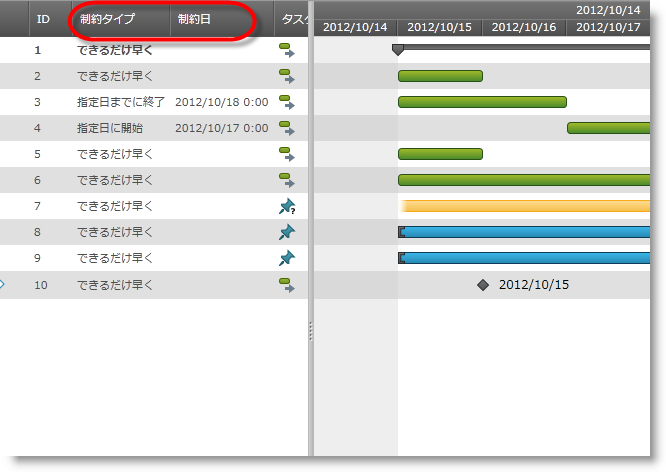

////

|metadata|
{
    "name": "xamgantt-code-example-changing-xamgantt-column-set",
    "controlName": ["xamGantt"],
    "tags": ["Data Presentation","Extending","Grids","Layouts","Scheduling"],
    "guid": "e57eefe2-c9f2-4479-b7a2-5543b1a71be9",  
    "buildFlags": [],
    "createdOn": "2016-05-25T18:21:55.5391394Z"
}
|metadata|
////

= コード例: xamGantt 列セットの変更

== トピックの概要

=== 目的

ListBackedProjectViewProvider を使用して  _xamGantt™_   グリッド セクションに表示される定義済みの列のセットをしていできます。

=== 前提条件

このトピックを理解するためには、以下のトピックを理解しておく必要があります。

[options="header", cols="a,a"]
|====
|トピック|目的

| link:xamgantt-adding-xamgantt-to-a-page.html[ _xamGantt_ をページに追加]
|このトピックでは、 _xamGantt_ コントロールをページに追加する方法を説明します。

|====

=== 本トピックの内容

このトピックには次のセクションがあります。

* <<_Code_Example_Changing_the_xamGantt_Columns, コード例: xamGantt 列の変更 >>

** <<_Ref333763526,説明>>

** <<_Ref334102005,前提条件>>

** <<_Ref334102013,プレビュー>>

** <<_Ref334464995,コード>>

* <<_Related_Content, 関連コンテンツ >>

[[_Code_Example_Changing_the_xamGantt_Columns]]
== コード例: xamGantt 列の変更

[[_Ref333763526]]

=== 説明

コード例では、列セットを変更する方法を示します。プロジェクト テーブルを作成して希望のプロジェクト列を設定します。これでプロジェクト テーブルが Project ビューで指定され、 _xamGantt_   によって使用されます。

コード例には、デフォルトの稼働時間がある日と比較した時に変更された稼働時間のある日を強調表示するに使用できるタスクのコレクションが含まれています。

[[_Ref334102005]]

=== 前提条件

コード例を完了するには  _xamGantt_   プロジェクトが必要です。サンプルの  _xamGantt_   プロジェクトを作成するためには、 link:xamgantt-adding-xamgantt-to-a-page.html[ _xamGantt_   をページに追加]の指示を復習してください。

次に、サンプル プロジェクトのビュー モデルを変更する必要があります。以下のクラスがなければなりません。

* `ProjectTableCollection` - このクラスのコードを確認するには、以下の ProjectTableCollection コード セクションを参照してください。

* `ProjectTableCollection` - このクラスのコードを確認するには、以下の ProjectTableCollection コード セクションを参照してください。

サンプル プロジェクトのビュー モデルを変更した後で、このトピックに表示されるマークアップでマークアップを置き換える必要があります。

[[_Ref334102013]]

=== プレビュー

以下は完全なサンプル プロジェクトのプレビューです。ID 列のすぐ後に制約タイプ列と制約日列が表示されることが確認できます。これはデフォルトと異なる配置です。

=== プロジェクト テーブル コレクション ノード

*C# の場合:*

[source,csharp]
----
public class ProjectTableCollection : ObservableCollection<ProjectTable>
{
}
----

*Visual Basic の場合:*

[source,vb]
----
Public Class ProjectTableCollection
      Inherits ObservableCollection(Of ProjectTable)
End Class
----

=== プロジェクト ビュー コレクション ノード

*C# の場合:*

[source,csharp]
----
public class ProjectViewCollection : ObservableCollection<ProjectView>
{
}
----

*Visual Basic の場合:*

[source,vb]
----
Public Class ProjectViewCollection
      Inherits ObservableCollection(Of ProjectView)
End Class
----

[[_Ref334464995]]

=== コード

*XAML の場合:*

[source,xaml]
----
<Grid>
        <Grid.Resources>
            <local:ProjectViewModel x:Key="viewmodel" />
        </Grid.Resources>
        <Grid.DataContext>
            <Binding Source="{StaticResource viewmodel}" />
        </Grid.DataContext>
        <ig:XamGantt x:Name="gantt" Project="{Binding Project}">
            <ig:XamGantt.ViewProvider>
                <ig:ListBackedProjectViewProvider>
                    <ig:ListBackedProjectViewProvider.ViewItemsSource>
                        <local:ProjectViewCollection>
                            <ig:ProjectView Key="GanttChart" TableKey="Basic" />
                        </local:ProjectViewCollection>
                    </ig:ListBackedProjectViewProvider.ViewItemsSource>
                    <ig:ListBackedProjectViewProvider.TableItemsSource>
                        <local:ProjectTableCollection>
                            <ig:ProjectTable Key="Basic">
                                <ig:ProjectTable.Columns>
                                    <ig:ProjectColumn Key="Id" Width="43" />
                                    <ig:ProjectColumn Key="ConstraintType" Width="100" />
                                    <ig:ProjectColumn Key="ConstraintDate" Width="100" />
                                    <ig:ProjectColumn Key="IsManual" Width="58" />
                                    <ig:ProjectColumn Key="TaskName" Width="174" />
                                    <ig:ProjectColumn Key="ManualDuration" Width="80" />
                                    <ig:ProjectColumn Key="ManualStart" Width="94" />
                                    <ig:ProjectColumn Key="ManualFinish" Width="94" />
                                    <ig:ProjectColumn Key="PredecessorsIdText" Width="102" />
                                    <ig:ProjectColumn Key="ResourcesText" Width="124" />
                                </ig:ProjectTable.Columns>
                            </ig:ProjectTable>
                        </local:ProjectTableCollection>
                    </ig:ListBackedProjectViewProvider.TableItemsSource>
                </ig:ListBackedProjectViewProvider>
            </ig:XamGantt.ViewProvider>
        </ig:XamGantt>
</Grid>
----

*C# の場合:*

[source,csharp]
----
…
public class ProjectTableCollection : ObservableCollection<ProjectTable>
{
}
public class ProjectViewCollection : ObservableCollection<ProjectView>
{
}
…
----

*Visual Basic の場合:*

[source,vb]
----
…
Public Class ProjectTableCollection
      Inherits ObservableCollection(Of ProjectTable)
End Class
Public Class ProjectViewCollection
      Inherits ObservableCollection(Of ProjectView)
End Class
…
----

[[_Related_Content]]
== 関連コンテンツ

このトピックについては、以下のトピックもあわせてご参照ください。

[options="header", cols="a,a"]
|====
|トピック|目的

| link:xamgantt-configuring-the-listbackedproject-viewprovider-for-xamgantt.html[xamGantt の ListBacked ViewProvider の構成]
|このグループのトピックには、 _xamGantt_ ListBackedProject ViewProvider の情報が含まれています。

| link:xamgantt-configuring-the-listbackedproject-viewprovider-overview.html[ _xamGantt_ ListBacked ViewProvider の概要]
|このトピックでは、 _xamGantt_ カレンダーの主要な機能の概要を提供します。_xamGantt_ はカレンダーを使用して時間を計算します。

|====
