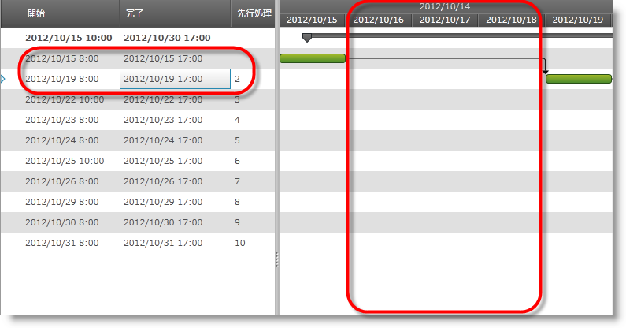

////

|metadata|
{
    "name": "xamgantt-code-example-create-calendar-exceptions",
    "controlName": ["xamGantt"],
    "tags": ["Data Presentation","Extending","Grids","How Do I","Scheduling"],
    "guid": "0784e37c-3f48-496b-a4eb-e4b6569cbb49",  
    "buildFlags": [],
    "createdOn": "2016-05-25T18:21:55.498137Z"
}
|metadata|
////

= xamGantt コード例カレンダー例外の作成 (xamGantt)

== トピックの概要

=== 目的

プロジェクト カレンダー例外を使用して稼働時間に特定の反復するカスタムの調整を作成できます。

=== 前提条件

このトピックを理解するためには、以下のトピックを理解しておく必要があります。

[options="header", cols="a,a"]
|====
|トピック|目的

| link:xamgantt-adding-xamgantt-to-a-page.html[ _xamGantt_ をページに追加]
|このトピックでは、xamGantt™ コントロールをページに追加する方法を説明します。

|====

=== 本トピックの内容

このトピックには次のセクションがあります。

* <<_Code_Example_Create_Calendar_Exceptions, コード例: カレンダー例外の作成 (xamGantt) >>

** <<_Ref334464968,説明>>

** <<_Ref334102005,前提条件>>

** <<_Ref334102013,プレビュー>>

** <<_Ref334464995,コード>>

* <<_Related_Content, 関連コンテンツ >>

[[_Code_Example_Create_Calendar_Exceptions]]
== コード例: カレンダー例外の作成 (xamGantt)

[[_Ref334464968]]

=== 説明

以下のコード例は、 link:{ApiPlatform}controls.schedules.xamgantt{ApiVersion}~infragistics.controls.schedules.projectcalendar_members.html[ProjectCalendar] クラスと link:{ApiPlatform}controls.schedules.xamgantt{ApiVersion}~infragistics.controls.schedules.projectcalendarexception_members.html[ProjectCalendarException] クラスのインスタンスを作成します。次に、プロジェクト カレンダー例外のために DateRange、DaySettings および DateRecurrence を設定します。最後に、プロジェクト カレンダー例外がプロジェクト カレンダーに追加され、プロジェクト カレンダーがプロジェクトに追加されます。

コード例には、例外が適用される日と影響を受けない日をよりはっきりと強調するためのタスクのコレクションが含まれています。

[[_Ref334102005]]

=== 前提条件

コード例を完了するには xamGantt プロジェクトが必要です。サンプルの xamGantt プロジェクトを作成するためには、 link:xamgantt-adding-xamgantt-to-a-page.html[ _xamGantt_  をページに追加]の指示に従ってください。次に、このトピックで示すように、ViewModel を置き換えて ViewModel クラス、`ProjectViewModel` を設定します。

[[_Ref334102013]]

=== プレビュー

以下は完全なサンプル プロジェクトのプレビューです。このアプリケーションは火曜日に実行されましたが、稼働日でなければならない水曜日と木曜日が非稼働日に設定されているのが確認できます。

注:

[NOTE]
====
その他の稼働日でこれを実行する場合、スクリーンショットは若干異なります。異なる日付以外に、金曜日にアプリケーションを実行する場合、非稼働日に設定される次の ２ 日は土曜日と日曜日で、これはデフォルトで非稼働日です。
====

[[_Ref334464995]]

=== コード

*C# の場合:*

[source,csharp]
----
 public class ProjectViewModel : 
INotifyPropertyChanged
    {
        private Project project;
        public Project Project
        {
            get
            {
                if (project == null)
                {
                    project = GenerateExceptionCalendarProject();
                }
                return project;
            }
        }
        public Project GenerateExceptionCalendarProject()
        {
            Project project = new Project();
            ProjectCalendar projectCalendar = new ProjectCalendar() { UniqueId = "pce" };
            ProjectCalendarException pce = new ProjectCalendarException();
            pce.DateRange = new DateRange(DateTime.Today.AddDays(1), DateTime.Today.AddDays(7));
            pce.DaySettings = new DaySettings { IsWorkday = false };
            pce.Recurrence = new DateRecurrence { Count = 2, Frequency = DateRecurrenceFrequency.Daily 
};
            projectCalendar.Exceptions.Add(pce);
            project.Calendars.Add(projectCalendar);
            project.CalendarId = "pce";
            project.Start = DateTime.Today;
            AddSampleWorkingHours(project);
            return project;
        }
        // これはヘルパー メソッド。10 のタスクを追加し関係を構築する
        private Project AddSampleWorkingHours(Project project)
        {
            ProjectTask root = new ProjectTask { TaskName = "Summary", 
IsManual = false };
            project.RootTask.Tasks.Add(root);
            for (int i = 0; i < 10; i++)
            {
                root.Tasks.Add(new ProjectTask
                {
                    TaskName = String.Format("Task {0:00}", i.ToString()),
                    IsManual = false,
                    ManualDuration = ProjectDuration.FromFormatUnits(8.0, ProjectDurationFormat.Hours),
                    Notes = String.Format("Notes {0:00}", i.ToString())
                });
            }
            for (int i = 1; i < 10; i++)
            {
                root.Tasks[i].Predecessors.Add(root.Tasks[i - 1]);
            }
            return project;
        }
        #region INotifyPropertyChanged
        public event PropertyChangedEventHandler PropertyChanged;
        public void OnPropertyChanged(string 
propertyName)
        {
            if (PropertyChanged != null)
            {
                PropertyChanged(this, new PropertyChangedEventArgs
(propertyName));
            }
        }
        #endregion // INotifyPropertyChanged
    }
----

*Visual Basic の場合:*

[source,vb]
----
Public Class ProjectViewModel
      Implements INotifyPropertyChanged
      Private m_project As Project
      Public ReadOnly Property Project() As Project
            Get
                  If m_project Is Nothing 
Then
                        m_project = GenerateExceptionCalendarProject()
                  End If
                  Return m_project
            End Get
      End Property
      Public Function GenerateExceptionCalendarProject() As Project
            Dim project As New Project()
            Dim projectCalendar As New 
ProjectCalendar() With { _
                  Key .UniqueId = "pce" _
            }
            Dim pce As New 
ProjectCalendarException()
            pce.DateRange = New DateRange(DateTime.Today.AddDays(1), DateTime.Today.AddDays(7))
            pce.DaySettings = New DaySettings() With { _
                  Key .IsWorkday = False _
            }
            pce.Recurrence = New DateRecurrence() With { _
                  Key .Count = 2, _
                  Key .Frequency = DateRecurrenceFrequency.Daily _
            }
            projectCalendar.Exceptions.Add(pce)
            project.Calendars.Add(projectCalendar)
            project.CalendarId = "pce"
            project.Start = DateTime.Today
            AddSampleWorkingHours(project)
            Return project
      End Function
      ' これはヘルパー メソッド。10 のタスクを追加し関係を構築する
      Private Function AddSampleWorkingHours(project As Project) As Project
            Dim root As New ProjectTask() 
With { _
                  Key .TaskName = "Summary", _
                  Key .IsManual = False _
            }
            project.RootTask.Tasks.Add(root)
            Dim i As Integer = 0
            While i < 10
                  root.Tasks.Add(New ProjectTask() With { _
                        Key .TaskName = [String].Format("Task {0:00}", 
i.ToString()), _
                        Key .IsManual = False, _
                        Key .ManualDuration = ProjectDuration.FromFormatUnits(8.0, ProjectDurationFormat.Hours), _
                        Key .Notes = [String].Format("Notes {0:00}", 
i.ToString()) _
                  })
                  i
            End While
            Dim i As Integer = 1
            While i < 10
                  root.Tasks(i).Predecessors.Add(root.Tasks(i - 1))
                  i
            End While
            Return project
      End Function
      #Region "INotifyPropertyChanged"
      Public Event PropertyChanged As 
PropertyChangedEventHandler
      Public Sub OnPropertyChanged(propertyName As String)
            RaiseEvent PropertyChanged(Me, New 
PropertyChangedEventArgs(propertyName))
      End Sub
      #End Region
End Class
----

[[_Related_Content]]
== 関連コンテンツ

このトピックについては、以下のトピックも参照してください。

[options="header", cols="a,a"]
|====
|トピック|目的

| link:xamgantt-configuring-the-xamgantt-calendars.html[xamGantt カレンダーの構成]
|このグループのトピックには、xamGantt™ カレンダーの情報が含まれています。

| link:xamgantt-calendars-configuration-overview.html[ _xamGantt_ カレンダー構成の概要]
|このトピックでは、 _xamGantt_™ カレンダーの主要な機能の概要を提供します。xamGantt はカレンダーを使用して時間計算を行います。

| link:xamgantt-configuring-the-xamgantt-project-calendar.html[xamGantt プロジェクト カレンダーの構成]
|このトピックは稼働時間情報を指定するためにプロジェクト カレンダーを使用する方法を説明します。

|====
