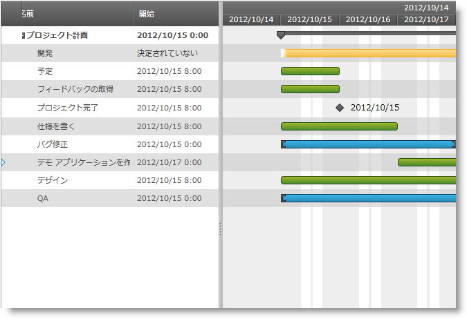

////

|metadata|
{
    "name": "xamgantt-code-example-creating-view-for-xamgantt-using-custom-classes",
    "controlName": ["xamGantt"],
    "tags": ["Charting","Data Binding","Data Presentation","Editing","Scheduling"],
    "guid": "74062d7a-af66-4450-90ee-e8a31ffd67a6",  
    "buildFlags": [],
    "createdOn": "2016-05-25T18:21:55.5681462Z"
}
|metadata|
////

= コード例: カスタム クラスを使用して xamGantt のビューを作成

== トピックの概要

=== 目的

プロジェクト列、プロジェクト テーブルおよびプロジェクト ビューのカスタム クラスを作成し、これらのクラスを使用して xamGantt _™_  の外観をカスタマイズできます。

=== 前提条件

このトピックを理解するためには、以下のトピックを理解しておく必要があります。

[options="header", cols="a,a"]
|====
|トピック|目的

|link:xamgantt-adding-xamgantt-to-a-page.html[_xamGantt_ をページに追加]
|このトピックでは、 _xamGantt_ コントロールをページに追加する方法を説明します。

|====

=== 本トピックの内容

このトピックには次のセクションがあります。

* <<_Code_Example_Creating_Customized_View_for_xamGantt, コード例:  _xamGantt_   のためにカスタマイズされたビューを作成 >>

** <<_Ref333763526,説明>>

** <<_Ref334102005,前提条件>>

** <<_Ref334102013,プレビュー>>

** <<_Ref334464995,コード>>

* <<_Related_Content, 関連コンテンツ >>

[[_Code_Example_Creating_Customized_View_for_xamGantt]]
== コード例: xamGantt のためにカスタマイズされたビューを作成

[[_Ref333763526]]

=== 説明

コード例はカスタム プロジェクト列クラス、カスタム プロジェクト テーブル クラスおよびカスタム プロジェクト ビュー クラスを作成する方法を示します。次に XAML で link:{ApiPlatform}controls.schedules.xamgantt{ApiVersion}~infragistics.controls.schedules.listbackedprojectviewprovider_members.html[ListBackedProjectViewProvider] を作成してその link:{ApiPlatform}controls.schedules.xamgantt{ApiVersion}~infragistics.controls.schedules.listbackedprojectviewprovider~columnitemssource.html[ColumnItemsSource]、 link:{ApiPlatform}controls.schedules.xamgantt{ApiVersion}~infragistics.controls.schedules.listbackedprojectviewprovider~tableitemssource.html[TableItemsSource] および link:{ApiPlatform}controls.schedules.xamgantt{ApiVersion}~infragistics.controls.schedules.listbackedprojectviewprovider~viewitemssource.html[ViewItemsSource] をこれらのカスタム オブジェクトの対応するコレクションに設定します。カスタム クラス間のマッピングは、`ListBackedProjectViewProvider` の link:{ApiPlatform}controls.schedules.xamgantt{ApiVersion}~infragistics.controls.schedules.listbackedprojectviewprovider~columnpropertymappings.html[ColumnPropertyMappings]、 link:{ApiPlatform}controls.schedules.xamgantt{ApiVersion}~infragistics.controls.schedules.listbackedprojectviewprovider~tablepropertymappings.html[TablePropertyMappings] および link:{ApiPlatform}controls.schedules.xamgantt{ApiVersion}~infragistics.controls.schedules.listbackedprojectviewprovider~viewpropertymappings.html[ViewPropertyMappings] プロパティで作成されます。

最後に、 _xamGantt_   の link:{ApiPlatform}controls.schedules.xamgantt{ApiVersion}~infragistics.controls.schedules.projectcontrolbase~viewprovider.html[ViewProvider] プロパティは `ListBackedProjectViewProvider` インスタンスに設定されます。

このコード例にはサンプルのカスタム タスクのコレクションが含まれています。

[[_Ref334102005]]

=== 前提条件

コード例を完了するには _xamGantt_ プロジェクトが必要です。サンプルの _xamGantt_ プロジェクトを作成するためには、link:xamgantt-adding-xamgantt-to-a-page.html[_xamGantt_ をページに追加]の指示を復習してください。

次にプロジェクトを変更する必要があります。以下のクラスがプロジェクトに含まれているはずです:

* `CustomProjectColumn` - このクラスの完全なコードを確認するには、 link:resources-xamgantt-custom-project-column-code-example.html[カスタム プロジェクト列コード例]を参照してください。

* `CustomProjectTable` - このクラスの完全なコードを確認するには、 link:resources-xamgantt-custom-project-table-code-example.html[カスタム プロジェクト テーブル コード例]を参照してください。

* `CustomProjectView` - このクラスの完全なコードを確認するには、 link:resources-xamgantt-custom-project-view-code-example.html[カスタム プロジェクト ビュー コード例]を参照してください。

マークアップと `ProjectViewModel` クラスをコードセクションに表示されるこれらで置き換える必要があります。

[[_Ref334102013]]

=== プレビュー

以下は完全なサンプル プロジェクトのプレビューです。ViewKey="View01" でスクリーンショットが撮られます。`Id="View01"` の `CustomProjectView` クラスのこのインスタンスはクリティカル タスクだけでなくサマリー タスクを表示するように _xamGantt_ を設定します。列セットは、カスタム ビューによって使用される `CustomProjectTable` クラス インスタンスの `ColumnIds` プロパティによって指定されます。

[[_Ref334464995]]

=== コード

*XAML の場合:*

[source,xaml]
----
<Grid>
        <Grid.Resources>
            <local:ProjectViewModel x:Key="dc" />
        </Grid.Resources>
        <Grid.DataContext>
            <Binding Source="{StaticResource dc}" />
        </Grid.DataContext>
        <ig:ListBackedProjectViewProvider x:Name="lbpViewProvider" ColumnItemsSource="{Binding Columns}" 
                                          TableItemsSource="{Binding Tables}" ViewItemsSource="{Binding CustomViews}">
            <ig:ListBackedProjectViewProvider.ColumnPropertyMappings>
                <ig:ProjectColumnPropertyMappingCollection UseDefaultMappings="True">
                    <ig:ProjectColumnPropertyMapping ColumnProperty="Id" DataObjectProperty="Id" />
                </ig:ProjectColumnPropertyMappingCollection>
            </ig:ListBackedProjectViewProvider.ColumnPropertyMappings>
            <ig:ListBackedProjectViewProvider.TablePropertyMappings>
                <ig:ProjectTablePropertyMappingCollection UseDefaultMappings="True" />
            </ig:ListBackedProjectViewProvider.TablePropertyMappings>
            <ig:ListBackedProjectViewProvider.ViewPropertyMappings>
                <ig:ProjectViewPropertyMappingCollection UseDefaultMappings="True" />
            </ig:ListBackedProjectViewProvider.ViewPropertyMappings>
        </ig:ListBackedProjectViewProvider>
        <ig:XamGantt x:Name="xamGantt" Grid.Row="0" Project="{Binding SampleProject}" 
                     ViewProvider="{Binding ElementName=lbpViewProvider}" ViewKey="View01" />
</Grid>
----

*C# の場合:*

[source,csharp]
----
public class ProjectViewModel : 
INotifyPropertyChanged
    {
        #region Private variables
        private Project project;
        private ObservableCollection<CustomProjectView> views;
        private ObservableCollection<CustomProjectTable> tables;
        private ObservableCollection<CustomProjectColumn> columns;
        private CustomProjectView selectedView;
        #endregion // プライベート変数
        #region Public Properties
        public Project SampleProject
        {
            get
            {
                if (project == null)
                {
                    project = ProjectDataHelper.GenerateProjectData();
                }
                return project;
            }
            set
            {
                if (project != value)
                {
                    project = value;
                    OnPropertyChanged("SampleProject");
                }
            }
        }
        public CustomProjectView SelectedView
        {
            get
            {
                return selectedView;
            }
            set
            {
                if (value != selectedView)
                {
                    selectedView = value;
                    OnPropertyChanged("SelectedView");
                }
            }
        }
        public ObservableCollection<CustomProjectColumn> Columns
        {
            get
            {
                if (columns == null)
                {
                    columns = GenerateColumns();
                }
                return columns;
            }
        }
        public ObservableCollection<CustomProjectTable> Tables
        {
            get
            {
                if (tables == null)
                {
                    tables = GenerateTables();
                }
                return tables;
            }
            set
            {
                if (tables != value)
                {
                    tables = value;
                }
            }
        }
        public ObservableCollection<CustomProjectView> CustomViews
        {
            get
            {
                if (views == null)
                {
                    views = GenerateViews();
                }
                return views;
            }
            set
            {
                if (views != value)
                {
                    views = value;
                    OnPropertyChanged("CustomViews");
                }
            }
        }
        #endregion // パブリック プロパティ
        #region Private helpers
        private ObservableCollection<CustomProjectColumn> GenerateColumns()
        {
            return new ObservableCollection<CustomProjectColumn>()
            {
                new CustomProjectColumn
                {
                    Id = "idTaskName",
                    Key = "TaskName",
                    HeaderText = "Name"
                },
                new CustomProjectColumn
                {
                    Id = "idStart",
                    Key = "ManualStart",
                    HeaderText = "Start",
                    HeaderTextHorizontalAlignment = "Center"
                },
                new CustomProjectColumn
                {
                    Id = "idFinish",
                    Key = "ManualFinish",
                    HeaderText = "Finish",
                    HeaderTextHorizontalAlignment = "Center"
                },
                new CustomProjectColumn
                {
                    Id = "idDuration",
                    Key = "ManualDuration",
                    HeaderText = "Duration"
                },
                new CustomProjectColumn
                {
                    Id = "idPredecessors",
                    Key = "PredecessorsIdText",
                    HeaderText = "Predecessors"
                },
                new CustomProjectColumn
                {
                    Id="idIsCritical",
                    Key = "IsCritical",
                    HeaderText = "Is Critical"
                }
            };
        }
        private ObservableCollection<CustomProjectTable> GenerateTables()
        {
            return new ObservableCollection<CustomProjectTable>()
            {
                new CustomProjectTable
                {
                    Key = "Table01",
                    // コンマで区切られた列 ID、これは ProjectColumnProperty.DataItemId 
プロパティ マッピングによって提供される
                    ColumnIds = "idTaskName, idStart, idDuration, idFinish, idPredecessors, 
idIsCritical",
                    ShowInMenu = true
                },
                new CustomProjectTable
                {
                    Key = "Table02",
                    ColumnIds = "idTaskName, idStart, idFinish, idIsCritical",
                    ShowInMenu = true
                },
                new CustomProjectTable
                {
                    Key = "Table03",
                    ColumnIds = "idTaskName, idDuration, idPredecessors",
                    ShowInMenu = true
                }
            };
        }
        private ObservableCollection<CustomProjectView> GenerateViews()
        {
            return new ObservableCollection<CustomProjectView>()
            {
                new CustomProjectView
                {
                    Key = "View01",
                    AreSummaryTasksVisible = true,
                    AreCriticalTasksHighlighted = true,
                    // コンマで区切られた列キー、それぞれのキーは、列を昇順または降順で並べ替えることを示すために、オプションで 'Ascending' または 
                    // 'Descending' という語を続けることができる
                    SortedColumns = "ManualStart, ManualFinish:Descending",
                    IsOutlineStructurePreservedWhenSorting = true,
                    TableKey = "Table01",
                    NonWorkingTimeHighlightStyle = "ActualNonWorkingHours"
                },
                new CustomProjectView
                {
                    Key = "View02",
                    TableKey = "Table02",
                    AreCriticalTasksHighlighted = false,
                    AreSummaryTasksVisible = false
                },
                new CustomProjectView
                {
                    Key = "View03",
                    TableKey = "Table03",
                    AreCriticalTasksHighlighted = true
                }
            };
        }
        #endregion // プライベート ヘルパー
        #region INotifyPropertyChanged
        public event PropertyChangedEventHandler PropertyChanged;
        public void OnPropertyChanged(string 
propertyName)
        {
            if (PropertyChanged != null)
            {
                PropertyChanged(this, new PropertyChangedEventArgs
(propertyName));
            }
        }
        #endregion // INotifyPropertyChanged
    }
----

*Visual Basic の場合:*

[source,vb]
----
Public Class ProjectViewModel
      Implements INotifyPropertyChanged
      #Region "Private variables"
      Private project As Project
      Private views As ObservableCollection(Of CustomProjectView)
      Private m_tables As ObservableCollection(Of CustomProjectTable)
      Private m_columns As ObservableCollection(Of CustomProjectColumn)
      Private m_selectedView As CustomProjectView
      #End Region
      #Region "Public Properties"
      Public Property SampleProject() As 
Project
            Get
                  If project Is Nothing Then
                        project = ProjectDataHelper.GenerateProjectData()
                  End If
                  Return project
            End Get
            Set
                  If project <> value Then
                        project = value
                        OnPropertyChanged("SampleProject")
                  End If
            End Set
      End Property
      Public Property SelectedView() As 
CustomProjectView
            Get
                  Return m_selectedView
            End Get
            Set
                  If value <> m_selectedView Then
                        m_selectedView = value
                        OnPropertyChanged("SelectedView")
                  End If
            End Set
      End Property
      Public ReadOnly Property Columns() As ObservableCollection(Of CustomProjectColumn)
            Get
                  If m_columns Is Nothing 
Then
                        m_columns = GenerateColumns()
                  End If
                  Return m_columns
            End Get
      End Property
      Public Property Tables() As 
ObservableCollection(Of CustomProjectTable)
            Get
                  If m_tables Is Nothing Then
                        m_tables = GenerateTables()
                  End If
                  Return m_tables
            End Get
            Set
                  If m_tables <> value Then
                        m_tables = value
                  End If
            End Set
      End Property
      Public Property CustomViews() As 
ObservableCollection(Of CustomProjectView)
            Get
                  If views Is Nothing Then
                        views = GenerateViews()
                  End If
                  Return views
            End Get
            Set
                  If views <> value Then
                        views = value
                        OnPropertyChanged("CustomViews")
                  End If
            End Set
      End Property
      #End Region
      #Region "Private helpers"
      Private Function GenerateColumns() As 
ObservableCollection(Of CustomProjectColumn)
            Return New ObservableCollection(Of CustomProjectColumn)() From 
{ _
                  New CustomProjectColumn() With { _
                        Key .Id = "idTaskName", _
                        Key .Key = "TaskName", _
                        Key .HeaderText = "Name" _
                  }, _
                  New CustomProjectColumn() With { _
                        Key .Id = "idStart", _
                        Key .Key = "ManualStart", _
                        Key .HeaderText = "Start", _
                        Key .HeaderTextHorizontalAlignment = "Center" _
                  }, _
                  New CustomProjectColumn() With { _
                        Key .Id = "idFinish", _
                        Key .Key = "ManualFinish", _
                        Key .HeaderText = "Finish", _
                        Key .HeaderTextHorizontalAlignment = "Center" _
                  }, _
                  New CustomProjectColumn() With { _
                        Key .Id = "idDuration", _
                        Key .Key = "ManualDuration", _
                        Key .HeaderText = "Duration" _
                  }, _
                  New CustomProjectColumn() With { _
                        Key .Id = "idPredecessors", _
                        Key .Key = "PredecessorsIdText", _
                        Key .HeaderText = "Predecessors" _
                  }, _
                  New CustomProjectColumn() With { _
                        Key .Id = "idIsCritical", _
                        Key .Key = "IsCritical", _
                        Key .HeaderText = "Is Critical" _
                  } _
            }
      End Function
      Private Function GenerateTables() As 
ObservableCollection(Of CustomProjectTable)
                        ' コンマで区切られた列 ID、これは ProjectColumnProperty.DataItemId 
プロパティ マッピングによって提供される
            Return New ObservableCollection(Of CustomProjectTable)() From { 
_
                  New CustomProjectTable() With { _
                        Key .Key = "Table01", _
                        Key .ColumnIds = "idTaskName, idStart, idDuration, idFinish, idPredecessors, 
idIsCritical", _
                        Key .ShowInMenu = True _
                  }, _
                  New CustomProjectTable() With { _
                        Key .Key = "Table02", _
                        Key .ColumnIds = "idTaskName, idStart, idFinish, idIsCritical", _
                        Key .ShowInMenu = True _
                  }, _
                  New CustomProjectTable() With { _
                        Key .Key = "Table03", _
                        Key .ColumnIds = "idTaskName, idDuration, idPredecessors", _
                        Key .ShowInMenu = True _
                  } _
            }
      End Function
      Private Function GenerateViews() As 
ObservableCollection(Of CustomProjectView)
                        ' コンマで区切られた列キー、それぞれのキーは、列を昇順または降順で並べ替えることを示すために、オプションで 'Ascending' または 
                        ' 'Descending' という語を続けることができる
            Return New ObservableCollection(Of CustomProjectView)() From { 
_
                  New CustomProjectView() With { _
                        Key .Key = "View01", _
                        Key .AreSummaryTasksVisible = True, _
                        Key .AreCriticalTasksHighlighted = True, _
                        Key .SortedColumns = "ManualStart, ManualFinish:Descending", _
                        Key .IsOutlineStructurePreservedWhenSorting = True, _
                        Key .TableKey = "Table01", _
                        Key .NonWorkingTimeHighlightStyle = "ActualNonWorkingHours" _
                  }, _
                  New CustomProjectView() With { _
                        Key .Key = "View02", _
                        Key .TableKey = "Table02", _
                        Key .AreCriticalTasksHighlighted = False, _
                        Key .AreSummaryTasksVisible = False _
                  }, _
                  New CustomProjectView() With { _
                        Key .Key = "View03", _
                        Key .TableKey = "Table03", _
                        Key .AreCriticalTasksHighlighted = True _
                  } _
            }
      End Function
      #End Region
      #Region "INotifyPropertyChanged"
      Public Event PropertyChanged As 
PropertyChangedEventHandler
      Public Sub OnPropertyChanged(propertyName As String)
            RaiseEvent PropertyChanged(Me, New 
PropertyChangedEventArgs(propertyName))
      End Sub
      #End Region
End Class
----

[[_Related_Content]]
== 関連コンテンツ

このトピックについては、以下のトピックもあわせてご参照ください。

[options="header", cols="a,a"]
|====
|トピック|目的

| link:xamgantt-configuring-the-listbackedproject-viewprovider-for-xamgantt.html[xamGantt の ListBacked ViewProvider の構成]
|このグループのトピックには、 _xamGantt_ ListBackedProject ViewProvider の情報が含まれています。

| link:xamgantt-configuring-the-listbackedproject-viewprovider-overview.html[ _xamGantt_ ListBacked ViewProvider の概要]
|このトピックでは、 _xamGantt_ カレンダーの主要な機能の概要を提供します。_xamGantt_ はカレンダーを使用して時間を計算します。

| link:xamgantt-code-example-creating-customized-view-for-xamgantt.html[コード例: xamGantt のためにカスタマイズされたビューを作成]
|ListBackedProject ViewProvider と定義済みプロジェクト列、プロジェクト テーブル、プロジェクト ビュー クラスを使用することによってカスタマイズされた xamGantt ビューを作成できます。

|====
