////

|metadata|
{
    "name": "xamgantt-columns-editing",
    "controlName": ["xamGantt"],
    "tags": ["Data Presentation","Editing","Getting Started","How Do I"],
    "guid": "4cf549f2-7cfa-4c71-a041-7f9067c14880",  
    "buildFlags": [],
    "createdOn": "2016-05-25T18:21:55.1931577Z"
}
|metadata|
////

= xamGantt 列の編集

== トピックの概要

=== 目的

このトピックでは、 _xamGantt™_   コントロールで重要なグリッド列のいくつかで使用可能な編集機能を説明します。

=== 本トピックの内容

このトピックには次のセクションがあります。

* <<_Ref335207203, 列の編集 >>

** <<_Ref335207208,ユーザー相互作用の概要>>
** <<predefStrings,日付フィールドの定義済みの文字列>>
** <<predefUnits,定義済みの単位文字列>>
** <<_Ref335145303,タスク モードを編集 (自動/手動)>>
** <<_Ref335145437,タスク名を編集>>
** <<_Ref335151013,タスク期間を編集>>
** <<_Ref335151173,タスク日付フィールドを編集>>
** <<_Ref335151872,タスクの依存関係を編集>>
** <<_Ref335151882,タスク リソースを編集>>
** <<_Ref335206465,タスク制約タイプおよび日付を編集>>
** <<_Ref335206498,タスクの進行状況を編集>>
** <<_Ref335206613,タスクの状態を編集 (アクティブ/非アクティブ)>>
** <<_Ref335206863,マイルストーンを作成>>

* <<_Ref335207263, 関連コンテンツ >>

[[_Ref335207203]]
== 列の編集

[[_Ref335207208]]

=== ユーザー相互作用の概要

以下の表に、 _xamGantt_   コントロールでプロジェクト タスク フィールドを編集するためのユーザー オプションのいくつかをまとめます。追加の詳細情報はこのトピックの後で説明します。

[options="header", cols="a,a,a"]
|====
|目的|ここで|詳細

|<<_Ref335145303,タスク モードを編集 (自動/手動)>>
|*タスク モード* 列で対応するコンボ ボックス
|選択したセルを編集するには: 

* クリック 

* ダブルクリック 

* 入力を開始 

* *Enter* を押す 

* *F2* を押す 

変更をコミットするには *Enter* を押します。 

変更をキャンセルするには *Escape* を押します。

|<<_Ref335145437,タスク名を編集>>
|*名前* 列の対応するテキスト フィールド
|選択したセルを編集するには: 

* クリック 

* ダブルクリック 

* 入力を開始 

* *Enter* を押す 

* *F2* を押す 

変更をコミットするには *Enter* を押します。 

変更をキャンセルするには *Escape* を押します。

|<<_Ref335151013,タスク期間を編集>>
|*期間* 列の対応するテキスト フィールド
|選択したセルを編集するには: 

* クリック 

* ダブルクリック 

* 入力を開始 

* *Enter* を押す 

* *F2* を押す 

変更をコミットするには *Enter* を押します。 

変更をキャンセルするには *Escape* を押します。 

キーボードの矢印を使用して編集することも可能です。

|<<_Ref335151173,タスク日付フィールドを編集>>
|以下の例の対応する日付/時刻入力: *開始日* 、 *終了日* 、 *実際の開始日* 、 *実際の終了日、期限* など。
|選択したセルを編集するには: 

* クリック 

* ダブルクリック 

* 入力を開始 

* *Enter* を押す 

* *F2* を押す 

変更をコミットするには *Enter* を押します。 

変更をキャンセルするには *Escape* を押します。 

日付/時刻の入力を使用して日付を入力します。

|<<_Ref335151872,タスクの依存関係を編集>>
|*先行処理* 列または *後続処理* 列の対応するテキスト フィールド
|選択したセルを編集するには: 

* クリック 

* ダブルクリック 

* 入力を開始 

* *Enter* を押す 

* *F2* を押す 

変更をコミットするには *Enter* を押します。 

変更をキャンセルするには *Escape* を押します。

|<<_Ref335151882,タスク リソースを編集>>
|*リソース名* 列の対応するテキスト フィールド
|選択したセルを編集するには: 

* クリック 

* ダブルクリック 

* 入力を開始 

* *Enter* を押す 

* *F2* を押す 

変更をコミットするには *Enter* を押します。 

変更をキャンセルするには *Escape* を押します。

|<<_Ref335206465,タスク制約タイプおよび日付を編集>>
|*制約タイプ* 列の対応するコンボ ボックスおよび *制約日* 列の日付/時刻入力
|選択したセルを編集するには: 

* クリック 

* ダブルクリック 

* 入力を開始 

* *Enter* を押す 

* *F2* を押す 

変更をコミットするには *Enter* を押します。 

変更をキャンセルするには *Escape* を押します。

|<<_Ref335206498,タスクの進行状況を編集>>
|*達成率* 列の対応するテキスト フィールド
|選択したセルを編集するには: 

* クリック 

* ダブルクリック 

* 入力を開始 

* *Enter* を押す 

* *F2* を押す 

変更をコミットするには *Enter* を押します。 

変更をキャンセルするには *Escape* を押します。

|<<_Ref335206613,タスクの状態を編集 (アクティブ/非アクティブ)>>
|*現在* 列で対応するコンボ ボックス
|選択したセルを編集するには: 

* クリック 

* ダブルクリック 

* 入力を開始 

* *Enter* を押す 

* *F2* を押す 

変更をコミットするには *Enter* を押します。 

変更をキャンセルするには *Escape* を押します。

|<<_Ref335206863,マイルストーンを作成>>
|*マイルストーン* 列で対応するコンボ ボックス
|選択したセルを編集するには: 

* クリック 

* ダブルクリック 

* 入力を開始 

* *Enter* を押す 

* *F2* を押す 

変更をコミットするには *Enter* を押します。 

変更をキャンセルするには *Escape* を押します。

|====

[[predefStrings]]

=== 日付フィールドの定義済みの文字列

_xamGantt_   コントロールの日付/時刻フィールドに入力された特別な意味を持つ定義済みの文字列のセットがあります。これらの定義済みの文字列は編集モードを終了した後で対応する日付に更新します。

これらの定義済みの文字列は、Microsoft Project 2010 で使用可能な特別な文字列を表します。

使用可能な定義済みの文字列を以下にリストします。

* “today” – 日付を現在の日に設定します。
* “tomorrow” – 日付を次のカレンダーの日付に設定します。
* 1 から 31 までの数字 - 現在の月の日番号に設定します。
* 曜日の名前 – 現在の日付から始まる週の特定の日の日付を設定します (たとえば、今日が 9 月 9 日日曜日で、“Sunday” と入力した場合、9/9 に変換されますが、今日が 9 月 10 日月曜日で “Sunday” と入力すると 9/16 (次の日曜日) に変換されます)。

[[predefUnits]]

=== 定義済みの単位文字列

特別な意味を持つ一連の定義済みの単位文字列を  _xamGantt_   コントロールで使用可能です。

これらの定義済みの単位文字列は、Microsoft Project 2010 で使用可能な特別な単位文字列を表します。

使用可能な定義済みの単位文字列を以下にリストします。

[options="header", cols="a,a,a"]
|====
|形式/単位のタイプ|標準の単位文字列|経過時間の単位文字列

|分
|m、min、mins、minute、minutes
|em、emin、eminute、eminutes

|時
|h、hr、hrs、hour、hours
|eh、ehr、ehrs、ehour、ehours

|日
|d、dy、dys、day、days
|ed、edy、edys、eday、edays

|週
|w、wk、wks、week、weeks
|ew、ewk、ewks、eweek、eweeks

|月
|mo、mon、mons、month、months
|emo、emon、emons、emonth、emonths

|パーセント
|%
|e%

|====

注:

[NOTE]
====

パーセントは、先行処理の期間の%を表す、タスクの依存関係のタイム ラグに使用される場合に限り意味を持ちます。

1 日 24 時間、週 7 日という場合は稼働時間もオフの時間も考慮せず、経過した時間の計算の基礎となります。

これが経過時間であることを示すために指定した単位の後に疑問符  *(?)*  記号を使用することもできます。
====

[[_Ref335145303]]

=== タスク モードを編集 (自動/手動)

タスク モードを編集するために、 *タスク モード* 列で対応するコンボ ボックスを使用して、自動スケジュールと手動スケジュールのいずれかのオプションを選択します。

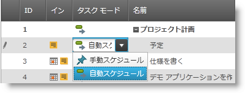

[[_Ref335145437]]

=== タスク名を編集

タスク名を編集するには、 *名前* 列で対応するフィールドを使用します。

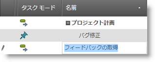

[[_Ref335151013]]

=== タスク期間を編集

タスク期間を編集するには、 *期間* 列で対応するフィールドを使用します。

直接入力する、数値エディターの上矢印と下矢印またはキーボードの上ボタンと下ボタンを使用してフィールドの値を変更できます。

手動スケジュール タスクの場合、自由な形式のテキストも入力できます。

使用可能な入力の詳細については、<<predefUnits,定義済みの単位文字列>>を参照してください。

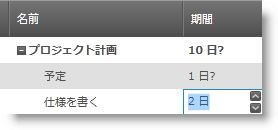

[[_Ref335151173]]

=== タスク日付フィールドを編集

タスクの日付フィールドを編集するには、対応する日付/時刻入力を開き、日付を入力します。

有効な日付/時刻入力の詳細については、 link:xamgantt-columns-editing.html#predefStrings[日付フィールドの定義済みの文字列]を参照してください。

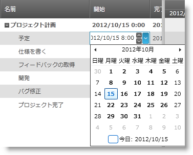

[[_Ref335151872]]

=== タスクの依存関係を編集

タスクの依存関係を編集するには、先行処理列または後続処理列で対応するフィールドを使用します。

以下を入力して依存関係を作成します。

* 後続処理/先行処理 ID (デフォルトのリンク タイプは終了 - 開始で指定する必要はありません)
* 後続処理/先行処理 ID と指定されたリンク タイプ
* 後続処理/先行処理 ID、特定のリンク タイプおよびリード/ラグ タイム

現在のカルチャ セパレーター (たとえば en-US の場合は “,”) によって区切ることで、複数の依存関係を追加できます。

使用可能なリンク タイプは以下の通りです。

[options="header", cols="a,a,a"]
|====
|エディターのリンク タイプ表記|リンク タイプ|説明

|FS
|終了 - 開始リンク
|指定されていない場合これがデフォルトのリンク タイプになります。 

後続処理の開始日は先行処理の終了日に依存します。

|FF
|終了 - 終了リンク
|後続処理の終了日は先行処理の終了日に依存します。

|SF
|開始 - 終了リンク
|後続処理の終了日は先行処理の開始日に依存します。

|SS
|開始 - 開始リンク
|後続処理の開始日は先行処理の開始日に依存します。

|====

リード タイムを指定することができます。この値は負の値でタスク間の重複時間を示します。

ラグ タイムを指定することができます。この値は正の値でタスク間の遅延を示します。

リード タイムとラグ タイムは期間または先行処理の期間のパーセンテージで定義できます。 *例:* 

*先行処理* 列に ID 4 “3FS-2 days” とタスクのために入力すると、ID 4 のタスクは ID 3 の先行処理を持つことを意味します。ID 4 のタスクの開始日は、ID 3 の先行処理の終了日に依存します。リード タイムが 2 日あるということは、ID 4 のタスクが ID 3 のタスクの終了 2 日前に開始しなければならないことを意味します。

注:

[NOTE]
====

タスクで使用されるタスク ID はタスクのインデックスに基づいてタスクの平らにしたコレクションを自動的に計算します。このコレクションはプロジェクトのサマリータスクに ID 0 で開始し、最初のルート レベル タスクには ID 1 で開始します。

タスク ID はタスクを追加および削除すると自動的に更新します。これによって実際の依存関係にいかなる変更が行われることにはなりません。グリッド内の先行処理/後続処理セルのテクスチャ表現も更新されます。
====

[[_Ref335151882]]

=== タスク リソースを編集

タスク リソースを編集するには、 *リソース名* 列で対応するフィールドを使用します。

複数のリソースを入力すると、リスト セパレーターがリソースを区切ります。

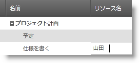

_xamGantt_   コントロールの構成によって異なりますが、フィールドにリソース名を入力する時新しいリソースをプロジェクトに追加できます。

この操作が使用できない場合はエラーのヒントが表示します。

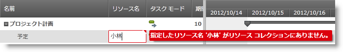

[[_Ref335151890]]

=== タスク制約タイプおよび日付を編集

タスクの制約タイプを編集するには、 *制約タイプ* 列で対応するフィールドを使用して、コンボ ボックスからリストされた制約タイプのいずれかを選択します。

_xamGantt_   コントロールは Microsoft Project 2010 で使用可能なタイプと同じ制約タイプを公開します。

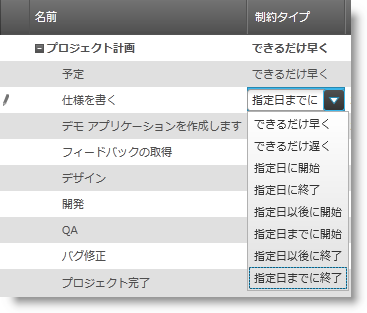

注:

[NOTE]
====
編集しているタスクが手動スケジュール タスクの場合、これは制約タイプの編集を無効にします。編集できるのは、自動スケジュール タスクの制約タイプのみです。
====

サマリー タスクの場合、コンボ ボックスのリストは制約タイプの有効なオプションのみを提供します。

サマリー タスクの有効な制約は以下の通りです。

* 指定日以後に開始
* 指定日までに終了
* 可能な限り早くまたは可能な限り遅く (開始日からか、終了日からかという、プロジェクトのスケジュールによって異なります)。

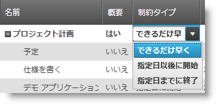

タスクの制約日を編集するには、 *制約日*  列で対応するフィールドを使用して、日時入力から日付を選択します。

有効な日付/時刻入力の詳細については、<<predefStrings,日付フィールドの定義済みの文字列>>を参照してください。

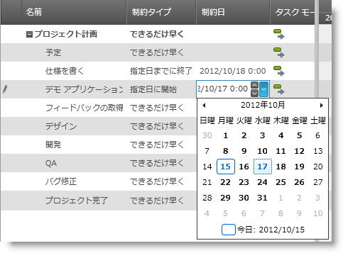

[[_Ref335206498]]

=== タスクの進行状況を編集

タスクの進行状況を編集するには、 *達成率* 列で対応するフィールドを使用します。直接パーセントを入力し、数値入力の矢印キーまたは上ボタンと下ボタンを使用します。

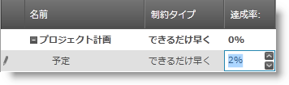

[[_Ref335206613]]

=== タスクの状態を編集 (アクティブ/非アクティブ)

タスクの状態 (アクティブ/非アクティブ) を編集するために、 *現在*  列で対応するコンボ ボックスを使用して、「はい」または「いいえ」のいずれかのオプションを選択します。

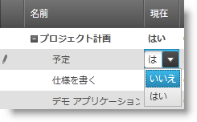

[[_Ref335206863]]

=== マイルストーンを作成

タスクがマイスストーンの場合編集するために、 *マイルストーン*  列で対応するコンボ ボックスを使用して、「はい」または「いいえ」のいずれかのオプションを選択します。

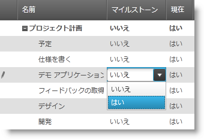

[[_Ref335207263]]
== 関連コンテンツ

=== トピック

このトピックについては、以下のトピックも参照してください。

[options="header", cols="a,a"]
|====
|トピック|目的

| link:xamgantt-xamgantt-user-interactions-in-the-grid-section.html[グリッド セクションにおける xamGantt ユーザー インタラクション]
|このトピックでは、 _xamGantt_ コントロールのグリッド セクションで使用可能なユーザー インタラクションについて説明します。

| link:xamgantt-xamgantt-user-interactions-in-the-chart-section.html[チャート セクションにおける xamGantt ユーザー インタラクション]
|このトピックでは、 _xamGantt_ コントロールのチャート セクションで使用可能なユーザー インタラクションについて説明します。

| link:xamgantt-keyboard-support.html[キーボードのサポート]
|このトピックでは、 _xamGantt_ コントロールの組み込みキーボード サポート、および関連するキーボード ショートカットを持つユーザー アクションについて説明します。

|====