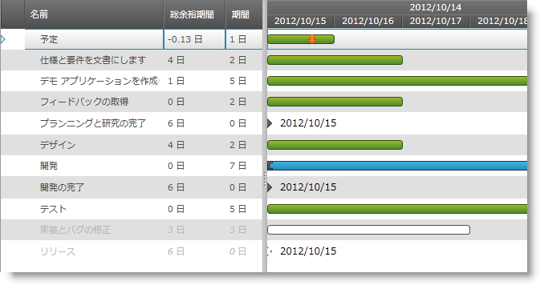

////

|metadata|
{
    "name": "xamgantt-configuring-critical-slack-limit",
    "controlName": ["xamGantt"],
    "tags": ["Data Presentation","How Do I","Scheduling"],
    "guid": "f7643b8f-3cad-4fa1-aa6c-e8f20b223938",  
    "buildFlags": [],
    "createdOn": "2016-05-25T18:21:55.3391661Z"
}
|metadata|
////

= クリティカル スラック制限を構成

== トピックの概要

=== 目的

このトピックでは、 _xamGantt™_   コントロールを使用してプロジェクト タスクにクリティカル スラック制限を構成する方法を説明します。

=== 前提条件

このトピックを理解するためには、以下のトピックを理解しておく必要があります。

[options="header", cols="a,a"]
|====
|トピック|目的

| link:xamgantt-binding-arbitrary-tasks-collection-listbackedproject.html[ListBackedProject によるタスク コレクションとのバインディング]
|このトピックでは、ListBackedProject で _xamGantt_ コントロールを任意のタスク コレクションにバインドする方法を説明します。

|====

=== 本トピックの内容

このトピックには次のセクションがあります。

* <<_Ref334907374, クリティカル スラック制限を構成 >>
* <<_Ref334907386, 関連コンテンツ >>

[[_Ref334907374]]
== クリティカル スラック制限を構成

=== 概要

_xamGantt_   コントロールのスケジューリング エンジンは、タスクがプロジェクトのクリティカル パスと見なされるかどうかに基づいて link:{ApiPlatform}controls.schedules.xamgantt{ApiVersion}~infragistics.controls.schedules.projecttask_members.html[ProjectTask] のクリティカルな状態を計算します。

スラックがゼロ日のプロジェクト タスクはクリティカルと見なされます。ただし、スラック制限のカスタム構成を指定できます。

link:{ApiPlatform}controls.schedules.xamgantt{ApiVersion}~infragistics.controls.schedules.projectsettings_members.html[ProjectSettings] link:{ApiPlatform}controls.schedules.xamgantt{ApiVersion}~infragistics.controls.schedules.projectsettings~criticalslacklimit.html[CriticalSlackLimit] プロパティはタスクがクリティカルとなるために必要なスラックの量を決定し、`ProjectTask` link:{ApiPlatform}controls.schedules.xamgantt{ApiVersion}~infragistics.controls.schedules.projecttask~iscritical.html[IsCritical] 読み取り専用プロパティにタスクのクリティカル状態を保存します。

_xamGantt_   コントロールのユーザー インターフェイスを使用してプロジェクトのクリティカル タスクを強調表示するために、 link:{ApiPlatform}controls.schedules.xamgantt{ApiVersion}~infragistics.controls.schedules.projectviewsettings_members.html[ProjectViewSettings] link:{ApiPlatform}controls.schedules.xamgantt{ApiVersion}~infragistics.controls.schedules.projectviewsettings~arecriticaltaskshighlighted.html[AreCriticalTasksHighlighted] プロパティを使用します。

=== プロパティ設定

以下の表では、目的の構成をプロパティ設定にマップしています。

[options="header", cols="a,a,a"]
|====
|目的:|使用するプロパティ:|次に設定:

|タスクのクリティカル スラック制限を指定
| link:{ApiPlatform}controls.schedules.xamgantt{ApiVersion}~infragistics.controls.schedules.projectsettings~criticalslacklimit.html[CriticalSlackLimit]
|`int`

|プロジェクトのクリティカル タスクを強調表示
| link:{ApiPlatform}controls.schedules.xamgantt{ApiVersion}~infragistics.controls.schedules.projectviewsettings~arecriticaltaskshighlighted.html[AreCriticalTasksHighlighted]
|`bool`

|====

=== 例

以下のスクリーンショットはクリティカル タスクをどのように決定し、クリティカルなスラック制限に応じて強調表示するのかを示します。以下の設定を使用して実行されます。

[options="header", cols="a,a"]
|====
|プロパティ|値

|`CriticalSlackLimit`
|2

|`AreCriticalTasksHighlighted`
|`True`

|====

*XAML の場合:*

[source,xaml]
----
<ig:ListBackedProject x:Name="dataProvider" 
                      TaskItemsSource="{Binding Tasks}">
    <ig:ListBackedProject.Settings>
        <ig:ProjectSettings CriticalSlackLimit="2" />
    </ig:ListBackedProject.Settings>
</ig:ListBackedProject>
<ig:XamGantt x:Name="gantt" 
             Project="{Binding ElementName=dataProvider}">
    <ig:XamGantt.ViewSettings>
        <ig:ProjectViewSettings AreCriticalTasksHighlighted="True" />
    </ig:XamGantt.ViewSettings>
</ig:XamGantt>
----

[[_Ref334907386]]
== 関連コンテンツ

このトピックについては、以下のトピックも参照してください。

[options="header", cols="a,a"]
|====
|トピック|目的

| link:xamgantt-project-settings-configuration-overview.html[プロジェクト設定構成の概要]
|このトピックでは、 _xamGantt_ ProjectSettings クラスとその構成可能な項目の概要を提供します。

|====
